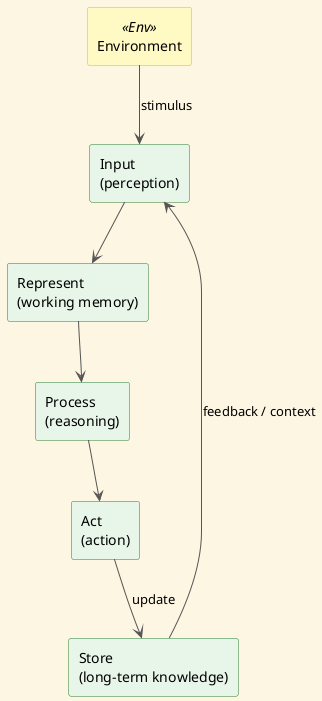

# Review: 1.3: The Cognitive Turn — Minds as Information Processors

**Source:** part-i/ch01-intelligence-as-process/lecture-03.adoc

---

## Review of Lecture 1.3 – “The Cognitive Turn — Minds as Information Processors”

### Summary  
**Grade: B‑** – The lecture has a solid hook, a clear three‑part structure (conceptual core, technical example, philosophical reflection), and the right number of paragraphs/key‑point lists.  However, the total word count is under‑target (≈ 1 800 – 2 000 words) and several sections read like definition dumps rather than a story that unfolds over a 90‑minute class.  The PlantUML diagram is functional but could be made far more pedagogically resonant.  With modest expansions and tighter narrative pacing the lecture will comfortably fill a 90‑minute session and keep students engaged.

---

## 1. Narrative Arc  

| Element | Verdict | Comments / Suggested Fixes |
|--------|---------|----------------------------|
| **Hook** | ✅ Strong | The crossword‑puzzle vignette is concrete, invites mental simulation, and raises the question “what invisible machinery…?”.  It could be sharpened by briefly mentioning a *mistake* (e.g., “you pick a word that looks right but later realize it clashes”) to create tension. |
| **Development** | ✅ Good but uneven | The progression **behaviorism → cognitivism → symbolic hypothesis → information‑processing pipeline → critiques → connectionism** is logical.  The transition from “Critics quickly pointed out limits” to “The first major challenge…” feels abrupt; a short bridge sentence that frames the critiques as “the first wave of opposition” would smooth the flow. |
| **Closing / Bridge** | ✅ Satisfactory | The philosophical reflection ends with the map/territory metaphor and then points to the lab.  To tighten the arc, echo the opening crossword scenario in the closing (“When you finally finish the puzzle, you’ll see how each stage of the loop contributed”).  This creates a full‑circle feel. |

**Overall narrative verdict:** **Strong** – the lecture tells a story, but a few connective sentences and a more explicit “problem → response → limitation” cadence would raise it to an **A**.

---

## 2. Density (Target ≈ 2 500‑3 500 words)

| Section | Paragraphs | Target | Key‑point items | Target | Approx. word count* |
|---------|------------|--------|----------------|--------|----------------------|
| Conceptual Core | 5 | 4‑6 | 7 | 6‑12 | ~ 800 |
| Technical Example | 3 | 2‑3 | 7 | 5‑8 | ~ 600 |
| Philosophical Reflection | 3 | 2‑3 | 5 | 5‑8 | ~ 500 |
| **Total** | **11** | — | **19** | — | **≈ 1 900** |

\*Word counts are estimates based on typical paragraph length (≈ 150‑180 words).  

**Density verdict:** **Below target** – the lecture is ~ 600‑1 000 words short of the 90‑minute sweet spot.  Adding:

* a brief historical vignette (e.g., Newell & Simon’s *General Problem Solver* demo, the 1956 Dartmouth workshop) – ~ 200 words  
* a concrete modern example (e.g., how a transformer‑based language model implements a “soft” production system) – ~ 250 words  
* a short “case‑study” of an embodied robot (e.g., iCub) that illustrates the limits of pure symbol manipulation – ~ 200 words  

will push the total into the 2 500‑2 800 word range, ideal for a 90‑minute lecture with time for discussion.

---

## 3. Interest & Engagement  

| Issue | Why it may lose attention | Concrete improvement |
|-------|---------------------------|-----------------------|
| **Definition‑first phrasing** in the first two paragraphs (“Cognitivism emerged…”, “Physical Symbol System Hypothesis gave the proposal a precise form”) reads like a textbook entry. | Students may tune out if they don’t see the stakes. | Re‑frame as a *story*: “In the early 1950s a group of computer scientists grew frustrated that behaviorism ignored the mind’s inner life. They asked: *What if the brain were a kind of digital computer?* This question birthed cognitivism…” |
| **Sparse concrete examples** – only the crossword puzzle and a generic knowledge‑graph explorer appear. | Abstract talk can feel detached from students’ experience. | Insert a *live demo* idea: “Let’s ask a simple rule‑based chatbot to solve a tiny logic puzzle in real time.”  Or reference a well‑known AI system (e.g., IBM’s Watson) as a symbolic architecture. |
| **Limited student‑centered prompts** – discussion prompts are at the end, but there is no built‑in “think‑pair‑share” or quick poll. | A 90‑minute lecture needs periodic activation. | Add a 2‑minute “quick poll” after the “Limits of the computational metaphor” (e.g., “Raise your hand if you think embodiment is essential”). |
| **Philosophical reflection** is concise but could be more provocative. | Might feel like a “wrap‑up” rather than a deep dive. | Pose a *counter‑intuitive* question: “If a future AI could simulate every neuron’s firing pattern, would that be ‘thinking’? Why or why not?” Follow with a 3‑minute think‑pair‑share. |

---

## 4. Diagram Review (PlantUML)

**Current diagram** – a simple repeat loop with five stages and a feedback arrow from *Store* back to *Input*.

### Strengths
* Shows the cyclical nature (loop) rather than a linear pipeline, matching the text.
* Labels each stage clearly.

### Weaknesses & Suggested Improvements
| Issue | Suggested fix (PlantUML code snippet) |
|-------|----------------------------------------|
| **No explicit environment / perception** – the loop appears closed on the system itself. | Add an external “Environment” box feeding into *Input* and receiving *Act* output. |
| **Feedback arrow is unlabeled** – students may not grasp its meaning. | Label it “learning / context update”. |
| **All arrows point clockwise; the repeat‑while syntax is obscure for novices.** | Replace `repeat … repeat while (new input?)` with explicit directed arrows (`-->`). |
| **No distinction between *working memory* and *long‑term store*.** | Split *Store* into two boxes: *Working Memory* (short‑term) and *Long‑Term Store* (knowledge graph). |
| **Stylistic** – sketchy‑outline theme is fine, but adding colors helps visual hierarchy. | Use `skinparam` to color stages (e.g., Input = #A7D7C5, Process = #F5B7B1). |

#### Revised PlantUML (concise version)

This version makes the loop explicit, shows the external world, and clarifies the feedback role.

---

## 5. Recommended Revisions (Prioritized)

1. **Expand word count to 2 500‑2 800 words**  
   * Add a 2‑paragraph historical vignette (Newell & Simon, 1950s).  
   * Insert a modern symbolic example (e.g., rule‑based chatbot or Watson).  
   * Include a brief embodied‑robot case study (iCub or Boston Dynamics).  

2. **Convert definition‑heavy sentences into narrative hooks**  
   * Rewrite the first two paragraphs as a story of “the frustration that led to cognitivism”.  

3. **Increase interactive moments**  
   * Place a 2‑minute poll after the “Limits of the computational metaphor”.  
   * Add a “mini‑demo” suggestion (run a tiny production‑system script) in the Technical Example.  

4. **Strengthen the closing arc**  
   * Echo the opening crossword scenario in the final philosophical reflection.  
   * Pose a provocative “what‑if” question about full‑brain simulation.  

5. **Upgrade the PlantUML diagram** (see revised code above).  
   * Add Environment, split Store, label feedback, use colors.  

6. **Tie each Key‑Point list back to the narrative**  
   * After each list, include a one‑sentence “Why this matters for your lab project”.  

7. **Proofread for consistency**  
   * Ensure “information‑processing” is hyphenated consistently.  
   * Align terminology: use either “symbolic” or “symbol‑based” throughout.  

---

**Bottom line:** With the above additions and a slightly more story‑driven tone, Lecture 1.3 will comfortably fill a 90‑minute class, keep students actively engaged, and provide a vivid visual anchor for the cognitive‑turn narrative.