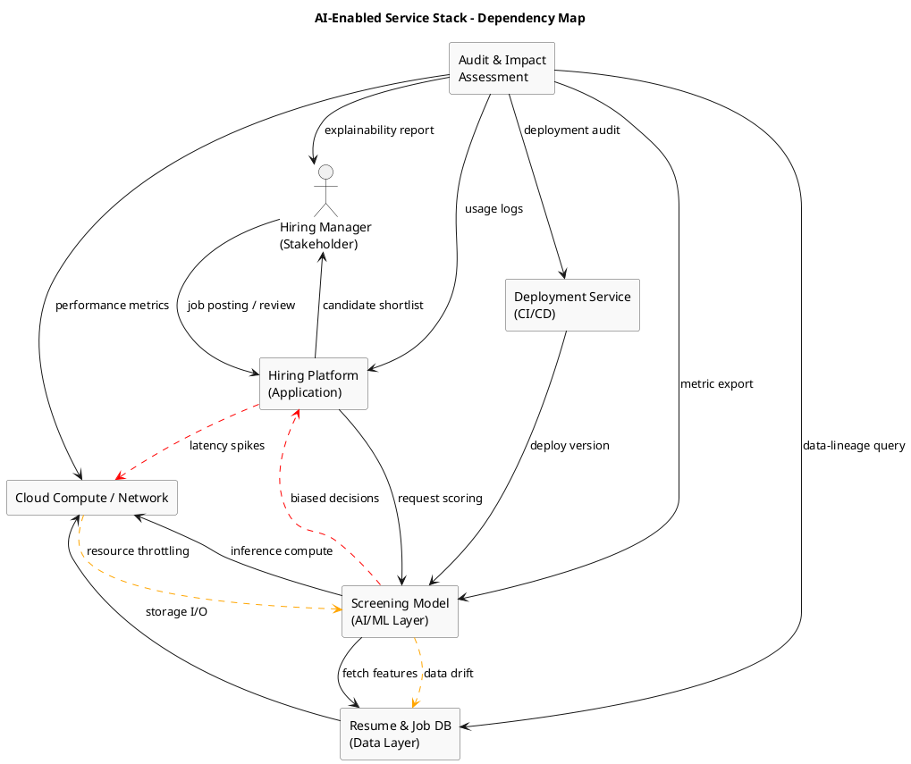

# Review: 1.6: Infrastructural Intelligence — Systems in Context

**Source:** part-i/ch01-intelligence-as-process/lecture-06.adoc

---

## Review of Lecture 1.6 – *Infrastructural Intelligence: Systems in Context*

### Summary & Grade
**Grade: C‑**  
The lecture contains a solid thematic core (AI as invisible infrastructure) and a useful dependency‑map diagram, but it falls short of the 90‑minute target in both **narrative momentum** and **word‑count density**. The opening vignette is a good hook, yet the subsequent sections quickly devolve into definition‑first exposition and a list‑like “Key Points” format. The material would struggle to sustain attention for a full class period without additional concrete cases, interactive moments, and a clearer story‑line that moves from problem → investigation → resolution.  

---

## 1. Narrative Arc  

| Element | What the lecture does | Verdict |
|--------|-----------------------|---------|
| **Hook** | Starts with a job‑application screening bot that instantly rejects the student. | ✅ Effective concrete scenario; raises immediate “who‑owns‑the‑decision?” tension. |
| **Development** | Moves into a broad definition of infrastructure, cites Latour, describes the historical shift from “feature” to “service”, then presents a technical manifest and a philosophical reflection. | ⚠️ The development is **fragmented**: each sub‑section feels like an isolated mini‑lecture rather than a single, unfolding argument. The logical bridge from “infrastructure is invisible” → “why does it matter now?” → “how do we make it legible?” is weak. |
| **Closing / Bridge** | Ends with a preview of the audit‑tool lab and a set of discussion prompts. | ✅ Gives a forward‑looking task, but the transition feels abrupt because the preceding material never built a clear “problem → solution” trajectory. |

**Overall narrative verdict:** *Hook is solid, development needs a tighter, step‑by‑step arc, and the closing should be tied back to the initial tension (“who is responsible when the bot rejects you?”).*

---

## 2. Density (Target ≈ 2 500‑3 500 words)

| Section | Approx. word count | Target range | Comments |
|---------|-------------------|--------------|----------|
| Conceptual Core | ~350 words | 4‑6 paragraphs, 6‑12 key points (≈ 800‑1 200 words) | Too short; only three paragraphs and six bullet points. |
| Technical Example | ~300 words | 2‑3 paragraphs, 5‑8 key points (≈ 600‑1 000 words) | Under‑developed; the manifest is shown but no walk‑through of each line or a concrete failure story. |
| Philosophical Reflection | ~250 words | 2‑3 paragraphs, 5‑8 key points (≈ 600‑1 000 words) | Lacks depth; mostly restates “invisible = power”. |
| **Total** | ~900 words | **2 500‑3 500** | **~ 1 600 words short**. The lecture would need roughly **double** the current content to fill a 90‑minute slot with time for discussion, Q&A, and the lab prep. |

---

## 3. Interest & Engagement  

| Issue | Why it hurts engagement | Suggested fix |
|-------|------------------------|--------------|
| **Definition‑first dump** (e.g., “Infrastructure is that which enables other activity”) | Students hear a textbook definition before seeing why they should care. | Start the conceptual core with a *real* incident (e.g., the 2018 Amazon hiring algorithm bias scandal) and let the definition emerge from the story. |
| **Sparse concrete examples** | The technical example stays at the level of a YAML manifest; no walkthrough of a real pipeline, no data‑drift detection demo. | Add a short case study: show a log line where model drift caused a 30 % drop in qualified candidates, then walk through how the manifest helps locate the failure. |
| **Lack of interactive moments** | The lecture lists “Discussion Prompts” only at the end, risking a long monologue. | Insert **mini‑polls** or **think‑pair‑share** after each major point (e.g., after “invisible until it breaks”, ask students to raise a hand if they’ve ever seen a “broken” AI service). |
| **Monotonous bullet‑point style** | Repeating “Key Points” after every section fragments the flow. | Replace most bullet lists with **short narrative paragraphs** that embed the points, reserving a single consolidated “Take‑aways” slide at the end. |
| **Missing forward‑looking tension** | The lab preview feels tacked on; students don’t see how today’s concepts will be used. | End the philosophical reflection by circling back to the opening vignette: “If the hiring bot had an audit trail, could you have appealed?” Then segue to the lab where they will build that audit. |

---

## 4. Diagram Review (PlantUML)

**Current diagram** shows four rectangles (APP, MODEL, DATA, COMP) with unidirectional arrows and a separate “Audit & Impact Assessment” box.  

| Observation | Recommendation |
|-------------|----------------|
| **Arrows lack labels for data flow vs. control flow** | Add labels such as *“request scoring”*, *“fetch features”*, *“store/retrieve”* (already present) but also *“feedback (latency)”, “drift signal”* on the dashed lines. |
| **Failure annotations are one‑way only** (e.g., APP → COMP latency spikes) | Make them **bidirectional** where appropriate (e.g., COMP ↔ APP: “resource saturation → delayed responses”). Use different colors for *performance* vs *bias* failures. |
| **Audit box is only outgoing arrows** | Show **bidirectional monitoring**: `AUDIT --> MODEL : log metrics`, `MODEL --> AUDIT : expose drift alerts`. This visualises the audit as an *active* component, not just a passive observer. |
| **No explicit “human” stakeholder** | Add a small “Stakeholder” actor (e.g., “Hiring Manager”) with a dashed line to APP and a feedback arrow from AUDIT to Stakeholder (e.g., “explainability report”). |
| **Layout** – rectangles are stacked horizontally; the diagram feels cramped. | Re‑arrange into a **layered stack** (Application → AI/ML → Data → Compute) with vertical spacing, and place the Audit box to the side with curved arrows, making the dependency hierarchy clearer. |
| **Missing versioning / deployment** | Add a small “Deployment Service” box feeding into MODEL to hint at the *pipeline* aspect discussed in the text. |

**Revised PlantUML sketch (conceptual):**

---

## 5. Recommended Revisions (Prioritized)

1. **Expand the narrative arc**  
   - Insert a **real‑world case study** (Amazon hiring bias, YouTube recommendation fallout, or a recent facial‑recognition error). Use it to *pose* the central question: “Who is accountable when the invisible AI makes a harmful decision?”  
   - Re‑structure the lecture into three **progressive acts**:  
     1. *Problem*: invisible AI failures (vignette + case study).  
     2. *Investigation*: mapping dependencies (conceptual core → technical manifest).  
     3. *Resolution*: legibility tools (audit, impact assessment) and the upcoming lab.  

2. **Increase word count to target**  
   - Add **2–3 paragraphs** of detailed explanation for each of the three main sections (≈ 800 words total).  
   - Flesh out the **technical example** with a step‑by‑step walkthrough of the YAML manifest, explaining each line and showing a *before/after* of a drift detection alert.  
   - Deepen the **philosophical reflection** with references to Latour’s “Instruments of the Self” and contemporary debates on “algorithmic sovereignty”.  

3. **Replace most bullet‑point “Key Points” with integrated prose**  
   - Keep a **single “Take‑aways”** list at the very end (5‑7 items).  
   - Within each section, embed the points in narrative sentences to improve flow.  

4. **Add interactive checkpoints**  
   - After the **Conceptual Core**, a **quick poll**: “Raise your hand if you’ve ever been blocked by an AI system without explanation.”  
   - After the **Technical Example**, a **pair‑share**: “Identify one hidden dependency in a service you use daily.”  
   - Use these to break up the lecture and keep students active.  

5. **Revise the diagram** (see PlantUML sketch).  
   - Implement the revised code, ensuring the figure is **clearly labeled**, **color‑coded**, and **includes the audit loop** and a stakeholder actor.  
   - Add a caption that explicitly ties the diagram to the “dependency manifest” discussed in the text.  

6. **Strengthen the lab bridge**  
   - In the “Lab Prep” paragraph, explicitly reference the opening vignette: “In the next lab you will build an audit that could have saved the applicant in our opening story.”  
   - Provide a **mini‑assignment**: students draft a one‑page “failure‑mode matrix” for the hiring platform before the lab.  

7. **Polish language & reduce redundancy**  
   - Remove repeated phrases (“invisible until it breaks”, “visibility is politicization”).  
   - Ensure each paragraph introduces a *new* idea or deepens the previous one.  

8. **Cite additional readings** (e.g., Pasquale 2015 *The Black Box Society*, Kroll 2017 *Accountability in Algorithmic Decision‑Making*) to give students concrete scholarly anchors for the philosophical part.  

---

### Quick Checklist for the Author

- [ ] Insert a concrete, recent case study (≈ 300 words).  
- [ ] Expand each major section to meet the word‑count target.  
- [ ] Convert bullet “Key Points” into narrative; keep only one consolidated take‑aways list.  
- [ ] Add at least two in‑class interaction moments.  
- [ ] Replace the current PlantUML block with the revised version (or a close variant).  
- [ ] Tighten the closing bridge to the lab, referencing the opening scenario.  
- [ ] Update the reading list with two additional scholarly sources.  

Implementing these changes will transform Lecture 1.6 from a collection of definitions into a **cohesive, story‑driven session** that can comfortably fill a 90‑minute class, keep students engaged, and lay a solid foundation for the upcoming audit‑tool lab.