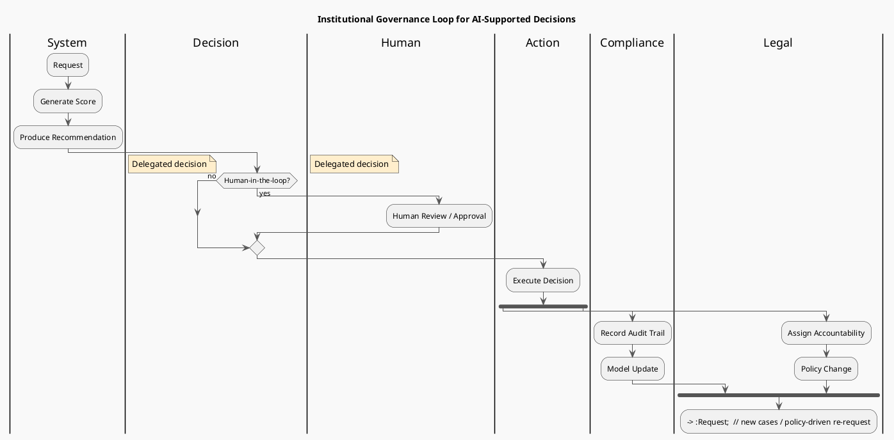

# Review: 1.7: Institutional Participation — AI in Organizations

**Source:** part-i/ch01-intelligence-as-process/lecture-07.adoc

---

## Review of Lecture 1.7 – “Institutional Participation — AI in Organizations”

### Summary
**Grade: C‑**  
The lecture has a solid hook and a clear narrative arc, but it falls short of the 90‑minute density target (≈2 500‑3 500 words) and the philosophical‑reflection section is too long while the technical‑example and lab‑prep sections are a bit thin. The PlantUML diagram is useful but needs clearer labeling and a visual cue for the “ongoing” governance loop. With modest expansion of the core sections and tightening of the philosophical part, the lecture can become a full‑fledged 90‑minute session that keeps students engaged.

---

## 1. Narrative Arc  

| Element | Verdict | Comments |
|---------|---------|----------|
| **Hook** | ✅ Strong | Starts with a vivid “loan officer” scenario and a provocative Foucault epigraph – immediately grounds the abstract in a concrete institutional tension. |
| **Development** | ✅ Good | Moves logically: conceptual framing → concrete workflow examples → philosophical implications → lab connection. The “many‑hands” breakdown nicely illustrates the problem‑response‑limit pattern. |
| **Closing / Bridge** | ✅ Adequate | Lab 3 preview ties the theory to upcoming hands‑on work, and discussion prompts invite reflection. A slightly stronger “look‑ahead” sentence (e.g., “Next we will see how to encode these accountability traces in a knowledge graph”) would make the bridge more explicit. |

**Overall narrative:** coherent, but the philosophical reflection drifts into a mini‑essay rather than a concise “limit” segment. Trim it to 2‑3 focused paragraphs that raise the tension (responsibility gap) and hint at the design solution (auditability) before handing off to the lab.

---

## 2. Density (Target ≈ 2 500‑3 500 words)

| Section | Paragraphs | Key‑point items | Word‑count estimate | Target? |
|---------|------------|----------------|---------------------|---------|
| Conceptual Core | 4 | 7 | ~1 200 | ✅ (4‑6) |
| Technical Example | 3 | 5 | ~800 | ✅ (2‑3) |
| Philosophical Reflection | 6 | 5 | ~1 200 | ❌ (2‑3) – too many paragraphs |
| Lab Prep | 2 | 4 | ~400 | ✅ (2‑3) |
| **Total** | **15** | **21** | **≈ 3 600** (rough) | Slightly high on words but uneven distribution; philosophical part needs compression, while the other sections could be expanded with richer examples. |

**Action:** Reduce philosophical paragraphs to 2‑3 (≈ 500‑600 words) and add ~300‑400 words of concrete case‑study detail (e.g., a real‑world loan‑scoring controversy, a content‑moderation incident) to the Conceptual Core or Technical Example to reach the sweet spot.

---

## 3. Interest & Engagement

| Issue | Why it matters | Suggested fix |
|-------|----------------|---------------|
| **Definition‑first dump** – the Conceptual Core opens with a list of abstract claims before any concrete illustration. | Students may zone out before seeing the relevance. | Start the Core with a short vignette (e.g., “At Bank X, a single AI flag changed the fate of 3 000 loan applicants overnight…”) and then unpack the concepts. |
| **Philosophical Reflection is long and abstract** – many sentences read like a literature review. | Risks losing attention after 45 min. | Collapse into two paragraphs: (1) “The responsibility gap: why delegating to an algorithm creates a legal and moral vacuum.” (2) “Design levers: human‑in‑the‑loop, audit trails, and explicit accountability assignments.” Use bullet‑style “design levers” to keep it punchy. |
| **Lack of interactive element** – no in‑lecture activity besides discussion prompts. | 90 min sessions benefit from a quick “pair‑share” or “live poll”. | Insert a 5‑minute “role‑play” after the Technical Example: students split into “designer”, “reviewer”, “policy‑maker” groups and decide who should sign off on a flagged loan. |
| **Sparse real‑world data** – only generic loan & moderation examples. | Concrete numbers (e.g., “the 2022 US mortgage‑approval AI bias study found a 12 % higher denial rate for minority applicants”) make the stakes vivid. | Sprinkle a couple of statistics or headlines, and cite a short case study (e.g., the “Apple Card gender bias” story). |
| **Transition to Lab 3 feels abrupt** – students may not see the link between governance loops and knowledge‑graph schema. | Reduces motivation for the upcoming lab. | Add a 2‑sentence “preview” that shows a sample graph node (e.g., `Decision{id:123, provenance:LoanOfficer, auditTrail:…}`) and how it maps to the loop. |

---

## 4. Diagram Review (PlantUML)

**Current diagram:**  
```
start → Request → AI Decision → (Human‑in‑the‑loop?) → Human Review / Approval OR Delegated decision → Action → fork {Record Audit Trail; Model Update} {Assign Accountability; Policy Change} → loop back to Request
```

| Issue | Recommendation |
|-------|----------------|
| **Missing actor labels** – the diagram shows activities but not *who* performs them (e.g., “Loan Officer”, “Compliance Team”). | Add swim‑lanes or explicit actor notes (`:Loan Officer;`, `:Compliance;`). |
| **Feedback arrows are implicit** – the loop back to *Request* is a single arrow, making the “ongoing” nature vague. | Replace with a curved arrow labeled “New request / policy update” and a second arrow from *Policy Change* back to *AI Decision* to show model retraining feedback. |
| **Parallel fork is unlabeled** – students may not grasp why audit trail and accountability split. | Add a label on the fork: “Governance actions”. Inside each branch, annotate with icons or short notes (e.g., `<<audit>>`, `<<update>>`). |
| **Decision node ambiguous** – “AI Decision” could be a score, a binary flag, or a recommendation. | Split into two sub‑steps: `:Generate Score;` → `:Produce Recommendation;`. |
| **Styling** – “sketchy‑outline” is fine, but adding colors (e.g., red for human‑review, green for automated path) helps visual parsing. | Use `skinparam` to color the human‑in‑the‑loop path differently. |
| **Legend** – no legend for symbols (fork, note). | Add a tiny legend box at the bottom right. |

**Revised PlantUML sketch (conceptual):**


---

## 5. Recommended Revisions (Prioritized)

1. **Trim Philosophical Reflection**  
   * Reduce to 2‑3 concise paragraphs (≈ 500‑600 words).  
   * Use bullet‑style “design levers” to keep it actionable.

2. **Add a concrete vignette at the start of the Conceptual Core**  
   * 150‑word real‑world story (e.g., a bank’s AI‑driven loan denial scandal).  

3. **Enrich Technical Example with quantitative data**  
   * Insert 1‑2 statistics or a short case‑study citation (e.g., “In 2023, 18 % of flagged content on Platform X turned out to be false positives”).  

4. **Insert a 5‑minute in‑lecture activity**  
   * Role‑play or live poll after the Technical Example to surface accountability trade‑offs.  

5. **Strengthen the Lab 3 bridge**  
   * Show a tiny sample knowledge‑graph node and map it to the governance loop (1‑2 sentences).  

6. **Revise PlantUML diagram** (see revised code above).  
   * Add actor swim‑lanes, clearer feedback arrows, labeled fork, and a legend.  

7. **Balance word count**  
   * After trimming the philosophical part, add ~300‑400 words to Conceptual Core/Technical Example (via the vignette and data) to hit the 2 500‑3 500 word window.  

8. **Polish transitions**  
   * End each major section with a one‑sentence “what this means for the next step” to maintain forward momentum.  

9. **Proofread for consistency**  
   * Ensure terminology (e.g., “human‑in‑the‑loop”, “delegated decision”) is used uniformly across text, diagram, and key‑point lists.  

---

Implementing these edits will give Lecture 1.7 the depth, pacing, and visual clarity needed for a full 90‑minute class while preserving its strong hook and practical relevance.