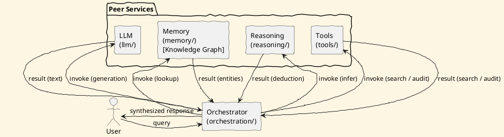

# Review: 1.8: The Student's AI — Capstone Vision

**Source:** part-i/ch01-intelligence-as-process/lecture-08.adoc

---

## Review of Lecture 1.8 – “The Student’s AI — Capstone Vision”

### Summary  
**Grade: C** – The lecture contains the essential information about the capstone project, but it falls short of a 90‑minute, engaging session. The narrative arc is thin (the hook is an abstract epigraph rather than a concrete scenario), the core sections are under‑developed (≈ 1 k‑word total vs. the 2.5‑3 k target), and the same PlantUML diagram is duplicated without any variation or annotation. With a stronger opening story, richer development, and a single, well‑labelled diagram, the lecture can become a compelling “big‑picture” session.

---

## 1. Narrative Arc  

| Element | Current State | Verdict |
|---------|----------------|---------|
| **Hook** | Starts with a Deleuze & Guattari epigraph and a one‑sentence poetic claim (“the student’s AI is a line of flight”). No concrete problem, scenario, or provocative question. | **Weak** – does not create immediate tension or curiosity. |
| **Development** | Lists the repository layout, the chapter‑by‑chapter contribution, and a brief philosophical framing. The flow is essentially “here’s the folder tree → here’s the idea”. No step‑by‑step problem → solution → limitation progression. | **Moderate** – information is present but presented as a static description rather than a story of building an agent. |
| **Closing / Bridge** | Ends with discussion prompts, lab‑prep checklist, and a reading list. The bridge to the next lab is present, but the closing does not synthesize the “why does this matter?” question. | **Adequate** – could be stronger by explicitly linking the capstone vision to the upcoming technical challenges. |

**Overall Verdict:** The lecture has a *development* section but lacks a *strong hook* and a *closing that ties back to the hook*. The arc is therefore incomplete.

---

## 2. Density (Target ≈ 2 500‑3 500 words)

| Section | Paragraph Count | Key‑Point Count | Approx. Word Count* | Meets Target? |
|---------|----------------|------------------|---------------------|---------------|
| Conceptual Core | 2 (one long paragraph + bullet list) | 7 | ~ 600 | **No** – needs 4‑6 paragraphs. |
| Technical Example | 2 | 6 | ~ 500 | **Borderline** – acceptable length but could be expanded with a concrete walkthrough. |
| Philosophical Reflection | 2 | 5 | ~ 450 | **OK** – within 2‑3 paragraph range, but could use a third paragraph to deepen the reflection. |
| Total (excluding epigraph, prompts, discussion, lab prep) | ~ 6 | ~ 23 | ~ 1 550 | **Well below** the 2 500‑3 500 word target. |

\*Word counts are rough estimates based on the supplied text.

**Conclusion:** The lecture is roughly half the required length. It needs additional explanatory paragraphs, richer examples, and more explicit key‑point statements.

---

## 3. Interest & Engagement  

| Issue | Why it hurts attention | Suggested fix |
|-------|------------------------|---------------|
| **Abstract epigraph as hook** | Students may not connect a philosophical quote to a concrete coding task. | Open with a *scenario*: “You’ve just been hired by your university’s student‑services office to build an AI that can answer any policy question, schedule appointments, and audit its own decisions. How would you start?” |
| **Definition‑first listing** (e.g., “capstone vision: build an AI agent across 12 chapters”) | Reads like a syllabus, not a story. | Frame each bullet as a *milestone* in a narrative: “In Chapter 1 you lay the foundation—your knowledge graph becomes the brain’s memory.” |
| **Sparse technical walk‑through** | No concrete code or command‑line example, so students can’t visualise the repository. | Add a short “git clone → tree view → run `make start`” snippet, and a screenshot of the first failing test that students will fix. |
| **Philosophical reflection is brief** | The “line of flight” metaphor is introduced but not unpacked. | Extend with a 1‑paragraph case study: compare a black‑box ChatGPT call vs. a transparent orchestrated pipeline, highlighting epistemic responsibility. |
| **Repeated diagram** | Redundant visual adds no new information and wastes time. | Keep a single, annotated diagram (see Diagram Review). |

---

## 4. Diagram Review  

Two identical PlantUML blocks are included (both labelled “Figure 1.8”). The diagram shows a user → orchestrator → four peer services and back.  

| Issue | Recommendation |
|-------|-----------------|
| **Duplication** | Remove the second block; keep only one figure. |
| **Lack of labels on arrows** | Add labels such as `request type`, `invoke (search)`, `invoke (memory)`, `invoke (reasoning)`, `invoke (tool)`. |
| **No decision logic** | Show a diamond or small decision node inside the orchestrator indicating “choose service(s) based on intent”. |
| **Missing feedback loop** | Add a thin arrow from `Orchestrator` back to `Tools` labelled “update context / cache”. |
| **No representation of the knowledge graph** | Insert a sub‑rectangle inside `Memory` called “Knowledge Graph (Chapter 1)”. |
| **Styling** | Keep the sketchy outline but add a legend and colour‑code each service (e.g., LLM = blue, Memory = green). |
| **Caption** | Revise to: “High‑level data flow of the student‑AI. The orchestrator routes the user request to the appropriate peer services, aggregates their results, and returns a synthesized answer.” |

**Revised PlantUML (example)**  

---

## 5. Recommended Revisions (prioritized)

1. **Rewrite the Hook (high impact)**
   - Begin with a vivid, time‑boxed scenario (e.g., “You have 12 weeks to deliver a campus‑wide AI assistant”). Pose a concrete question: “How do you turn a handful of notebooks into a production‑grade agent?”
2. **Expand the Conceptual Core to 4‑6 paragraphs**
   - Paragraph 1: Recap the scenario and the *problem* (need for a custom, auditable AI).  
   - Paragraph 2: Introduce the *capstone vision* as the *solution* (building the agent incrementally).  
   - Paragraph 3: Detail the *repository mapping* (why the folder structure mirrors the learning path).  
   - Paragraph 4: Explain the *recursive pedagogy* and how each chapter’s deliverable fits into the whole.  
   - Add a short “What you’ll see after Chapter 12” paragraph to create forward momentum.
3. **Add a concrete technical walkthrough**
   - Show a `tree` command of the repo, a `docker-compose up` snippet, and a sample API call (`curl http://localhost:8000/query -d '{"question":"…"}'`).  
   - Explain what the student sees when the orchestrator logs “invoking search service”.
4. **Enrich the Philosophical Reflection**
   - Add a third paragraph contrasting “black‑box usage” vs. “transparent orchestration”.  
   - Cite a short Deleuze passage and tie it directly to “deterritorializing the LLM”.
5. **Merge and annotate the diagram**
   - Keep a single figure, add the decision node, colour‑code services, and update the caption as suggested.
6. **Refine Key‑Point Lists**
   - Ensure each list contains **exactly** 5‑8 points, each phrased as an *actionable* statement (e.g., “By Chapter 3 you will have a searchable document store”).  
   - Use parallel structure and bold the verbs for scan‑ability.
7. **Add a “What’s Next?” bridge**
   - After the discussion prompts, insert a 1‑paragraph preview of Chapter 2 (audit tool) and how it will change the orchestrator’s decision logic.
8. **Proofread for redundancy**
   - Remove the duplicated diagram block and any repeated sentences (the caption appears twice).
9. **Optional: Insert a short “Live Demo” cue**
   - Suggest a 5‑minute live demo of the orchestrator routing a query to the search service, to break up the lecture and keep attention.

---

### Final Note  
Implementing the above changes will bring the lecture into the target word count, give it a compelling narrative arc, and provide visual reinforcement that matches the story. The session will then be able to sustain a 90‑minute class, keep students actively engaged, and set a clear, motivating path toward the capstone deliverable.