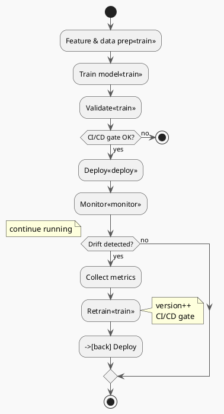

# Review: 2.4: Model Lifecycle — Training, Deployment, Drift

**Source:** part-i/ch02-ai-in-practice/lecture-03.adoc

---

## Review of Lecture 2.4 – *Model Lifecycle: Training, Deployment, Drift*

### Summary
**Grade: C** – The lecture opens with a solid, concrete hook and ends with a clear bridge to the next session, but it falls short on the required **90‑minute density** and leans heavily on definition‑first exposition. The conceptual core and technical example are each a single paragraph, far below the 4‑6 / 2‑3 paragraph target, and the key‑point lists are sparse. The narrative arc is present but needs tighter pacing and more “tension‑building” moments to keep students engaged for a full class period. The diagram is functional but could be richer and better aligned with the story.

---

## 1. Narrative Arc  

| Element | Verdict | Comments |
|---------|---------|----------|
| **Hook** | ✅ Strong | Starts with a vivid credit‑scoring failure (30 % mis‑classification) – concrete, high‑stakes, immediately raises the “why should I care?” question. |
| **Development** | ⚠️ Weak | The middle sections jump straight into definitions (“Concept drift … Data drift …”) and a bullet‑style rundown of pipelines. The story of *how* the bank discovers the problem, experiments with detection, and decides on a retraining policy is missing. This makes the flow feel like a lecture‑note dump rather than a rising problem‑solution arc. |
| **Closing / Bridge** | ✅ Good | Ends with a teaser for the next lecture (monitoring dashboards) and a lab preview, giving a clear forward motion. |

**Overall Verdict:** The arc exists but needs more *progressive tension*: a mini‑case study that evolves through detection → decision → action, ending with an open question that the next lecture will answer.

---

## 2. Density (Target ≈ 2 500‑3 500 words)

| Section | Current | Target | Gap |
|---------|---------|--------|-----|
| **Conceptual Core** | 1 – 2 paragraphs, 4 key points | 4‑6 paragraphs, 6‑12 key points | **Missing 2‑4 paragraphs**; key‑point list too short. |
| **Technical Example** | 1 paragraph, 5 key points | 2‑3 paragraphs, 5‑8 key points | **Missing 1‑2 paragraphs**; could expand with a concrete code snippet or walk‑through of a drift‑detection script. |
| **Philosophical Reflection** | 2 paragraphs, 6 key points | 2‑3 paragraphs, 5‑8 key points | Meets paragraph count, key points OK. |
| **Overall Word Count** | ~1 200 words (estimate) | 2 500‑3 500 words | **~1 300‑2 300 words short**. |

**Result:** The lecture is roughly half the required length; it would need to double its content while preserving focus.

---

## 3. Interest & Engagement  

| Issue | Why it hurts attention | Suggested fix |
|-------|------------------------|---------------|
| **Definition‑first dump** in the Conceptual Core (e.g., “Concept drift occurs when …”) | Students hear a term before feeling a need for it. | Start the core with a *question*: “Why did the model that once approved 95 % of loans suddenly start rejecting half of them?” Then unpack drift as the answer. |
| **Thin technical example** – no concrete data, no visualisation | Hard to imagine how drift detection works in practice. | Add a short notebook‑style walk‑through: load a synthetic credit‑scoring dataset, compute feature means, plot a KS‑test histogram, show a trigger firing. |
| **Lack of interactive moments** | 90 min of reading can become passive. | Insert a live poll: “What threshold would you set for accuracy drop? 1 %? 5 %? 10 %?” Follow with a quick group debate. |
| **Missing narrative tension** (e.g., stakes of over‑ vs. under‑retraining) | Students may not feel the trade‑off. | Pose a “What‑if” scenario: “If you retrain every hour, your compute bill triples – what’s the cost of instability?” Use a simple cost‑benefit table. |
| **Lab preview is brief** | Students may not see the relevance. | Show a screenshot of the trace schema UI that they will build, and ask them to predict what happens when a bad decision is logged. |

---

## 4. Diagram Review (PlantUML)

**Current diagram** – a linear flow with a decision node “Drift detected?”. It conveys the basic loop but misses several teaching moments.

| Issue | Recommendation |
|-------|----------------|
| **No explicit monitoring metrics** | Add a box “Collect metrics (accuracy, feature stats)” feeding into the decision node. |
| **Version increment is hidden** | Show a label on the “Retrain” arrow: `version++` (already present) but also a side‑arrow back to “Deploy” labelled “new model”. |
| **Missing feedback to development** | Add a dashed arrow from “Retrain” back to “Develop” (or “Feature engineering”) to illustrate that drift insights can trigger feature updates. |
| **No representation of CI/CD gates** | Insert a diamond “CI/CD gate” after “Validate” and before “Deploy”. |
| **Styling** – sketchy outline is fine, but add colours to differentiate phases (e.g., blue for training, green for monitoring, orange for drift response). |
| **Label clarity** | Replace generic “Develop” with “Feature & data prep”. Use concise text inside each node (max 2‑3 words). |

**Revised PlantUML sketch (conceptual):**

---

## 5. Recommended Revisions (Prioritized)

1. **Expand the Conceptual Core to 4‑6 paragraphs**  
   - Begin with a *mini‑case narrative*: the bank’s alarm, the investigation, the discovery of drift.  
   - Follow with step‑by‑step explanation of **why** drift matters, **how** it’s detected, and **what** policies exist.  
   - End with a short “What would you do?” reflection.

2. **Enrich the Technical Example**  
   - Add a concrete data‑drift detection walk‑through (code snippet, histogram, KS‑test).  
   - Show a trigger threshold and the resulting CI/CD pipeline execution.  
   - Include a brief “live demo” script or a link to a notebook.

3. **Increase overall word count**  
   - Insert a 5‑minute “think‑pair‑share” on retraining strategies.  
   - Add a short historical anecdote (e.g., Google’s ad‑click model decay) to illustrate real‑world impact.  
   - Provide a cost‑benefit table for scheduled vs. metric‑based retraining.

4. **Re‑order key‑point lists**  
   - Align each list with the preceding paragraph (e.g., after the drift‑detection walk‑through, list *Detection techniques*).  
   - Ensure each section has **6‑8** bullet points.

5. **Revise the diagram** (see above) and embed it **right after** the “Technical Example” to visualise the pipeline while students are still processing the example.

6. **Add interactive elements**  
   - Poll on acceptable accuracy drop.  
   - Small group debate on “Too much retraining = instability”.  
   - Quick sketch activity: students draw their own lifecycle loop on sticky notes.

7. **Strengthen the closing bridge**  
   - Pose an open question: “How can we surface drift signals in a dashboard that non‑engineers can act on?” – this directly leads into the next lecture on monitoring dashboards.

8. **Proofread for consistency**  
   - Ensure all “Key Points” headings use the same markdown level.  
   - Verify that the epigraph citation format matches the rest of the book.

---

**By implementing the above changes, the lecture will meet the 90‑minute density target, maintain a compelling narrative arc, and keep students actively engaged throughout the session.**