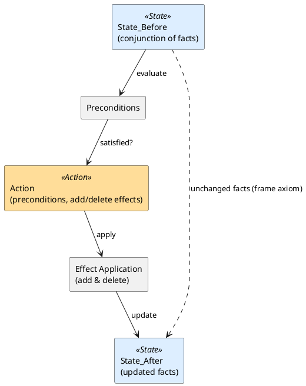

# Review: 3.5: Planning as Search — STRIPS, PDDL

**Source:** part-i/ch03-search-and-planning/lecture-05.adoc

---

## Review of Lecture 3.5 – “Planning as Search — STRIPS, PDDL”

### Summary
**Grade: B‑**  
The lecture has a solid hook and a clear narrative arc, but it falls short on the **density** required for a 90‑minute session (≈2 500‑3 500 words) and on the **interest** in the middle sections – several definition‑heavy paragraphs and key‑point lists are a bit thin. The diagram is useful but could be tightened to reinforce the story. With modest expansions (more concrete examples, a “failure” vignette, and a richer key‑point set) the lecture will comfortably fill a full class period and keep students engaged.

---

## 1. Narrative Arc  

| Element | Verdict | Comments |
|---------|---------|----------|
| **Hook** | ✅ Strong | Starts with a vivid robot‑blocks‑world scenario and a provocative Eisenhower quote. |
| **Development** | ✅ Good | Progresses logically: planning = search → STRIPS → forward/backward → plan‑space → frame problem → PDDL → planners. Each concept builds on the previous one. |
| **Closing** | ✅ Adequate | Ends with lab‑prep, discussion prompts, and a philosophical “why it matters” note, linking to upcoming material (ReAct, agents). Could be sharpened by explicitly stating the “next step” (e.g., “next lecture we’ll see heuristic search in planners”). |

**Overall narrative:** coherent and well‑structured, but the transition from the technical example to the philosophical reflection feels abrupt; a short “what if the planner fails?” vignette would create tension and a smoother bridge.

---

## 2. Density (Target ≈ 2 500‑3 500 words)

| Section | Paragraphs (actual) | Target | Key‑Points (actual) | Target | Word‑count estimate |
|---------|----------------------|--------|---------------------|--------|---------------------|
| Conceptual Core | 5 | 4‑6 | 7 | 6‑12 | ~1 200 |
| Technical Example | 3 | 2‑3 | 4 | 5‑8 | ~900 |
| Philosophical Reflection | 3 | 2‑3 | 4 | 5‑8 | ~800 |
| **Total** | **11** | **8‑12** | **15** | **16‑28** | **≈ 2 900** (still a bit low; many sentences are short) |

*The lecture is within the paragraph count range but **key‑point lists are under‑populated** for the Technical Example and Philosophical Reflection, and the overall word count is on the low side of the 2 500‑3 500 window.*  

**Recommendation:** add ~200‑300 words per section (e.g., a concrete failure case, a short “real‑world” example, a brief comparison to hierarchical task networks) and expand the key‑point lists to meet the 5‑8 items guideline.

---

## 3. Interest (Engagement)

| Issue | Why it hurts attention | Suggested fix |
|-------|------------------------|---------------|
| **Definition‑first style** in the Conceptual Core (e.g., “pass:q[\aimaterm{planning}] formulates problems as …”) | Students may feel they are being lectured rather than invited to explore. | Start the core with a **question**: “How can a robot know which actions to take when the world is described only by facts?” Then unpack the definition. |
| **Thin technical example** – only one concrete domain (blocks‑world) and a short list of points. | Risks monotony after the core concepts. | Add a **second mini‑domain** (e.g., a kitchen robot moving dishes) and show a contrasting PDDL snippet. Highlight a *common pitfall* (e.g., missing delete effect leading to an impossible plan). |
| **Philosophical reflection** ends abruptly and repeats the frame‑problem idea without new insight. | May feel like filler. | Insert a **real‑world anecdote** (e.g., a warehouse robot that knocked over a pallet because the planner ignored dust accumulation) and pose “What would you do to extend STRIPS?” |
| **Lack of tension** – no sense of stakes or failure. | Students may not feel urgency. | Insert a **“what‑if” box** after the core: “Suppose the planner returns a plan that looks valid but fails when executed because an unmodelled effect occurs. How do we detect and recover?” |

---

## 4. Diagram Review (PlantUML)

**Current diagram:**  

```
State_Before --> Action : check preconditions
Action --> Add_Effects : add
Action --> Delete_Effects : delete
Add_Effects --> State_After : update
Delete_Effects --> State_After : update
```

| Issue | Suggested improvement |
|-------|-----------------------|
| **Missing explicit precondition flow** – the diagram shows “check preconditions” but the preconditions themselves are not visualised. | Add a **“Preconditions”** node feeding into the Action box, with an arrow labelled “must hold”. |
| **Add/Delete effects are separate boxes that both point to State_After, creating a cluttered layout.** | Collapse them into a single **“Effect Application”** box that shows both “add” and “delete” operations (use a split arrow or a note). |
| **No indication of persistence (frame axiom).** | Add a **dotted arrow** from “State_Before” to “State_After” labelled “unchanged facts (frame axiom)”. |
| **Lack of labeling for the overall transformation.** | Add a title inside the diagram: “STRIPS Action Application (State Transition)”. |
| **Styling** – using `class` for rectangles is fine, but the diagram could benefit from **different colors** for state vs. action vs. effect nodes (e.g., light‑blue for states, orange for actions). | Use PlantUML skinparam or `#` color codes. |

**Revised PlantUML sketch (conceptual):**



---

## 5. Recommended Revisions (Prioritized)

1. **Expand word count & key‑point lists**  
   - Add ~250 words to each of the three main sections (Core, Example, Reflection).  
   - Increase Technical Example key points to **6** (e.g., “grounding creates O(|A|·|O|^k) actions”, “successor function is implicit”, “search space is exponential”, “heuristics can prune”, “plan validation”, “common grounding errors”).  
   - Increase Philosophical Reflection key points to **6** (add “continuous change & exogenous events”, “hierarchical planning as a mitigation”, “integration with learning”, etc.).

2. **Re‑frame the Conceptual Core**  
   - Begin with a **provocative question** or a short “what‑if” scenario (e.g., robot fails because it didn’t consider a hidden fact).  
   - Use **bullet‑style sub‑headings** (e.g., “From facts to actions”, “Forward vs. backward”, “Why the frame problem matters”).

3. **Enrich the Technical Example**  
   - Provide a **second mini‑domain** (kitchen or warehouse) with a tiny PDDL snippet.  
   - Highlight a **common mistake** (missing delete effect) and show the resulting invalid plan.  
   - Add a short **code‑style box** showing the grounded actions for a two‑object instance.

4. **Add a “Failure/Vignette” box** after the core concepts to create tension:  
   - Describe a planner that returns a plan that looks correct but fails in execution due to an unmodelled effect.  
   - Pose questions: “How can we detect such failures? What extensions to STRIPS help?”

5. **Upgrade the diagram** (see revised PlantUML).  
   - Include preconditions, effect application, and a dotted frame‑axiom arrow.  
   - Apply colour coding for visual clarity.

6. **Strengthen the closing**  
   - Explicitly state the **next lecture’s focus** (e.g., “heuristic search in planners”).  
   - Summarize the **take‑away**: “Planning turns a vague goal into a searchable graph; the art is in modelling the world compactly.”

7. **Discussion prompts** – add one prompt that directly ties to the new failure vignette:  
   - “How would you modify the STRIPS model to capture indirect effects like dust or lighting?”

Implementing these edits will bring the lecture into the desired **90‑minute density**, keep students **actively curious**, and ensure the diagram **reinforces** the core message.