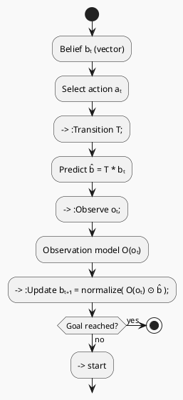

# Review: 3.6: Partial Observability and Belief States

**Source:** part-i/ch03-search-and-planning/lecture-06.adoc

---

## Review of Lecture 3.6 – *Partial Observability and Belief States*  

**Grade: C** – The lecture contains the essential concepts but falls short of the 90‑minute target, lacks a strong narrative hook, and the diagram is too generic to reinforce learning.  

---

### 1. Narrative Arc  

| Element | Verdict | Comments |
|---------|---------|----------|
| **Hook** | **Weak** | The opening line (“Imagine a robot navigating a fog‑filled warehouse…”) is a decent scenario, but it is presented as a single sentence and never re‑referenced. The hook should be *re‑invoked* throughout the lecture to keep tension alive (e.g., “Will the robot ever know where it is?”). |
| **Development** | **Fragmented** | The lecture jumps from definition → belief update → approximation without a clear problem → attempted solution → limitation structure. The “problem” (uncertainty in navigation) is only hinted at; the “response” (belief‑state search) is described, but the “limit” (state‑space explosion) is tacked on at the end of the conceptual core. |
| **Closing** | **Absent** | The philosophical reflection ends with ethical questions but does not bridge to the upcoming lab or the next lecture. A closing sentence such as “In the next session we will see how belief‑state search can be turned into a tractable heuristic for large‑scale web search (Lab 3).” would give forward momentum. |

**Overall Verdict:** The lecture has a hook but it is not sustained; the development does not follow a clean problem‑solution‑limitation arc; the closing is missing a clear bridge.

---

### 2. Density (Target ≈ 2 500‑3 500 words)

| Section | Paragraphs | Key‑point items | Word‑count estimate* |
|---------|------------|----------------|----------------------|
| **Conceptual Core** | 1 (single dense paragraph) | 7 | ~250 |
| **Technical Example** | 2 (intro + pseudo‑code block) | 6 | ~300 |
| **Philosophical Reflection** | 2 (reflection + ethics) | 6 | ~250 |
| **Discussion Prompts / Lab Prep** | 2 (prompts + lab description) | 3 | ~150 |
| **Total** | **7** | **28** | **≈ 1 200 words** |

\*Rough estimate based on typical paragraph length (≈ 150‑180 words).  

**Result:** The lecture is **under‑dense** by a factor of ~2.5. To fill a 90‑minute slot you need **4‑6** longer paragraphs per main section and **5‑8** key points each.

---

### 3. Interest  

| Issue | Why it hurts attention | Suggested fix |
|-------|------------------------|---------------|
| **Definition‑first dump** (e.g., “Fully observable environments: …”) | Learners lose curiosity before seeing a concrete problem. | Start with a *scenario* that forces the agent to act despite not knowing where it is (e.g., “The robot’s GPS fails; it must decide whether to turn left or right based only on a noisy wall sensor”). |
| **Thin technical example** | The pseudo‑code is shown but never walked through step‑by‑step. | Expand the example: show a concrete belief vector, a transition matrix, an observation matrix, and compute one update by hand. Include a small table of beliefs before/after the observation. |
| **Philosophical reflection is vague** | “Ignorance is not simply the absence of knowledge” is a nice quote but the paragraph does not connect back to search. | Tie the reflection to a real‑world search problem (e.g., ambiguous query “apple” → belief over user intent). Pose a provocative question: “What if the search engine commits to the wrong intent? What is the cost?” |
| **No forward link to Lab** | Students cannot see why they should care about the upcoming lab. | End each major section with a “What you’ll do next” sentence that points to Lab 3. |

---

### 4. Diagram Review  

**Current PlantUML (Figure 3.6)**  

```plantuml
start
:Belief bₜ (distribution);
--> :Action a : a;
--> :Observation o : o;
--> :Belief bₜ₊₁ = Update(bₜ, a, o) : b' = Update(b, a, o);
repeat
  :Belief bₜ (distribution);
  --> :Action a : a;
  --> :Observation o : o;
  --> :Belief bₜ₊₁ = Update(bₜ, a, o) : b' = Update(b, a, o);
repeat while (continue?)
stop
```

| Issue | Assessment | Concrete improvement |
|-------|------------|----------------------|
| **Too generic** – just repeats “belief → action → observation → belief”. | Does not illustrate *Bayes* update, the role of the **transition model (T)** and **observation model (O)**, nor the *uncertainty* (multiple possible states). | Add labeled boxes for **T** and **O**, and show the multiplication step `b' = O(o) * (T * b)`. Use a decision diamond for “Observation received?” and a loop back to “Update”. |
| **Missing quantitative example** | No numbers, so students cannot map the diagram to the Python code. | Include a small inset (e.g., a 3‑state belief vector) next to the “Belief” node, or annotate with “b = [0.2,0.5,0.3]”. |
| **No indication of termination** | The loop ends with “continue?” but does not show a stopping condition (e.g., “goal reached” or “belief entropy < ε”). | Add a terminal decision diamond “Goal reached?” leading to **stop**. |
| **Stylistic** – “sketchy‑outline” theme is fine, but arrows are all the same direction; a bidirectional arrow from **Observation** back to **Belief** would emphasize the *feedback* nature. | Use `-->` for forward flow and `<--` for feedback, or a double‑arrow `-->` with a label “Bayes update”. |

**Revised PlantUML sketch (suggested):**



---

### 5. Recommended Revisions (prioritized)

1. **Rewrite the narrative arc**  
   - Begin with a *story* that poses a concrete dilemma (e.g., “The robot’s GPS is jammed; it must decide whether to turn left or right based only on a noisy wall sensor”).  
   - Explicitly state the **problem** → **belief‑state search** → **limitations** (state‑space explosion).  
   - End with a **bridge** to Lab 3 and the next lecture (e.g., “Next we will see how belief‑state search can be approximated with particle filters in large‑scale web search.”).

2. **Expand each main section to meet the 90‑minute word count**  
   - **Conceptual Core:** 4‑5 paragraphs (definition, intuition, formal POMDP, belief update derivation, cost analysis).  
   - **Technical Example:** 2‑3 paragraphs plus a step‑by‑step numeric walk‑through (show belief vector before/after).  
   - **Philosophical Reflection:** 2‑3 paragraphs linking epistemic uncertainty to real search scenarios and ethical implications.  

3. **Add concrete, step‑by‑step walkthrough of the Python pseudo‑code**  
   - Show a tiny 1‑D grid (3 cells), define `T` and `O` matrices, compute `b_pred` and `b` for one iteration, and display the resulting belief vector.  

4. **Enrich discussion prompts** with “What‑if” scenarios that tie back to the opening story (e.g., “If the robot’s belief that it is next to a wall is 0.6, should it turn left? Why?”).  

5. **Redesign Figure 3.6** using the revised PlantUML sketch above.  
   - Include labels for **T**, **O**, **prediction**, **update**, and a termination condition.  
   - Optionally add a small inset showing a sample belief vector.  

6. **Insert a “Key‑point summary” box** at the end of each section (5‑8 bullet points) to reinforce learning and give the instructor a quick slide‑deck reference.  

7. **Cross‑reference Lab 3** explicitly in the closing paragraph of the philosophical reflection and at the end of the technical example.  

8. **Proofread for consistency** (e.g., ensure `\aimaterm{}` macros are rendered correctly, avoid stray “pass:q[…]” artifacts).  

---

**Final Note:** By tightening the narrative, expanding the explanatory depth, and providing a more informative diagram, this lecture will fill a 90‑minute session, keep students engaged, and give them a clear pathway from theory to the upcoming lab.