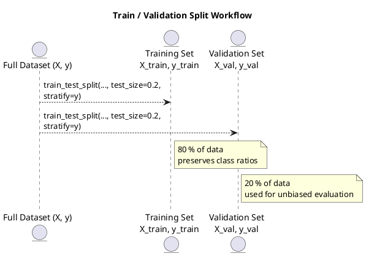

# Review: python
from sklearn.model_selection import train_test_split
X_train, X_val, y_train, y_val = train_test_split(
    X, y, test_size=0.2, stratify=y if is_classification else None, random_state=42)

**Source:** part-ii/ch04-learning-from-data/lecture-01.adoc

---

## Review of Lecture “python” (part‑ii/ch04‑learning‑from‑data/lecture‑01.adoc)

### Summary  
**Grade: D** – The lecture consists of a single two‑line code snippet with no narrative, no conceptual framing, and no supporting material. It fails the 90‑minute density target, offers no hook or arc, and provides no visual aids. As written it would occupy a few seconds of class time, not a full session.

---

## 1. Narrative Arc  

| Element | Verdict | Comments |
|---------|---------|----------|
| **Hook** | ❌ Missing | There is no concrete scenario, provocative question, or tension to capture attention. |
| **Development** | ❌ Missing | No problem statement, no step‑by‑step reasoning, no discussion of why train/validation splits matter, no alternatives, no pitfalls. |
| **Closing / Bridge** | ❌ Missing | No implication for downstream modeling, no segue to a lab, no preview of the next topic (e.g., model evaluation, cross‑validation). |

**Overall:** No narrative arc at all. The lecture reads like a “definition‑first dump” (in fact, a code‑first dump) with no story.

---

## 2. Density  

| Section | Expected (90 min) | Actual | Gap |
|---------|-------------------|--------|-----|
| Conceptual Core | 4‑6 paragraphs, 6‑12 key points, ~1 200‑1 800 words | **0** | Entirely absent |
| Technical Example | 2‑3 paragraphs, 5‑8 key points, ~600‑900 words | **1** short code block, no explanation | Missing context, no walkthrough |
| Philosophical Reflection | 2‑3 paragraphs, 5‑8 key points, ~600‑900 words | **0** | No reflection on data ethics, bias, or the epistemology of splitting data |

**Total word count:** ≈ 10 words. The target is 2 500‑3 500 words. The lecture is off by > 99 %.

---

## 3. Interest  

- **Engagement:** A lone `train_test_split` line cannot sustain attention for 90 minutes.  
- **Thin/Vague:** No explanation of *why* we split data, what “stratify” does, or how the random seed influences reproducibility.  
- **Definition‑first:** The code appears before any definition of the concepts (training set, validation set, stratification).  

**Concrete ways to add interest:**  
1. **Hook:** Open with a real‑world dilemma (“You have 10 000 medical records and need to estimate how well a diagnostic model will perform on future patients. How do you avoid overly optimistic results?”).  
2. **Narrative tension:** Pose the question “What happens if we forget to stratify on a highly imbalanced disease label?” and promise to demonstrate the consequences.  
3. **Step‑by‑step walk‑through:** Show the data, explain the parameters, run the split, then compute class distributions before/after to illustrate stratification.  
4. **Lab bridge:** End with a hands‑on exercise where students experiment with different `test_size` and `random_state` values and observe variance in performance metrics.  

---

## 4. Diagram Review  

There are **no PlantUML blocks** in the current lecture, so no diagram to evaluate. A visual representation of the data‑splitting process would be highly beneficial.

**Suggested diagram:**  

*Improvements:* label arrows with the split parameters, add a note on reproducibility (random_state), and optionally a feedback loop showing how the validation results inform hyper‑parameter tuning.

---

## 5. Recommended Revisions (Prioritized)

1. **Create a full narrative** (hook → problem → solution → implications).  
   - Start with a concrete, domain‑specific scenario that motivates data splitting.  
   - Pose a provocative question about model evaluation bias.

2. **Expand the conceptual core** (≈ 4‑6 paragraphs).  
   - Define training, validation, and test sets.  
   - Explain why stratification matters for classification, especially with imbalanced classes.  
   - Discuss reproducibility (random_state) and the trade‑off of test‑size choices.

3. **Develop the technical example** (≈ 2‑3 paragraphs).  
   - Show a small toy dataset (e.g., a pandas DataFrame).  
   - Walk through the `train_test_split` call line‑by‑line, printing shapes and class distributions before/after.  
   - Highlight common pitfalls (no stratify, leakage, using validation as test).

4. **Add a philosophical reflection** (≈ 2‑3 paragraphs).  
   - Question the epistemic assumptions behind a single split (does it capture population variance?).  
   - Briefly introduce alternatives (k‑fold cross‑validation, nested CV) and their ethical implications for model fairness.

5. **Insert at least one diagram** (PlantUML or hand‑drawn).  
   - Visualize the split process, annotate parameters, and show the flow to downstream evaluation.

6. **Design a lab activity** (10‑15 min) that follows the lecture.  
   - Students modify `test_size` and `random_state`, observe changes in validation accuracy, and write a short reflection on reproducibility.

7. **Adjust length** to meet the 2 500‑3 500 word target.  
   - Aim for ~1 200 words in the conceptual core, ~800 words in the example, ~800 words in the reflection, plus transitional sentences.

8. **Proofread for clarity** and avoid jargon without explanation.  
   - Define “stratify”, “random_state”, “validation leakage”, etc., before using them.

---

**Bottom line:** The current lecture is a placeholder. To become a 90‑minute, engaging session it must be rebuilt around a clear narrative, expanded conceptual content, illustrative code walkthroughs, reflective discussion, and supporting visuals. Implement the revisions above and the lecture will meet the AIPA textbook standards.