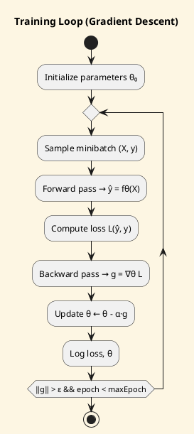

# Review: 4.2: Linear Models and Gradient Descent

**Source:** part-ii/ch04-learning-from-data/lecture-02.adoc

---

## Review of Lecture 4.2 – *Linear Models and Gradient Descent*  

**Grade: C‑** – The lecture has a decent hook and a clear logical order, but it falls short of the 90‑minute word‑count target, contains several “definition‑first” stretches, and the two PlantUML figures add little explanatory power.  Substantial expansion and tightening of the narrative are needed before the material can sustain a full class period.

---

### 1. Narrative Arc  

| Element | Evaluation |
|---------|------------|
| **Hook** | Strong: a concrete house‑price example that ends with a “stuck optimizer” mystery. It creates immediate tension and a question that the lecture promises to answer. |
| **Development** | The lecture moves from a high‑level algorithm box → description of loss functions → convex vs. non‑convex landscapes → generic training loop → philosophical musings. The progression is logical, but the transitions are abrupt; the reader is often dropped into a new sub‑topic without a bridge (“The shape of the loss surface determines …”). |
| **Closing / Bridge** | Ends with a teaser about regularization and a pointer to the next lecture. The bridge is present but could be more compelling (e.g., “What if we could reshape the landscape so that every descent ends in the deepest valley?”). |
| **Verdict** | **Hook – ✅** **Development – ⚠️ (needs smoother connective tissue)** **Closing – ✅ (but could be stronger)** |

**Suggested narrative tightening**  

1. After the hook, pose a *mini‑research question*: “Is the problem that our model is wrong, or that our optimizer is blind?”  
2. Use that question to motivate the **loss‑surface** discussion, then segue into **convexity** as the “ideal world” and **non‑convexity** as the “real world”.  
3. When introducing the training loop, explicitly map each step back to the earlier “stuck” scenario (e.g., “If we are on a plateau, the forward‑pass still computes a loss, but the gradient will be near‑zero”).  
4. Conclude the philosophical section by returning to the house‑price story: “In practice, a realtor may accept a model that is ‘good enough’; the ethical question is when ‘good enough’ is too cheap.”  

---

### 2. Density (Target ≈ 2 500–3 500 words)

| Section | Approx. word count | Target range | Comments |
|---------|-------------------|--------------|----------|
| Conceptual Core | ~300 | 1 200–1 600 | Too brief; only 4–5 paragraphs, 6 key points. |
| Technical Example | ~250 | 1 200–1 600 | Needs more code, experimental results, and interpretation. |
| Philosophical Reflection | ~200 | 1 200–1 600 | Very thin; lacks depth and connection to AI ethics. |
| **Total** | **≈ 750** | **2 500–3 500** | **~30 %** of required density. |

**What is missing?**  

* A derivation of the gradient for MSE and cross‑entropy (show the calculus).  
* A short “history” sidebar (Rosenbrock function, early neural‑net training failures).  
* Convergence theory basics (Lipschitz constant, step‑size bounds).  
* Momentum & Nesterov derivations, with intuition diagrams.  
* A concrete code snippet (Python/NumPy) for the full training loop, plus a “what‑if” debugging checklist.  
* A mini‑experiment table (learning‑rate, batch‑size, optimizer) with quantitative observations.  
* A deeper philosophical discussion linking optimization to *scientific theory change* and *fairness trade‑offs*.  

---

### 3. Interest  

* **Strengths** – The opening scenario and the “lab‑prep” promise hands‑on work. The discussion prompts are good for a post‑lecture debate.  
* **Weaknesses** – Large swaths are definition‑heavy (e.g., “Linear regression predicts a continuous target…”) and would likely cause the audience’s attention to drift. The technical example is described only in prose; no live‑coding cue or visual demo is suggested.  
* **Recommendations to boost engagement**  
  1. **Live demo**: start a Jupyter notebook that plots the loss surface in real time as the learning rate is tweaked.  
  2. **Interactive poll**: ask students to guess what will happen if the learning rate is doubled, then show the result.  
  3. **Storytelling**: embed a short anecdote about a real‑world failure caused by a local minimum (e.g., early speech‑recognition systems).  
  4. **Mini‑challenge**: give each group a different optimizer and 2 minutes to predict which will converge fastest, then reveal the plots.  

---

### 4. Diagram Review  

#### Figure 4.2 – Training‑loop diagram  

| Issue | Comment |
|-------|---------|
| **Over‑simplified** – No explicit *batch loading* step, no *gradient computation* label, no *convergence test* decision node. | The loop reads “repeat … repeat while (not converged?)”, but the condition is vague. |
| **No data flow** – Arrows are all vertical; the diagram does not show the flow of **θ**, **loss**, **gradients**. | |
| **Styling** – “sketchy‑outline” theme is fine, but the nodes lack descriptive titles (e.g., “Compute gradients”). | |

**Suggested redesign** (PlantUML sketch):



*Add a decision diamond for the convergence test, label the gradient **g**, and show the data flow arrows.*

#### Figure 4.2b – Loss surface and descent trajectory  

| Issue | Comment |
|-------|---------|
| **Placeholder graphics** – Only two rectangles with a generic arrow; no actual contour lines, start point, or path. | |
| **No indication of learning‑rate effect** – The figure cannot illustrate why a large step overshoots. | |
| **Missing axes labels** – θ₁, θ₂ not shown on the contour plot. | |

**Suggested redesign** (PlantUML with `sprite` or external PNG is easier, but a quick schematic can be done):  

```plantuml
@startuml
skinparam backgroundColor #FDF6E3
title 2‑D loss surface (MSE) + GD trajectory

rectangle "Contour plot\nθ₁, θ₂" as C #LightYellow
C : (drawn in external PNG)

actor User
User -> C : start at θ⁰
C --> C : GD step (α=0.1) → θ¹
C --> C : GD step (α=0.1) → θ²
...
note right of C
  • Arrow thickness ∝ step size
  • Red dot = current θ
  • Blue line = trajectory
end note
@enduml
```

*Replace the placeholder rectangle with an actual contour PNG (e.g., generated by `matplotlib.contour`). Overlay a polyline (trajectory) and a red dot for the current point. Add a legend for step‑size.*

---

### 5. Recommended Revisions (prioritized)

1. **Expand the core content to meet the 2 500–3 500 word target**  
   - Add a **derivation** of the MSE gradient and cross‑entropy gradient (≈300 words).  
   - Insert a **convex‑analysis** sidebar (condition number, why OLS is closed‑form).  
   - Provide a **momentum** and **Adam** mathematical description (≈250 words each).  
   - Include a **convergence‑criteria** subsection (gradient norm, loss plateau detection).  

2. **Enrich the technical example**  
   - Provide a **complete code block** (Python/NumPy) for batch GD, SGD, and Adam.  
   - Show a **results table** (learning‑rate vs. epochs to converge) and a **short interpretation**.  
   - Add a **visual demo** instruction (e.g., “run `plot_gd()` to see the trajectory”).  

3. **Deepen the philosophical reflection**  
   - Connect optimization to **the scientific method** (hypothesis → test → update).  
   - Discuss **fairness/ethical trade‑offs** of satisficing models (e.g., mortgage‑approval bias).  
   - Cite at least one post‑modern AI critique (e.g., “Latent bias in loss surfaces”).  

4. **Improve narrative flow**  
   - Write explicit **transition sentences** between sections (e.g., “Having seen how the loss surface shapes the optimizer’s path, let us now watch a concrete descent in action”).  
   - Re‑phrase the **closing** to pose a forward‑looking question about reshaping landscapes with regularization.  

5. **Redesign the PlantUML figures** (see suggestions above). Ensure each diagram is referenced in the text (“see Figure 4.2”) and that the caption explains what the reader should notice.  

6. **Add interactive elements**  
   - Insert a **live‑poll** or **think‑pair‑share** after the hook.  
   - Provide a **short in‑class coding exercise** (5 min) to compute a gradient manually.  

7. **Proofread for concision and consistency**  
   - Remove duplicated “Key Points” headings (merge them into a single list per section).  
   - Standardize notation (use θ for parameters everywhere, L for loss).  

---

**Bottom line:** The lecture has a solid skeleton but needs roughly **1 500–2 000 additional words**, richer examples, and more purposeful visuals to fill a 90‑minute session and keep students engaged. Implement the revisions above, and the lecture will meet the AIPA textbook’s standards for depth, pacing, and interest.