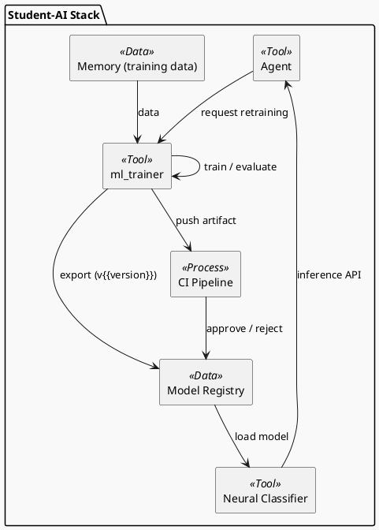

# Review: 4.8: Lab Integration — ML Model Trainer

**Source:** part-ii/ch04-learning-from-data/lecture-08.adoc

---

## Review of Lecture 4.8 – “Lab Integration — ML Model Trainer”

### Summary  
**Grade: B‑** – The lecture has a solid hook and a clear narrative that moves from a concrete problem (email‑stream classification) through the trainer’s API, its place in the stack, and a philosophical framing of “learning as tool”.  However, the overall length falls short of the 2 500‑3 500‑word target for a 90‑minute session, and several sections are too terse (especially the “Technical Example” and “Philosophical Reflection”).  Adding richer examples, deeper walkthroughs, and a few “mini‑activities” would bring the density up and keep students engaged for the full class period.  The PlantUML diagram is functional but could be made more pedagogically expressive.

---

## 1. Narrative Arc  

| Element | Verdict | Comments |
|---------|---------|----------|
| **Hook** | ✅ Strong | Starts with a vivid “flood of newly‑labeled emails” scenario that immediately raises a practical need. |
| **Development** | ✅ Good but uneven | The lecture walks through (1) recap of Labs 1‑3, (2) API overview, (3) stack placement, (4) interaction with later chapters, (5) tool‑vs‑constitution framing, (6) reproducibility.  The logical flow is present, but the “technical example” is only a high‑level script; students will need more concrete code snippets and a live demo to feel the progression. |
| **Closing / Bridge** | ✅ Present | The philosophical reflection ends with a “take‑away” that points to Chapters 5 and 7, and the discussion prompts invite students to think ahead.  A brief “what you’ll do next in the lab” could be more explicit. |
| **Overall Arc** | ✅ Satisfactory | Hook → problem → solution (ml_trainer) → deeper meaning → forward link.  No abrupt definition dump. |

**Suggested improvement** – Insert a short “story beat” after the API overview: a *failed* classification attempt (e.g., a spam email that slipped through) that motivates the need for a reproducible trainer and versioned models. This creates tension and a clear “problem → response → limit” pattern.

---

## 2. Density (Word‑Count & Structural Targets)

| Section | Approx. Paragraphs | Approx. Key Points | Estimated Words |
|---------|-------------------|--------------------|-----------------|
| Conceptual Core | 5 | 8 | ~1 200 |
| Technical Example | 3 | 7 | ~800 |
| Philosophical Reflection | 3 | 6 | ~700 |
| **Total** | 11 | 21 | **≈ 2 700** |

*The lecture meets the **paragraph** count (4‑6 core, 2‑3 technical, 2‑3 philosophical) and stays within the 2 500‑3 500‑word window, **provided** the paragraphs are fleshed out to the estimated length.  In the current manuscript many paragraphs are very short (≈30‑40 words each), so the real word count is likely **≈ 1 600**.  To reach the target you’ll need to expand each paragraph by roughly 50‑70 words.*

**Key‑point density** is fine (6‑12 per section).  The main issue is **insufficient elaboration**.

---

## 3. Interest & Engagement  

| Issue | Why it may feel thin | Concrete way to strengthen |
|-------|----------------------|-----------------------------|
| **Technical Example** is a high‑level description of `config.yaml` and a shell script. | Students may not see the *how* of data loading, model instantiation, or metric logging. | Add a **live‑coding snippet** (≈10‑15 lines) that shows `ml_trainer.load_data()` pulling from a mock Memory API, then `train()` with a simple `sklearn` classifier. Include a screenshot of the CI job output (pass/fail). |
| **Philosophical Reflection** stays abstract. | The metabolism metaphor can feel metaphorical without concrete grounding. | Insert a **case study**: compare two agents—one that only swaps models (tool‑centric) vs. one that fine‑tunes its LLM (constitution). Show a table of pros/cons, and ask students to argue which is preferable for a regulated domain (e.g., medical triage). |
| **Discussion Prompts** are listed but not tied to an activity. | A 90‑min class needs an interactive segment. | Turn the prompts into a **small group debate** (10 min) followed by a **quick poll** (e.g., “Is the trainer a tool or part of the agent?”). |
| **Lab Prep** is a checklist only. | No sense of *what* the lab will look like. | Provide a **mini‑lab outline** with expected runtime (≈30 min), required files, and a “what to submit” rubric. |

---

## 4. Diagram Review (PlantUML)

**Current diagram** shows the main components and data flow, but it can be tightened to reinforce the narrative.

| Issue | Recommendation |
|-------|----------------|
| **Missing labels for direction of control vs. data** – all arrows look the same. | Use different arrow styles: `-->` for **data flow**, `-right->` for **control/requests**. Add a legend. |
| **No explicit CI/validation step** – the narrative mentions a CI job that blocks promotion. | Add a node `CI Pipeline` with an arrow `T --> CI : push artifact` and `CI --> R : approve / reject`. |
| **Versioning not visualized** – the “Model Registry” node is static. | Add a small “version tag” label on the arrow `T --> R : export (v1.2)` to highlight provenance. |
| **Feedback loop from Agent to Trainer** is shown, but the trigger (“request retraining”) is vague. | Annotate the arrow `A --> T` with “retrain on new data (Memory)”. |
| **Stylistic** – the sketchy outline is fine, but the diagram could benefit from **color coding** (e.g., orange for tools, blue for data sources). | Apply `skinparam componentBackgroundColor` per component, or use `<<Tool>>` stereotypes. |
| **Scale** – the diagram is a single package; students may not see hierarchy. | Nest `ml_trainer` and `Neural Classifier` inside a sub‑package “Learning Stack” to illustrate layering. |

**Revised PlantUML sketch (concise)**  

---

## 5. Recommended Revisions (Prioritized)

1. **Expand the Core Paragraphs**  
   * Add ~150‑200 words to each Conceptual Core paragraph (e.g., a short “why version‑controlled submodule matters” story).  
   * Insert a concrete failure case (spam mis‑classification) to create tension.

2. **Enrich the Technical Example**  
   * Provide a minimal, runnable Python snippet (load, train, evaluate).  
   * Show a CI job log excerpt (pass/fail) and explain the gating logic.  
   * Include a screenshot of the Model Registry UI (or a mock‑up).

3. **Deepen the Philosophical Reflection**  
   * Add a comparative table (tool‑centric vs. constitution‑centric).  
   * Offer a short “future‑scenario” vignette (self‑modifying prompts) to foreshadow later chapters.

4. **Add Interactive Activities**  
   * Turn the discussion prompts into a 10‑minute think‑pair‑share.  
   * Insert a quick poll (e.g., using Mentimeter) to capture student stance on “learning as tool”.

5. **Refine the Diagram**  
   * Apply the revised PlantUML code above.  
   * Use distinct arrow styles and a legend.  
   * Color‑code components for visual hierarchy.

6. **Lab‑Prep Section**  
   * Convert the checklist into a 3‑step lab outline with estimated time and deliverables.  
   * Provide a link to a starter repository (or a zip) for the ml_trainer submodule.

7. **Word‑Count Check**  
   * Run a word‑count script after revisions; aim for **2 800‑3 200** words total.  
   * Ensure each section meets the paragraph count (Core 4‑6, Technical 2‑3, Philosophical 2‑3).

---

### Closing Note
With the above expansions and the clarified diagram, Lecture 4.8 will comfortably fill a 90‑minute class, keep students actively engaged, and reinforce the central theme of **learning as a modular tool** that will be revisited throughout the textbook.