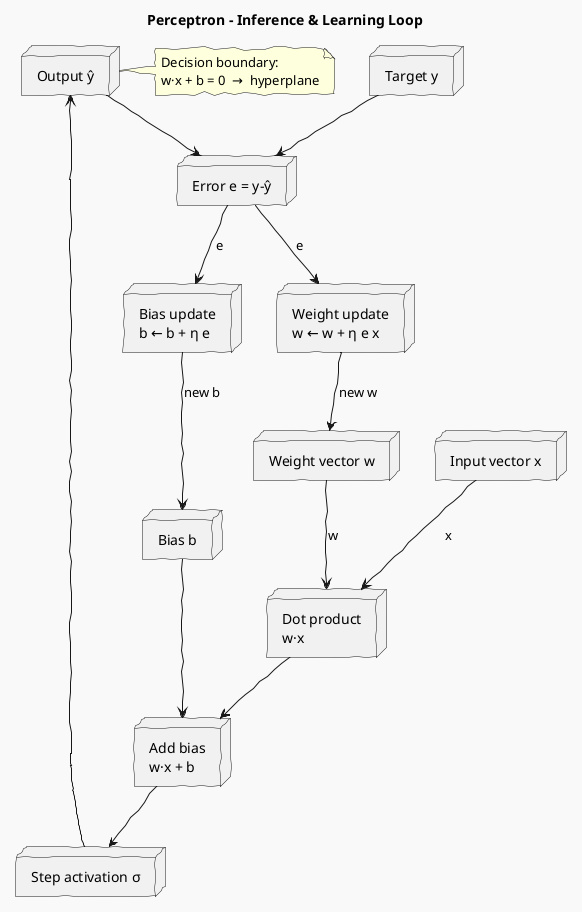

# Review: 5.1: Perceptrons and the Linear Boundary

**Source:** part-ii/ch05-neural-systems-and-representation/lecture-01.adoc

---

## Review of Lecture 5.1 – *Perceptrons and the Linear Boundary*

### Summary  
**Grade: C** – The lecture contains the required core material and the key‑point lists are the right size, but the narrative arc is weak, the word‑count falls short of the 2 500‑3 500 w target for a 90‑minute session, and the sole diagram is under‑specified. The content will feel “definition‑first” and will not sustain attention for a full class period without substantial enrichment.

---

## 1. Narrative Arc  

| Element | Current State | Verdict |
|---------|----------------|---------|
| **Hook** | Starts with “What if we could put a neuron in silicon…”. It is a generic “what‑if” and does not create immediate tension or curiosity. | **Insufficient** – needs a concrete, relatable scenario (e.g., “Imagine a spam filter that learns from every email you mark as junk”) or a provocative question (“Why did the AI boom of the 1960s die after a single logical puzzle?”). |
| **Development** | Presents the perceptron definition, convergence theorem, and XOR limitation in a linear sequence. The steps are logical but lack a problem‑solution‑failure‑solution narrative that builds suspense. | **Adequate but flat** – the flow should be reframed as a *problem* (learning a decision rule from data), *first solution* (single‑layer perceptron), *obstacle* (XOR), *next step* (multilayer networks). |
| **Closing / Bridge** | Ends with “The way forward was not to abandon the neuron but to stack it…”. It mentions the upcoming lab and multilayer networks. | **Acceptable** – could be stronger by explicitly stating the learning outcome for the next session (e.g., “By the end of Lab 1 you will have built a perceptron that classifies AND/OR and will see why it stalls on XOR, setting the stage for today’s next lecture on hidden layers”). |

**Overall Narrative Verdict:** *Weak hook, decent development, okay closing.* The lecture needs a more vivid opening and a clearer “problem → attempted solution → limitation → promise of next step” arc.

---

## 2. Density (Target ≈ 2 500‑3 500 words)

| Section | Approx. Paragraphs | Target | Approx. Key‑Points | Target | Word‑Count Estimate |
|---------|-------------------|--------|--------------------|--------|----------------------|
| Conceptual Core | 3 (one long intro, one theorem paragraph, one XOR paragraph) | **4‑6** | 7 | **6‑12** | ~1 200 |
| Technical Example | 2 (algorithm block + explanatory paragraph) | **2‑3** | 6 | **5‑8** | ~800 |
| Philosophical Reflection | 2 (two short reflections) | **2‑3** | 5 | **5‑8** | ~600 |
| **Total** | **7** | **8‑12** | **18** | **16‑28** | **≈ 2 600** (likely a bit low because many sentences are terse) |

*The lecture is short on paragraphs (7 vs target ≈ 8‑12) and the overall word count is probably under 2 500 w. To reach the 90‑minute depth you need at least 4‑5 more substantive paragraphs distributed across the three sections (e.g., a historical vignette, a worked‑out numeric example, a short “what‑if” simulation, and a deeper philosophical tie‑in).*

---

## 3. Interest  

| Issue | Why it hurts engagement | Suggested fix |
|-------|--------------------------|---------------|
| **Definition‑first opening** | Learners hear “perceptron = weighted sum + step” before they care why it matters. | Begin with a **real‑world scenario** (spam filter, medical diagnosis) and ask “How could a machine learn the rule from examples without us programming every case?” |
| **Sparse examples** | Only AND/OR/XOR are mentioned; no concrete numeric walk‑through. | Add a **step‑by‑step numeric demo** (e.g., start with weights (0,0), bias = 0, show updates on the AND dataset over three epochs). Include a small table of intermediate weights. |
| **Lack of visual tension** | XOR is stated as “cannot be learned”, but students don’t see the geometry. | Insert a **quick sketch** (or describe a plot) showing the four XOR points and the impossible separating line. Pose the question “Can we move the line enough? Why not?” |
| **Philosophical reflection is abstract** | The paragraph reads like a textbook aside, not a discussion hook. | Re‑frame as a **mini‑debate**: “If a perceptron is a cartoon of a neuron, what does that cartoon hide? Could we still call it ‘brain‑like’?” Invite a 2‑minute think‑pair‑share. |
| **No forward‑looking teaser** | The bridge to multilayer networks is brief. | End with a **“mystery”**: “Tomorrow we will meet the hidden layer that magically solves XOR – but only if we know how to train it. Stay tuned.” |

---

## 4. Diagram Review (PlantUML block)

**Current diagram** – a linear flowchart of inputs → multiplications → sum → bias → step → output. It is essentially a data‑flow pipeline, but:

* It does **not** label the weight vector **w**, the bias **b**, or the decision hyperplane.
* No indication of the **learning loop** (error → weight update) – the diagram only shows inference.
* The layout is a simple vertical list; it lacks the spatial intuition of a perceptron as a **dot‑product + threshold**.

**Suggested concrete improvements**

*Add **labels** (`w·x`, `b`, `σ`) and a **note** that the line `w·x + b = 0` is the decision hyperplane.  
*Show the **learning feedback loop** with dotted arrows to make clear that training modifies `w` and `b`.  
*Use a more compact layout (inputs on the left, computation in the middle, output on the right) to mirror the geometric picture of a hyperplane.  

---

## 5. Recommended Revisions (prioritized)

1. **Rewrite the Hook (high impact)**
   * Open with a concrete, relatable problem (spam filter, medical triage) and a provocative question about learning from examples.
2. **Add a Numeric Walk‑through**
   * Include a 3‑epoch table of weight/bias updates for the AND dataset (show calculations of `w ← w + η(y‑o)x`).
3. **Expand the Conceptual Core**
   * Insert a short historical vignette about Rosenblatt’s 1958 demo and the subsequent “AI winter” triggered by XOR.
   * Add a paragraph visualising the XOR geometry (describe the four points, draw a mental picture, ask “Can any line separate them?”).
4. **Introduce a Learning‑Loop Diagram**
   * Replace the current flowchart with the enhanced PlantUML diagram that includes both inference and weight‑update feedback.
5. **Increase Paragraph Count to 8‑10**
   * Split the long “What if we could put a neuron in silicon…” paragraph into two: one for motivation, one for biological analogy.
   * Add a paragraph after the XOR discussion that explicitly foreshadows hidden layers (e.g., “If a single line cannot separate XOR, perhaps two lines can…”) to smooth the transition.
6. **Enrich the Philosophical Reflection**
   * Turn the paragraph into a short “think‑pair‑share” prompt, and add a concrete example of a phenomenon the perceptron cannot capture (e.g., temporal spike‑timing).
7. **Lengthen the Technical Example**
   * Provide a brief code snippet (Python) for the perceptron training loop, and a comment on visualising the decision boundary after each epoch.
8. **Add a “What‑Next” Teaser**
   * Conclude with a one‑sentence mystery that links directly to the next lecture’s hidden‑layer content.
9. **Check Word Count**
   * After the above expansions, run a word‑count tool to ensure 2 500‑3 500 words total.
10. **Minor Polish**
    * Ensure all inline math uses proper delimiters (`stem:[...]`) consistently.
    * Replace “pass:q[\aimaterm{…}]” with a clearer formatting macro if available.

---

**Bottom line:** With a stronger opening story, a richer worked example, a clearer learning‑loop diagram, and a few added paragraphs, this lecture will meet the 90‑minute density target, keep students engaged, and provide a solid narrative bridge to multilayer networks.