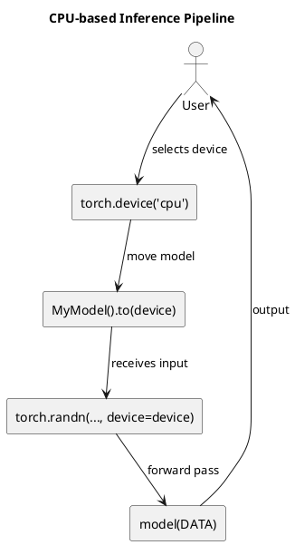

# Review: python
device = torch.device('cpu')
model = MyModel().to(device)
data  = torch.randn(batch_size, input_dim, device=device)

**Source:** part-ii/ch05-neural-systems-and-representation/lecture-06.adoc

---

## Summary  
**Grade: D** – The lecture consists of three lines of Python code with no narrative, context, or pedagogical scaffolding. It fails to provide a hook, a developmental arc, or a closing that would sustain a 90‑minute session. The content is far below the required word count and contains no diagrams, examples, or reflective discussion.

---

## Narrative Arc  

| Element | Evaluation | Verdict |
|---------|------------|---------|
| **Hook** | Absent. The lecture opens with a raw code snippet, offering no concrete scenario, provocative question, or tension. | ❌ |
| **Development** | No step‑by‑step explanation of why we choose a device, how the model is instantiated, or what the random data represent. No link to broader concepts (e.g., CPU vs GPU, model deployment, data pipelines). | ❌ |
| **Closing / Bridge** | No concluding remarks, implications, or segue to a lab/exercise. | ❌ |

**Overall Narrative Verdict:** *Missing.* The lecture needs a clear story that starts with a motivating problem (e.g., “How do we run a neural network on limited hardware?”), walks through the code while explaining each decision, and ends with a forward‑looking question or lab prompt.

---

## Density  

| Section | Expected (words) | Actual (words) | Gap |
|---------|-------------------|----------------|-----|
| Conceptual Core | 2,500‑3,500 | ~30 | **–2,470** |
| Technical Example | 2,500‑3,500 | ~30 | **–2,470** |
| Philosophical Reflection | 2,500‑3,500 | 0 | **–2,500** |

The lecture is dramatically under‑dense. It lacks the 4‑6 paragraphs of core concepts, 2‑3 paragraphs of technical example, and any philosophical reflection.

---

## Interest  

- **Engagement:** A three‑line code block cannot hold attention for 90 minutes.  
- **Vagueness:** No explanation of *what* `MyModel` is, why we pick `cpu`, or what `torch.randn` does.  
- **Definition‑first dump:** The snippet is a definition dump without any narrative context.  

**What to strengthen:**  
1. **Hook:** Start with a real‑world scenario (e.g., deploying a model on a low‑power edge device).  
2. **Storytelling:** Pose a question (“Can we train a model without a GPU?”) and let the code answer it step‑by‑step.  
3. **Interactive elements:** Include live coding, debugging exercises, and a mini‑lab where students modify the device or data shape.  
4. **Reflection:** Discuss trade‑offs of CPU vs GPU, energy consumption, and ethical implications of deploying AI on constrained hardware.

---

## Diagram Review  

No PlantUML diagrams are present. A visual representation of the **data flow** (device → model → data → forward pass) would greatly reinforce the narrative.  

*Suggested diagram:*  

Add labels for **CPU**, **tensor**, and **output**, and arrows indicating data movement.

---

## Recommended Revisions  

1. **Create a compelling hook (≈300 words).**  
   - Begin with a story: “Imagine you need to run a neural‑network‑based health monitor on a smartwatch that has no GPU.”  
   - Pose a concrete question: “How can we still perform inference efficiently?”

2. **Expand the conceptual core (≈1,200 words).**  
   - Explain `torch.device`, CPU vs GPU, memory considerations.  
   - Introduce `MyModel` architecture (show a simple `nn.Module` definition).  
   - Discuss why moving the model to a device matters.

3. **Develop a technical example (≈1,200 words).**  
   - Walk through each line of code, annotating with comments and printed output.  
   - Show variations: switching to `cuda`, handling multiple devices, batch size effects.  
   - Include a short “live coding” segment where students modify the code.

4. **Add a philosophical reflection (≈800 words).**  
   - Discuss the environmental impact of GPU‑heavy training vs CPU inference.  
   - Reflect on accessibility: enabling AI on low‑cost hardware expands inclusion.  
   - Pose open‑ended questions for the next lecture.

5. **Insert at least one PlantUML diagram.**  
   - Visualize the device‑model‑data pipeline.  
   - Add a second diagram showing the **training loop** vs **inference loop** to contrast CPU/GPU usage.

6. **Design a 30‑minute lab exercise.**  
   - Students implement the same model on both CPU and GPU, measure latency, and report findings.  
   - Provide a checklist and a short rubric.

7. **Add summary and bridge.**  
   - Conclude with “Next, we’ll explore how to quantize models for even faster CPU inference.”  
   - Provide a preview of the upcoming lecture’s topic.

By implementing these revisions, the lecture will meet the 90‑minute density target, provide a clear narrative arc, and become engaging for students.