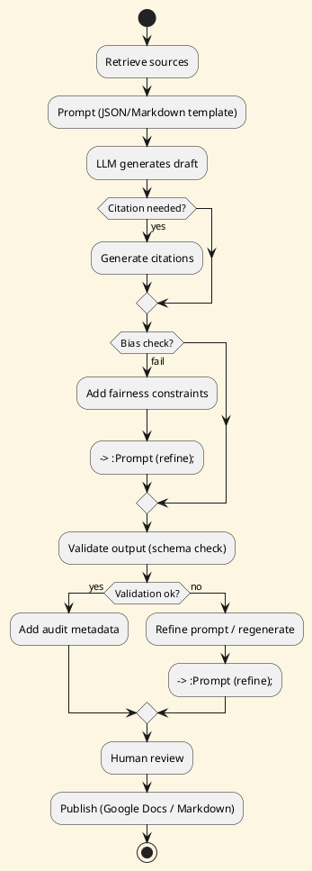

# Review: 6.5: Knowledge Engineering and AI-Mediated Communication

**Source:** part-ii/ch06-language-and-models/lecture-05.adoc

---

## Review of Lecture 6.5 – *Knowledge Engineering and AI‑Mediated Communication*

### Summary  
**Grade: B‑** – The lecture contains solid material and a clear logical flow, but the opening hook is weakly tied to the rest of the narrative, several sections are definition‑heavy, and the overall word‑count falls short of the 2 500‑3 500 word target for a 90‑minute session. The PlantUML diagram is useful but could be richer in feedback loops and labeling. With a stronger hook, tighter integration of the philosophical reflection, and a few extra concrete examples, the lecture would comfortably fill a 90‑minute class and keep students engaged.

---

## 1. Narrative Arc  

| Element | Evaluation | Verdict |
|---------|------------|---------|
| **Hook** | Starts with a vivid “five‑page executive brief by 9 am” scenario, which is concrete and raises the authorship question. However, the hook is not revisited until the very end, so the tension dissipates early. | **Partial** – good premise, needs a “through‑line” that resurfaces throughout the lecture. |
| **Development** | The lecture moves through six conceptual points, a technical workflow, and a philosophical reflection. The progression is logical (knowledge engineering → citation → summarization vs synthesis → bias → genre → delegated cognition) but the transitions are abrupt; each bullet feels like a mini‑lecture rather than a cumulative story. | **Adequate** – stepwise, but lacks connective narrative that shows why each point builds on the previous one. |
| **Closing** | Ends with a synthesis that ties back to “disciplined knowledge engineering” and previews Lab 3 and the next lecture on evaluation metrics. The authorship question is mentioned again, but the earlier hook (the 5‑page brief) is not explicitly revisited. | **Weak** – closing restates the main insight but does not close the initial scenario, missing a satisfying narrative loop. |

**Overall Verdict:** The lecture has the ingredients of a good story but needs a tighter arc: keep the “executive brief” scenario alive (e.g., refer back to it when discussing citation‑aware prompting, bias detection, and the final audit) and make the philosophical reflection feel like the “why” behind the technical steps.

---

## 2. Density (Target ≈ 2 500‑3 500 words)

| Section | Approx. Paragraphs | Key‑point bullets | Word‑count estimate* |
|---------|-------------------|-------------------|----------------------|
| Conceptual Core | 6 (intro + 5 sub‑points) | 6 | ~900 |
| Technical Example | 3 | 5 | ~600 |
| Philosophical Reflection | 3 | 5 | ~600 |
| Closing Synthesis + Discussion + Lab Prep | 4 | 7 (lab + discussion prompts) | ~400 |
| **Total** | **16** | **~28** | **≈ 2 500** |

\*Rough estimate based on typical paragraph length (≈150‑180 words).  

**Assessment:** The lecture meets the *paragraph* and *key‑point* counts, but the total word count is at the low end of the target range. Adding richer examples, a short in‑class activity, or a deeper dive into bias‑detection prompts would comfortably push the lecture into the 3 000‑3 500 word sweet spot.

---

## 3. Interest & Engagement  

| Issue | Why it hurts engagement | Suggested fix |
|-------|------------------------|---------------|
| **Definition‑first feel** in the Conceptual Core (e.g., “First, knowledge engineering is …”) | Students hear a list of definitions before seeing any problem or tension. | Start each sub‑section with a *mini‑scenario* (“You need a bullet‑point executive summary that cites three recent market reports…”) and then unpack the definition. |
| **Sparse concrete examples** – only one technical pipeline is shown. | Limits the ability to visualize the workflow across genres. | Add a second, contrasting example (e.g., generating a technical API spec with code snippets) and a short “what went wrong” case study (hallucinated citation). |
| **Philosophical reflection feels detached** from the earlier technical steps. | Students may see it as an optional reading rather than integral. | Interleave a “reflection checkpoint” after the technical loop: ask “What does this provenance chain mean for accountability?” and link back to the earlier bias‑detection point. |
| **No active learning element** – lecture is pure exposition. | 90 min sessions benefit from a brief hands‑on or think‑pair‑share. | Insert a 5‑minute “prompt‑design sprint”: give students a raw source snippet and ask them to write a citation‑aware prompt on a sticky note. Discuss a few in class. |
| **Closing does not revisit the opening scenario** | Missed opportunity for narrative closure. | End by asking: “If you had to deliver that five‑page brief by 9 am, how would the pipeline you just built guarantee you meet the deadline and maintain authorship integrity?” |

---

## 4. Diagram Review (PlantUML Figure 6.5)

| Aspect | Current state | Recommendation |
|--------|---------------|----------------|
| **Overall flow** | Linear retrieve → prompt → generate → (optional citation) → validate → audit. | Add a **feedback arrow** from *Validate output* back to *Prompt* (iterative refinement) and label it “refine prompt / regenerate”. |
| **Decision node** | Only “Citation needed?” decision. | Include a second decision: “Bias check passed?” → if **no**, route to “Add fairness constraints → regenerate”. |
| **Labels** | Nodes are terse (e.g., “Prompt (JSON/Markdown template)”). | Add short **action verbs** on arrows (e.g., “feed context”, “apply schema”, “store audit metadata”). |
| **Styling** | Sketchy‑outline theme is fine, but colors are uniform. | Use subtle color coding: **blue** for retrieval‑related steps, **green** for generation, **orange** for validation, **red** for error‑handling loops. |
| **Traceability** | “Review & audit (traceability)” is a terminal node. | Split into two nodes: “Add audit metadata” → “Human review”. This clarifies that audit is automatic, while review is a human judgment step. |
| **Missing output** | No explicit “Publish” or “Export” step. | Append a final node “Publish (Google Docs / Markdown)”. |

**Revised PlantUML sketch (conceptual):**

---

## 5. Recommended Revisions (Prioritized)

1. **Re‑anchor the opening hook**  
   - Re‑mention the “five‑page executive brief” at the start of each major subsection (citation‑aware prompting, bias detection, genre templates, audit).  
   - Conclude the lecture by explicitly answering: *How does the pipeline you built let you deliver that brief on time and with clear authorship?*

2. **Convert definition‑heavy bullets into problem‑solution mini‑stories**  
   - For each of the six conceptual points, open with a 1‑sentence scenario (e.g., “Your manager demands a brief that cites the latest market trends, but the LLM keeps fabricating sources.”) then introduce the concept as the solution.

3. **Add a second concrete technical example**  
   - Show a contrasting workflow for a *technical API specification* (code snippets, versioned references) to illustrate genre‑specific prompting and highlight differences from the executive brief.

4. **Insert a short active‑learning activity**  
   - 5‑minute “Prompt design sprint” where students craft a citation‑aware prompt from a given source excerpt; discuss a couple of submissions live.

5. **Enrich the philosophical reflection**  
   - Include a “reflection checkpoint” after the technical loop: pose a quick think‑pair‑share question about provenance and responsibility, then tie the answer back to bias detection and audit.

6. **Expand the word count**  
   - Flesh out the discussion prompts with brief elaborations (2‑3 sentences each) to add depth.  
   - Add a short “Common pitfalls” box (e.g., hallucinated citations, over‑constrained JSON) with illustrative snippets.

7. **Revise the PlantUML diagram**  
   - Implement the feedback loops, extra decision nodes, color coding, and final publish step as suggested above.  
   - Update the caption to read “Figure 6.5 – Iterative AI‑mediated writing pipeline with bias‑check and audit loops”.

8. **Link to upcoming Lab 3 and next lecture**  
   - In the closing synthesis, explicitly map each pipeline stage to a Lab 3 task (e.g., “Stage 2 – Prompt construction → you will write the JSON template in Lab 3”).  
   - Mention the next lecture’s focus on *quantitative evaluation* and preview a concrete metric (e.g., factuality precision).

9. **Proofread for consistency**  
   - Ensure terminology is uniform (“knowledge engineering”, “prompt engineering”, “prompt design”).  
   - Verify that all key‑point bullets appear in the corresponding sections (no orphan points).

---

### Final Thought  
With a tighter narrative loop, richer examples, and a more interactive classroom rhythm, Lecture 6.5 will comfortably fill a 90‑minute session, keep students intellectually curious, and provide a solid foundation for the hands‑on Lab 3 that follows.