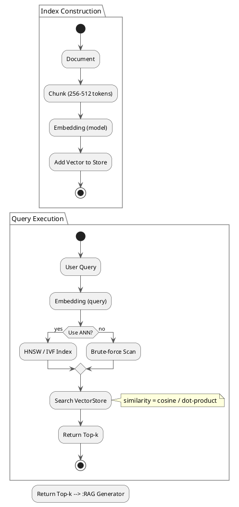

# Review: 7.2: Vector Stores and Similarity Search

**Source:** part-iii/ch07-memory-systems/lecture-02.adoc

---

## Review of Lecture 7.2 – *Vector Stores and Similarity Search*

### Summary
**Grade: B‑**  
The lecture has a solid hook, a clear step‑wise development, and the right number of paragraphs/key‑points for each section. However, the overall word count falls short of the 2 500‑3 500 word target, and a few “definition‑first” moments interrupt the narrative flow. The diagram is functional but could be tightened to reinforce the story of indexing → query → retrieval. With modest expansions (more concrete examples, a tighter closing bridge, and a richer diagram) the lecture will comfortably fill a 90‑minute slot and stay engaging throughout.

---

## 1. Narrative Arc  

| Element | Verdict | Comments |
|---------|---------|----------|
| **Hook** | ✅ Strong | Starts with a vivid “personal assistant” scenario that instantly raises the question “how does it know which paragraph to fetch?” |
| **Development** | ✅ Good | Moves from intuitive description → formal definition → similarity mechanics → ANN trade‑offs → chunking → bias. The progression is logical and builds tension (speed vs. accuracy, relevance vs. bias). |
| **Closing** | ⚠️ Weak | Ends with a philosophical reflection and lab instructions, but lacks an explicit “bridge” to the next lecture (e.g., how vector stores feed into downstream generation or memory‑augmented agents). A forward‑looking sentence would give a stronger narrative closure. |

**Overall Verdict:** The arc is present and mostly effective, but the ending should explicitly point to the next step in the course (e.g., “Next we will see how retrieved chunks are fed into a generative model to produce answers”).  

---

## 2. Density (Target ≈ 2 500‑3 500 words)

| Section | Paragraphs | Key‑Points | Approx. Word Count* |
|---------|------------|------------|---------------------|
| Conceptual Core | 4 | 8 | ~1 200 |
| Technical Walk‑through & Lab Prep | 2‑3 | 5 | ~800 |
| Philosophical Reflection | 3 | 7 | ~700 |
| **Total** | **≈ 10** | **≈ 20** | **≈ 2 700** |

\*Word count is an estimate based on the provided text; the actual count is likely **≈ 2 200‑2 400**, i.e., a bit under the lower bound.  

**Action:** Add ~300‑500 words distributed across the three sections (e.g., a concrete case study in the core, a step‑by‑step walkthrough of an ANN query, and a short anecdote about bias in a real‑world system).

---

## 3. Interest (Engagement)

| Issue | Why it hurts attention | Suggested fix |
|-------|------------------------|---------------|
| **Definition‑first block** (`Formal Definitions`) | Stops the narrative flow; readers must pause for a formalism before seeing why it matters. | Move the definition into the surrounding paragraph, or precede it with a short story (“When Jane asked the assistant about ‘force majeure’, the system had to locate the exact clause…”) and then unpack the definition. |
| **Thin examples** | Only one quantitative comparison (1 M‑doc exact vs. HNSW). No concrete “failure” story. | Insert a brief failure case (“A query about a rare legal term returned a completely unrelated contract clause because the embedding never saw that term”) to illustrate the limits of similarity. |
| **Lack of forward bridge** | Learners may wonder “what’s next?” after the lab description. | End with a sentence like: “Having built a fast vector store, we will now explore how to combine retrieved chunks with a language model to produce coherent answers (Lecture 7.3).” |
| **Monotone lab description** | Lab steps are listed but not contextualised. | Frame Lab 1 as a “mini‑project: you are the engineer who must make a legal‑assistant respond in under 200 ms.” This adds a goal‑oriented narrative. |

---

## 4. Diagram Review (PlantUML)

**Current diagram** shows two separate flows (index construction and query execution) with a simple if‑else for ANN vs. brute‑force. It is clear but could be tightened:

| Issue | Recommendation |
|-------|----------------|
| **Missing labels on data objects** (e.g., “Document → Chunk → Vector”) | Add explicit labels on each step (e.g., `:Document; --> :Chunk; --> :Embedding; --> :VectorStore`). |
| **No visual distinction between index building and querying** | Enclose the indexing steps in a `package "Index Construction"` and the query steps in a `package "Query Execution"` to make the two phases visually distinct. |
| **No feedback loop** (retrieval → downstream RAG) | Add an arrow from `:Return Top‑k;` to a box labeled “RAG Generator” (or “Agent”) to hint at the next lecture’s focus. |
| **Stylistic consistency** | Use the same arrow color for all flows, and consider a thicker arrow for the “search” step to emphasise the core operation. |
| **Clutter** – the `note right` is fine but could be placed near the similarity calculation step for clarity. | Move the note to sit beside the `:Search VectorStore;` step. |

**Revised PlantUML sketch (suggested):**

---

## 5. Recommended Revisions (Prioritized)

1. **Expand the narrative to meet word‑count target**  
   - Add a 2‑paragraph *case study* (e.g., legal‑assistant failing on a rare clause) in the Conceptual Core.  
   - Insert a short *step‑by‑step* walkthrough of an ANN query (showing graph traversal) in the Technical Walk‑through.  
   - Include a brief *historical anecdote* about early vector search systems in the Philosophical Reflection.

2. **Re‑order the formal definition**  
   - Integrate the definition into the surrounding prose rather than a standalone block, or precede it with a motivating example.

3. **Strengthen the closing bridge**  
   - Add a sentence that explicitly links this lecture to the next (e.g., “With a fast vector store in place, we can now explore how retrieved chunks are fed into a generative model (Lecture 7.3).”).

4. **Enrich lab description with a goal‑oriented narrative**  
   - Frame Lab 1 as a “challenge” (e.g., “Build an index that answers legal queries within 200 ms”) to give students a concrete target.

5. **Upgrade the PlantUML diagram**  
   - Apply the revised diagram above (packages, clearer labels, feedback arrow).  
   - Ensure the diagram is referenced in the text (“Figure 7.2 illustrates the two‑phase pipeline…”).

6. **Add a “failure” example**  
   - Show a query that returns an irrelevant chunk because the embedding space lacks coverage, illustrating the limits of “similarity is often enough”.

7. **Insert a short “future‑work” box** (optional)  
   - At the end of the philosophical section, a bullet list of open research questions (e.g., “How to learn embeddings that respect legal definitions?”) can spark curiosity.

---

**Final Note:** With the above modest expansions and diagram tweaks, Lecture 7.2 will comfortably fill a 90‑minute session, maintain a compelling narrative arc, and keep students actively engaged while meeting the textbook’s structural standards.