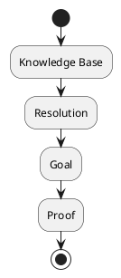
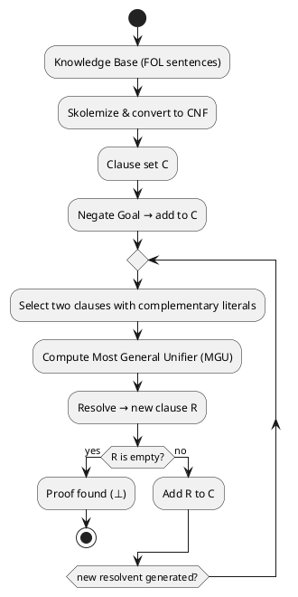

# Review: 8.2: First-Order Logic — Quantifiers and Unification

**Source:** part-iii/ch08-reasoning-and-inference/lecture-02.adoc

---

## Review of Lecture 8.2 – *First‑Order Logic: Quantifiers and Unification*  

**Grade: C** – The lecture touches the right topics, but the current structure is too thin for a 90‑minute class, lacks a compelling hook, and the diagram does not reinforce the narrative. Major expansion and re‑ordering are needed.

---

### 1. Narrative Arc  

| Element | Current State | Verdict |
|--------|---------------|---------|
| **Hook** | Starts with an epigraph and a list of “example prompts”. The prompts are useful but are presented *after* the title, not as a dramatic opening. No concrete story, paradox, or tension is created. | **Weak** – needs a vivid scenario that forces students to ask “how can we reason about *all* and *some*?” |
| **Development** | A single paragraph mixes syntax, unification, resolution, and undecidability. The flow jumps from “terms” → “unification” → “resolution” → “limits” without a step‑by‑step problem → method → limitation structure. | **Fragmented** – the logical progression is not explicit. |
| **Closing / Bridge** | Ends with a philosophical reflection that repeats the expressiveness‑tractability trade‑off and a list of discussion prompts. No explicit link to the upcoming lab or to the next lecture. | **Missing** – no clear “so what now?” or preview of the lab. |

**Overall Narrative Verdict:** *Insufficient.* The lecture needs a clear story line: present a concrete inference problem that cannot be solved with propositional logic, show how FOL solves it, demonstrate the algorithmic steps (skolemization → clause form → unification → resolution), then expose the undecidability boundary and tie it to the lab.

---

### 2. Density (Target ≈ 2,500‑3,500 words)

| Section | Current Word Count* | Target Range | Comments |
|---------|--------------------|--------------|----------|
| Conceptual Core | ~120 w | 4‑6 paragraphs, 6‑12 key points (≈ 800‑1 200 w) | Too short; only 1 paragraph, 5 key points. |
| Technical Example | ~70 w | 2‑3 paragraphs, 5‑8 key points (≈ 400‑600 w) | One paragraph, 2 key points. |
| Philosophical Reflection | ~70 w | 2‑3 paragraphs, 5‑8 key points (≈ 400‑600 w) | One paragraph, 2 key points. |
| **Total** | ~260 w | **≈ 2 500‑3 500 w** | **Severe under‑density** – the lecture is only ~10 % of the required length. |

\*Word counts are approximate (based on the supplied AsciiDoc).  

**Result:** The lecture must be expanded roughly ten‑fold while preserving a clear hierarchy of ideas.

---

### 3. Interest & Engagement  

| Issue | Why it hurts engagement | Suggested fix |
|-------|------------------------|----------------|
| **Definition‑first dump** – the core paragraph launches straight into “terms, predicates, ∀, ∃”. | Students hear a laundry list of symbols before seeing why they matter. | Begin with a *real‑world* puzzle (e.g., “Can we prove that every ancestor of Alice is also an ancestor of Bob?”) and let the need for variables emerge naturally. |
| **No tension** – undecidability is mentioned only as a footnote. | The stakes of “why should we care about limits?” are unclear. | Pose a provocative question: *“If we could automate any reasoning, why do we still need human mathematicians?”* Then reveal the undecidability barrier. |
| **Lab appears as an afterthought** – Lab description is tacked on at the end without a bridge. | Students may not see the relevance of the lab to the lecture material. | End the lecture with a *“From theory to practice”* segment that walks through the exact steps they will code in Lab 1, perhaps using a live‑coding demo. |
| **Sparse examples** – only a single family‑relations sketch. | Lack of variety makes it hard to keep attention. | Add at least two contrasting examples: (1) a classic syllogism (All men are mortal…) and (2) a more algorithmic one (graph reachability via Ancestor). Show both a successful resolution proof and a case that loops forever (illustrating undecidability). |
| **Discussion prompts are good but isolated** – they sit after the reflection without a transition. | Students may treat them as an optional add‑on. | Integrate the prompts into the narrative: after each major sub‑section, pose a short “think‑pair‑share” question. |

---

### 4. Diagram Review  

**Diagram 1 – “FOL inference (unification, resolution)”**  

| Issue | Assessment | Concrete Improvement |
|-------|------------|----------------------|
| **Too abstract** – boxes are just labels; no flow of data or transformations is shown. | The diagram does not illustrate *skolemization*, *clause conversion*, or *unification* steps. | Replace with a flowchart:  1. **KB (FOL sentences)** → 2. **Skolemize & CNF** → 3. **Clause set** → 4. **Goal (negated)** → 5. **Resolution loop** (unification → resolvent) → 6. **Empty clause?** (Proof). Use decision diamonds for “new clause?” and arrows labeled “unify”. |
| **Missing feedback loop** – resolution is an iterative process; the current diagram ends at “Proof”. | No indication that resolution may generate new clauses and repeat. | Add a loop arrow from “Resolution” back to “Clause set” labeled “add resolvent”. |
| **No visual distinction between terms and clauses** – all nodes look the same. | Students may not see the structural shift from *sentences* to *clauses*. | Use different shapes (rounded rectangle for “KB”, rectangle for “Clause set”, parallelogram for “Goal”). |
| **No annotation of key operations** – unification is mentioned only in the title. | The diagram does not reinforce the *unification* concept. | Insert a sub‑process box “Unify literals (most general unifier)”. Optionally show a tiny example of two literals and the resulting substitution. |
| **Styling** – theme “sketchy-outline” is fine, but the diagram is too small for a 90‑min lecture slide. | May be unreadable on a projector. | Increase font size, add explicit labels (e.g., “Step 1: Skolemization”, “Step 2: Convert to CNF”). |

---

### 5. Recommended Revisions (prioritized)

1. **Create a strong opening hook**  
   - Begin with a *story* or *paradox*: “A detective must prove that every suspect who is a parent of a murderer is also a murderer. How can we formalize ‘every’?”  
   - Pose a concrete inference question that cannot be expressed in propositional logic.

2. **Restructure the lecture into three clear phases**  
   - **Phase 1 – Motivation & Syntax** (2–3 paragraphs): why we need variables, introduce terms, predicates, quantifiers with examples.  
   - **Phase 2 – Algorithmic Reasoning** (4–5 paragraphs): skolemization, CNF, clause form, unification, resolution loop. Include a step‑by‑step walk‑through of the family‑relations example, showing each transformation.  
   - **Phase 3 – Limits & Reflection** (2–3 paragraphs): undecidability, tractable fragments (Horn, Datalog), trade‑off, segue to Lab 1.

3. **Expand key‑point lists**  
   - For each phase, produce 6–8 bullet points (total 18–24). Ensure each bullet is a *conceptual claim* rather than a mere restatement.

4. **Enrich the Technical Example**  
   - Provide two mini‑proofs: (a) a successful resolution proof for `Ancestor(Alice, Bob)`, (b) a failed attempt that loops, illustrating undecidability.  
   - Show the actual clause set, the most‑general unifier, and the resolvent at each step.

5. **Integrate discussion prompts**  
   - After each phase, insert a “Think‑Pair‑Share” question (e.g., after syntax: “Can you write ‘Some cats are black’ in FOL?”).  

6. **Rewrite the philosophical reflection**  
   - Connect the trade‑off to real AI systems (e.g., why planners use STRIPS (a fragment of FOL) while language models handle uncertainty).  
   - Add 2–3 concrete “what‑if” scenarios (legal reasoning, medical diagnosis).

7. **Revise the diagram**  
   - Redesign as a detailed pipeline (KB → Skolemize → CNF → Clause set → Negated Goal → Resolution Loop → Empty Clause).  
   - Label each arrow with the operation (e.g., “apply most‑general unifier”).  
   - Use distinct shapes and a loop arrow to show iteration.

8. **Add a “Bridge to Lab” segment (≈ 200 w)**  
   - Summarize the algorithmic steps students will implement.  
   - Show a tiny pseudo‑code snippet of the resolution loop.  
   - Explain how the lab will let them experiment with both a decidable fragment (Horn) and a small undecidable set.

9. **Word‑count check**  
   - Aim for ~2,800 words total. Use the expanded sections above as a checklist.  

10. **Proofread for terminology consistency**  
    - Use “first‑order logic (FOL)” consistently; avoid “L1”, “L7” unless previously defined.  
    - Define “skolemization” before using it in the algorithmic phase.

---

#### Quick Sketch of Revised Diagram (PlantUML)

*Add labels “MGU”, “Resolution”, and distinct shapes for “KB”, “Clause set”, and “Goal”.*

---

### Closing Note  

With the above expansions, the lecture will fill a 90‑minute slot, keep students actively reasoning about quantifiers and unification, and provide a clear pathway from theory to the hands‑on lab. The revised diagram will serve as a visual anchor for the resolution algorithm, reinforcing the step‑wise narrative. Implement these changes before the next curriculum review.