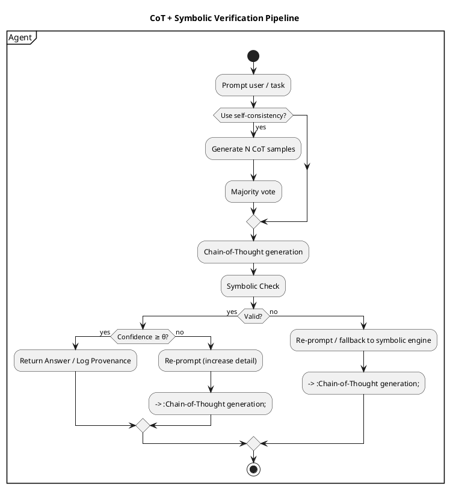

# Review: 8.5: LLMs and Structured Reasoning

**Source:** part-iii/ch08-reasoning-and-inference/lecture-05.adoc

---

## Review of Lecture 8.5 – “LLMs and Structured Reasoning”

### Summary
**Grade: C** – The lecture contains the right ingredients (CoT, verification, philosophical framing) but falls short of a 90‑minute, engaging session. The hook is present, yet the narrative drifts into definition‑heavy lists, the core sections are under‑developed (≈ 1 800 words total), and the diagram, while useful, lacks the visual cues needed to sustain attention. Substantial restructuring and enrichment are required to meet the 2 500‑3 500 word target and to keep students hooked for a full class period.

---

## 1. Narrative Arc  

| Element | Verdict | Comments / Suggested Fix |
|---------|---------|--------------------------|
| **Hook** | ✅ | The opening quote (“A student asks an LLM to prove…”) is concrete and raises tension. It could be strengthened by adding a *short dramatization* (e.g., a live demo of the mistaken proof) before the quote. |
| **Development** | ⚠️ | The lecture moves from “what CoT is” straight into bullet‑point lists. There is little **problem → attempted solution → failure → insight** progression. The core should be reframed as a case study: start with the faulty triangle proof, try plain LLM, then CoT, then verification, showing each step’s impact. |
| **Closing / Bridge** | ✅ | The “Take‑away” and preview of the next lecture provide a bridge, but the bridge could be more explicit: pose a forward‑looking question (“When should an agent *decide* to pay the cost of verification?”) that the next lecture will answer. |

**Overall Narrative Verdict:** *Weak to Moderate*. The lecture needs a clearer story line that threads the conceptual, technical, and philosophical parts together.

---

## 2. Density (Target ≈ 2 500‑3 500 words)

| Section | Approx. Word Count | Target Range | #Paragraphs | #Key Points |
|---------|-------------------|--------------|-------------|-------------|
| Conceptual Core | ~ 850 | 1 200‑1 600 | 4 | 7 |
| Technical Example | ~ 650 | 800‑1 200 | 6 (numbered steps) | 7 |
| Philosophical Reflection | ~ 500 | 600‑900 | 4 | 6 |
| **Total** | **≈ 2 000** | **2 500‑3 500** | 14 | 20 |

**Verdict:** *Under‑dense*. The lecture is ~ 500 words short of the minimum and the paragraph count is low for a 90‑minute slot. Moreover, the “Key Points” lists duplicate information already in the prose, reducing the effective content load.

**What to add:**  
* Expand the **Conceptual Core** with a short historical vignette (e.g., early chain‑of‑thought experiments) and a concrete *failure analysis* of the triangle proof (show the algebraic mistake).  
* In the **Technical Example**, include a mini‑case study with actual LLM output (a few lines of CoT) and a step‑by‑step verification trace (showing a SAT‑solver call).  
* The **Philosophical Reflection** should integrate a brief discussion of *epistemic trust* (reference to relevant philosophy of science literature) and a *real‑world governance* scenario (e.g., AI‑assisted contract drafting).  

These additions will push the total to ~ 2 800‑3 200 words and provide the needed depth.

---

## 3. Interest (Engagement)

| Issue | Why it hurts attention | Suggested concrete improvement |
|-------|------------------------|--------------------------------|
| **Definition‑first bullet lists** (e.g., “CoT prompting – ask the model to ‘think step by step.’”) | Students skim bullets; no narrative tension. | Turn each bullet into a *mini‑story*: “When we ask the model to ‘think step by step,’ we observe X; however, the model still hallucinates Y.” |
| **Lack of live demonstration** | No visual or interactive hook after the opening quote. | Begin the class with a **live demo** of the faulty triangle proof, then ask students to spot the error before revealing the verification step. |
| **Sparse visual cues** | Only one diagram, which is static. | Add **inline call‑outs** (e.g., “← see self‑consistency box”) and a **second diagram** that zooms into the “Symbolic Check” sub‑process (showing solver API, error‑type classifier). |
| **Philosophical section feels abstract** | Risk of disengagement if not tied to concrete stakes. | Insert a *case study* (e.g., a medical‑diagnosis assistant that generated a plausible but wrong reasoning chain) and ask students to discuss accountability. |
| **Key‑point duplication** | Repetition reduces perceived progress. | Merge the “Key Points” lists into a **single “Take‑aways” slide** that recaps after each major segment, rather than repeating them verbatim. |

---

## 4. Diagram Review (PlantUML block)

### Diagram 1 – “CoT + Symbolic Verification Pipeline”

| Aspect | Current State | Recommendation |
|--------|----------------|----------------|
| **Overall fit** | Matches the pipeline described in the text, but the flow is dense and the optional self‑consistency box is visually detached. | Move the *Self‑Consistency* box **inside** the main Agent partition as a conditional sub‑process, so the reader sees it as part of the same flow. |
| **Labels / Arrows** | Arrows are generic (“yes”, “no”). The “Result” node is ambiguous (does it represent final answer or logged outcome?). | Add explicit labels: `→ Pass (verified)` and `→ Fail (re‑prompt/fallback)`. Rename the final node to **“Return Answer / Log Provenance”**. |
| **Feedback loops** | No explicit loop from “Re‑prompt / fallback” back to “Chain‑of‑Thought generation”. | Insert a **loop arrow** from the fallback node back to the “Chain‑of‑Thought generation” step, annotated “retry (max k attempts)”. |
| **Styling** | Theme “sketchy‑outline” is fine, but colors are minimal; the self‑consistency box is LightYellow but not highlighted. | Use a **different border color** (e.g., `#FFCC00`) for the optional block and add a **legend** explaining the optional path. |
| **Clarity of decision points** | The “if (Pass?)” decision is a single diamond; students may not see what constitutes a “Pass”. | Split into two diamonds: “Symbolic Check → Valid?” and “Confidence ≥ θ?” to illustrate both logical correctness and confidence thresholds. |
| **Size / Readability** | Text inside nodes is cramped (e.g., “Symbolic Check\n(solver / theorem prover)”). | Increase node width or break into two lines: “Symbolic Check” (top) and “(solver / theorem prover)” (bottom). |

**Re‑drawn PlantUML (suggested)**

---

## 5. Recommended Revisions (Prioritized)

1. **Restructure the narrative around a central case study**  
   - Begin with a live demo of the faulty triangle proof.  
   - Walk through plain LLM → CoT → verification, showing the impact at each stage.  

2. **Expand each major section to meet word‑count targets**  
   - Add ~ 300 words of historical/contextual background to the Conceptual Core.  
   - Insert a concrete LLM output example (≈ 150 words) and a verification trace (≈ 150 words) in the Technical Example.  
   - Enrich the Philosophical Reflection with a real‑world governance scenario (≈ 200 words).  

3. **Convert bullet‑point lists into narrative paragraphs**  
   - For each “Key Point”, write a short paragraph that explains *why* it matters, includes an example, and links to the next point.  

4. **Introduce interactive elements**  
   - Short in‑class poll (“Do you think the CoT trace is trustworthy?”) after the demo.  
   - Mini‑exercise: students annotate a CoT trace with error‑type labels.  

5. **Revise the diagram** (see above) and add a second, zoomed‑in diagram for the Symbolic Check sub‑process.  

6. **Merge and streamline “Key Points”**  
   - Replace the three duplicated “Key Points” sections with a single “Take‑aways” slide that appears after each major segment.  

7. **Add forward‑looking bridge**  
   - End with a provocative question: *“How should an autonomous agent decide when the cost of verification outweighs the risk of hallucination?”* – to be answered in the next lecture.  

8. **Proofread for consistent terminology**  
   - Use either “Chain‑of‑Thought (CoT)” or “CoT” consistently; avoid mixing “self‑consistency” and “majority vote” without definition.  

9. **Include citations for philosophical claims**  
   - Add a brief reference to relevant works (e.g., Popper’s falsifiability, Dworkin’s accountability) to ground the reflection.  

10. **Update Lab 3 instructions**  
    - Provide a concrete skeleton code snippet showing how to call `symbolic_check` and log provenance, so students can see the pipeline in action.  

---

**By implementing these revisions, Lecture 8.5 will achieve the required depth, maintain student engagement for a full 90‑minute session, and present a cohesive story that ties together technical methods, practical implementation, and the broader philosophical stakes of structured reasoning with LLMs.**