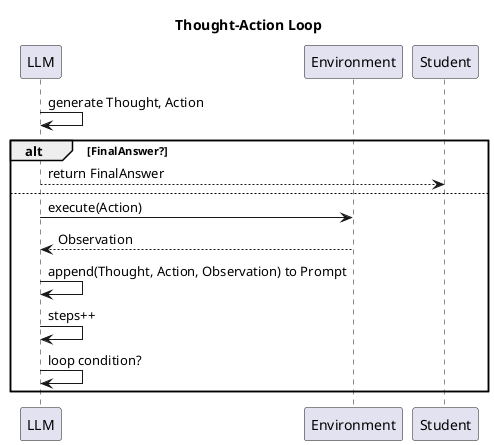

# Review:  generates Thought + Action
    if response contains FinalAnswer then
        return response.FinalAnswer
    end if
    observation ← execute(response.Action)
    prompt ← prompt + format(response.Thought, response.Action, observation)
    steps ← steps + 1
end while
return "max_steps reached"

**Source:** part-iii/ch09-acting-in-the-world/lecture-04.adoc

---

## Summary  
**Grade: D** – The lecture consists almost entirely of a raw code fragment with no narrative framing, context, or reflective discussion. It falls far short of the 2,500‑3,500‑word target, provides no hook or closing, and would not sustain attention for a 90‑minute session. Diagrams are absent, and the existing pseudo‑code is presented without explanation, making it a definition‑first dump rather than an engaging story.

---

## Narrative Arc  

| Element | Verdict | Comments |
|---------|---------|----------|
| **Hook** | ❌ Missing | No concrete scenario, provocative question, or tension. The reader is dropped straight into a loop without knowing *why* it matters. |
| **Development** | ❌ Missing | The code is shown, but there is no step‑by‑step exposition of the problem being solved (e.g., “How can an LLM act in an environment?”), the design choices, or the limits (max‑steps, failure modes). |
| **Closing / Bridge** | ❌ Missing | No summary, implication, or segue to a lab/exercise. The lecture ends abruptly with a return string. |

**Overall narrative arc:** non‑existent. The lecture needs a story‑line that moves from a motivating problem → algorithmic solution → critical analysis → next steps.

---

## Density  

| Section | Expected (words) | Actual (words) | Verdict |
|---------|------------------|----------------|---------|
| Conceptual Core (4‑6 paras, 6‑12 key points) | 1,200‑1,800 | ~30 (code only) | ❌ |
| Technical Example (2‑3 paras, 5‑8 key points) | 600‑900 | 0 | ❌ |
| Philosophical Reflection (2‑3 paras, 5‑8 key points) | 600‑900 | 0 | ❌ |
| **Total** | 2,500‑3,500 | ~30 | ❌ |

The lecture is dramatically under‑dense; it needs at least 2,500 words spread across the three required sections.

---

## Interest  

* **Engagement:** A 90‑minute class cannot be sustained by a single code block. Students will lose focus within minutes.  
* **Thin sections:** No explanation of “Thought + Action” paradigm, no real‑world example (e.g., a virtual robot cleaning a room), no discussion of failure cases (loops, hallucinated actions).  
* **Definition‑first:** The code is presented before any definition of the terms (Thought, Action, Observation, Prompt).  

**Concrete ways to add tension and forward motion:**  

1. **Start with a vivid scenario** – “Imagine a household robot that must fetch a cup of coffee while the kitchen layout changes in real time.”  
2. **Pose a provocative question** – “Can a language model reliably plan and act without a separate planner?”  
3. **Introduce the loop as a solution** and walk through the first two iterations with concrete data (e.g., “Thought: ‘The cup is on the counter.’ Action: ‘Move to (x, y)’”).  
4. **Interleave short “what‑if” pauses** – ask students to predict the next observation, fostering active participation.  
5. **Close with a forward‑looking statement** – “Next we will see how to bound the loop with a learned termination condition and connect it to reinforcement learning.”  

---

## Diagram Review  

No PlantUML blocks are present. A visual representation is essential for this algorithmic material.

**Suggested diagram:**  

*Add labels* (`Thought`, `Action`, `Observation`), *feedback arrow* from Environment back to LLM, and *loop condition* box. This will make the flow concrete and reinforce the narrative.

---

## Recommended Revisions  

| Priority | Action |
|----------|--------|
| **1️⃣** | **Create a compelling hook** (5‑minute story or demo) that frames the need for a “Thought + Action” loop. |
| **2️⃣** | **Expand the conceptual core**: define Thought, Action, Observation, Prompt; explain why a single LLM can be used for both planning and execution; discuss the “max_steps” safety valve. Aim for 4‑6 paragraphs, 6‑12 bullet key points. |
| **3️⃣** | **Add a concrete technical example** (e.g., a grid‑world robot). Walk through 2–3 iterations, showing actual prompt strings, model outputs, and environment responses. Include 5‑8 key observations (e.g., “Observation can be noisy”, “Action syntax must be validated”). |
| **4️⃣** | **Insert a philosophical reflection** (2‑3 paragraphs) on agency, the limits of language‑model‑only control, and ethical concerns of autonomous LLM agents. Provide 5‑8 discussion questions. |
| **5️⃣** | **Design and embed a PlantUML flow diagram** as shown above; ensure it appears after the code block and is referenced in the text (“see Figure 1”). |
| **6️⃣** | **Add a closing bridge** that previews the next lecture (e.g., “Learning to predict when to stop” or “Integrating external memory”). |
| **7️⃣** | **Create a short in‑class activity** (e.g., students write the next Thought given an Observation) to keep the 90‑minute session interactive. |
| **8️⃣** | **Proofread for consistent terminology** (use “LLM”, “Prompt”, “Observation” uniformly) and replace the raw pseudo‑code with a formatted code block that includes line numbers and comments. |
| **9️⃣** | **Check word count** – target 2,800–3,200 words across the three sections. Use sub‑headings (`## Conceptual Core`, `## Technical Example`, `## Philosophical Reflection`) to guide pacing. |
| **🔟** | **Add references** to seminal papers (e.g., “ReAct: Synergizing Reasoning and Acting in Language Models”, “Chain‑of‑Thought Prompting”) for further reading. |

Implementing these revisions will transform the lecture from a bare code dump into a rich, narrative‑driven, 90‑minute learning experience that engages students, meets the textbook’s structural standards, and provides clear visual support.