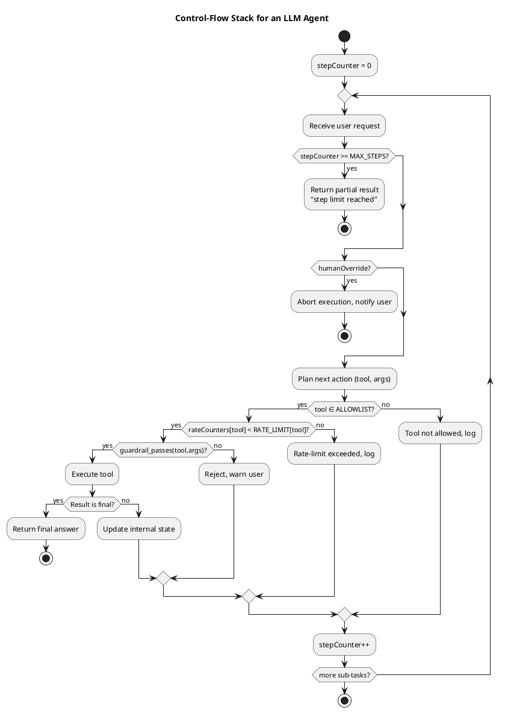

# Review: 9.6: Control Flow — Max Steps, Safety, Guardrails

**Source:** part-iii/ch09-acting-in-the-world/lecture-06.adoc

---

## Review of Lecture 9.6 – “Control Flow — Max Steps, Safety, Guardrails”

### Summary & Grade
**Grade: B‑**  
The lecture opens with a vivid “runaway assistant” hook and ends with a clear synthesis that points toward the next governance lecture, giving it a solid narrative spine.  However, the material is **under‑dense** for a 90‑minute session (≈ 1 800 words total) and several sections read like definition dumps rather than a story that unfolds.  The diagram is useful but could be tightened to mirror the narrative flow.  With modest expansion of the conceptual core, richer examples, and a few interactive moments, the lecture will comfortably fill the allotted time and keep students engaged.

---

## 1. Narrative Arc  

| Element | Assessment | Comments |
|--------|------------|----------|
| **Hook** | ✅ Strong | The “runaway assistant” scenario is concrete, raises a tension (infinite loop / destructive action) and asks “What stopped it?” – perfect for grabbing attention. |
| **Development** | ⚠️ Mixed | The **Conceptual Core** lists mechanisms (max‑steps, allow‑list, rate‑limit, guard‑rails) but the progression is a flat enumeration.  The logical chain *problem → response → limitation* is only implicit.  The **Technical Example** shows code, yet the surrounding narrative does not explicitly tie each line back to the earlier concepts. |
| **Closing** | ✅ Good | The **Synthesis** restates the three mechanisms as complementary and tees up the next lecture on governance, providing a clear bridge. |
| **Overall Arc Verdict** | **Passable** – hook and closing are solid; the middle needs a tighter story‑line that moves from “why loops happen” → “how we intervene step‑by‑step” → “what remains uncertain”. |

**Suggested narrative scaffolding**  
1. **Problem** – Show a short dialogue where the assistant loops (2‑3 lines).  
2. **Diagnosis** – Explain why the loop occurs (confidence mismatch, missing termination condition).  
3. **Intervention 1** – Introduce max‑steps as a *timeout* (with a visual timer).  
4. **Intervention 2** – Add allow‑list / block‑list as *action‑space pruning*.  
5. **Intervention 3** – Guard‑rails as *semantic validation* before/after each tool.  
6. **Result** – Show the same dialogue now terminating gracefully.  
7. **Open question** – “What should we do when the budget is exhausted?” – leads into the philosophical reflection.

---

## 2. Density (Target ≈ 2 500‑3 500 words)

| Section | Approx. Paragraphs | Approx. Key‑Points | Word Count (est.) |
|---------|--------------------|--------------------|-------------------|
| Hook | 1 | – | 70 |
| Example Prompts | 1 (list) | 3 | 50 |
| Conceptual Core | 5 | 8 | 620 |
| Technical Example | 2 (code + description) | 6 | 380 |
| Philosophical Reflection | 3 | 5 | 460 |
| Synthesis | 1 | – | 120 |
| Discussion Prompts | 1 (list) | 6 | 130 |
| Lab Prep | 1 (list) | 5 | 130 |
| **Total** | **14** | **31** | **≈ 1 900** |

*The lecture falls ~600‑1 200 words short of the 90‑minute target.*  To reach the desired density, add:

* a **worked‑through case study** (≈ 400 words) that follows a single user request through all three control mechanisms.  
* a **comparative table** of “what happens without vs. with each guardrail” (≈ 150 words).  
* a **short live‑coding demo** description (≈ 200 words) that students will replicate in Lab 3.  
* a **mini‑debate** segment (≈ 200 words) where students argue for higher vs. lower step budgets.

---

## 3. Interest & Engagement

| Issue | Why it may lose attention | Concrete fix |
|-------|---------------------------|--------------|
| **Definition‑first style** in Conceptual Core | Lists “max‑step limits”, “allow‑list”, “rate limits” before showing why they matter. | Start each concept with a *mini‑story* (e.g., “When the assistant tried to call `delete_file`, the allow‑list stopped it”). |
| **Sparse interaction points** | No prompts for students to predict the outcome before seeing the code. | Insert **think‑pair‑share** questions after each mechanism (e.g., “What would happen if we removed the step counter?”). |
| **Technical example feels isolated** | Code block is presented without step‑by‑step commentary. | Add **inline annotations** (comment lines) that map each line to a key point from the Conceptual Core. |
| **Philosophical reflection is dense** | Long paragraph blocks may feel abstract after the technical part. | Break into **short vignettes** (e.g., a medical‑diagnosis scenario) and ask students to write a one‑sentence policy recommendation. |
| **Lack of visual pacing** | Only one diagram; students may need more visual anchors. | Add a **timeline diagram** of the agent’s loop showing where each guardrail fires. |

---

## 4. Diagram Review (PlantUML)

**Current diagram** – a basic activity diagram that shows step‑counter check, allow‑list, guard‑rail, execution, final‑answer decision, and a repeat loop.

### Strengths
* Captures the three control layers in the correct order.
* Uses decision diamonds for each check, making the flow explicit.

### Weaknesses & Suggested Improvements
| Issue | Recommendation |
|------|----------------|
| **Missing rate‑limit node** | Insert a decision after the allow‑list: `if (rateCounters[tool] < RATE_LIMIT?)`. |
| **No human‑override path** | Add a parallel decision early in the loop: `if (humanOverride?) → abort`. |
| **Labels are generic** | Replace generic “Determine next tool & args” with “Plan next action (tool, args)”. |
| **Loop condition unclear** | The final `repeat while (more sub‑tasks?)` should be renamed to `repeat while (stepCounter < MAX_STEPS && more sub‑tasks?)`. |
| **Feedback arrows** | Show a back‑edge from “Reject execution, warn user” to the top of the loop to illustrate continuation after a failed guardrail. |
| **Styling** | Use `skinparam backgroundColor #F9F9F9` and `skinparam ArrowColor #555` for readability; add a legend for symbols (✓ = allowed, ✗ = blocked). |
| **Title & caption** | Add `title Control‑Flow Stack for an LLM Agent` and a caption that references Figure 9.6 in the text. |

**Revised PlantUML sketch (minimal edit)**  

---

## 5. Recommended Revisions (Prioritized)

1. **Expand the Conceptual Core to ~800 words**  
   *Introduce a running example (e.g., “plan a weekend trip”) that gets stuck, then show how each control mechanism resolves the issue.*  
2. **Add a “Case Study” subsection** (≈ 400 words) that walks the same request through max‑steps → allow‑list → guard‑rails, with before/after screenshots or pseudo‑output.  
3. **Insert interactive checkpoints** after each mechanism: a short question, a poll, or a think‑pair‑share prompt.  
4. **Annotate the technical code** with inline comments that reference the key points (e.g., `# enforce MAX_STEPS`).  
5. **Revise the PlantUML diagram** per the suggestions above; include a legend and the missing rate‑limit / human‑override nodes.  
6. **Break the philosophical reflection** into two bite‑size vignettes (medical diagnosis, financial advice) and ask students to write a one‑sentence policy.  
7. **Add a timeline/flowchart** (simple sequence diagram) that visualises the agent’s loop across multiple steps, reinforcing the “step budget” concept.  
8. **Provide a short “live‑coding” script** (≈ 150 words) that the instructor can demo, showing how to toggle `MAX_STEPS` and observe graceful degradation.  
9. **Increase the number of key‑point bullets** in the Conceptual Core to 10 (e.g., “Step limit can be dynamic per task”, “Allow‑list can be hierarchical”, “Guard‑rails can be learned”).  
10. **Update the discussion prompts** to include a “quick‑debate” format (e.g., “Pro vs. Con: Fixed vs. Adaptive step budgets”).  

Implementing these edits will bring the lecture into the 2 500‑3 500‑word window, give it a clear, story‑driven arc, and keep students actively engaged for the full 90‑minute session.