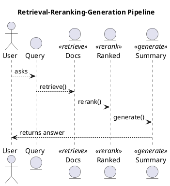

# Review: python
def pipeline(query):
    docs = retrieve(query)          # Stage 1
    ranked = rerank(docs, query)    # Stage 2
    summary = generate(ranked)      # Stage 3
    return summary

**Source:** part-iv/ch10-architectures-of-intelligence/lecture-01.adoc

---

## Summary  
**Grade: D** – The lecture consists of a single three‑line code snippet with no narrative hook, no development, and no closing. It falls far short of the 2,500‑3,500‑word target for a 90‑minute session, provides no key points, and offers nothing to sustain student interest. No diagrams are present, so there is no visual reinforcement either.

---

## Narrative Arc  

| Element | Verdict | Comments |
|---------|---------|----------|
| **Hook** | ❌ Missing | The lecture opens with a bare definition (`def pipeline(query): …`) rather than a concrete scenario, provocative question, or tension‑creating problem. |
| **Development** | ❌ Missing | No step‑by‑step exposition of why the three stages (retrieve → rerank → generate) matter, how they interact, what alternatives exist, or what challenges arise. |
| **Closing / Bridge** | ❌ Missing | No implication, reflection, or segue to a lab, case study, or next lecture. |

**Overall narrative verdict:** *Absent.* The lecture needs a story‑line that frames the pipeline as a solution to a real‑world information‑need (e.g., “How does a virtual research assistant answer a complex query?”).

---

## Density  

| Section | Expected (words) | Actual | Gap |
|---------|------------------|--------|-----|
| Conceptual Core (4‑6 paragraphs, 6‑12 key points) | 2,500‑3,500 | ≈30 (code only) | **~2,470‑3,470** missing |
| Technical Example (2‑3 paragraphs, 5‑8 key points) | – | 0 | **Missing** |
| Philosophical Reflection (2‑3 paragraphs, 5‑8 key points) | – | 0 | **Missing** |

The lecture does not meet any of the required structural or word‑count criteria.

---

## Interest  

- **Engagement:** A 90‑minute class cannot be sustained by a three‑line snippet. Students will disengage almost immediately.  
- **Thin/Vague Sections:** Every section is absent; the only content is a definition‑first code block.  
- **Suggested Hooks:**  
  1. Begin with a **real‑world scenario** (e.g., a journalist needing a concise briefing from a massive corpus).  
  2. Pose a **provocative question**: “Can a single function magically turn millions of documents into a useful answer?”  
  3. Show a **failure case** (e.g., naive retrieval returning irrelevant results) to create tension.  

- **Forward Motion:** After the hook, walk through each stage, illustrate pitfalls, compare alternatives, and end with a lab where students implement or extend the pipeline.

---

## Diagram Review  

*No PlantUML blocks are present.*  
A pipeline diagram is essential to visualise the flow of data between **retrieve → rerank → generate** and to highlight feedback loops (e.g., relevance feedback).  

**Suggested diagram:**  

- Add **labels** on arrows (e.g., “raw hits”, “re‑scored list”, “concise answer”).  
- Include an optional **feedback loop** from `Summary` back to `Retrieve` to hint at iterative refinement.  

---

## Recommended Revisions  

1. **Create a narrative hook (1–2 paragraphs).**  
   - Open with a vivid scenario or a “What if?” question that frames the need for a multi‑stage pipeline.  

2. **Expand the Conceptual Core (≈4–5 paragraphs, 6–10 key points).**  
   - Define each stage (retrieval, reranking, generation) *in context*, not as isolated definitions.  
   - Discuss common algorithms (BM25, dense retrieval, cross‑encoders, LLM‑based generation).  
   - Highlight trade‑offs (speed vs. relevance, lexical vs. semantic).  

3. **Add a Technical Example (≈2–3 paragraphs, 5–7 key points).**  
   - Walk through a concrete query (e.g., “Explain the causes of the 2008 financial crisis”).  
   - Show sample code for each stage, include pseudo‑outputs, and discuss error cases.  

4. **Insert a Philosophical Reflection (≈2 paragraphs, 5–6 key points).**  
   - Question the limits of pipeline modularity (e.g., “Does separating retrieve and generate hide emergent reasoning?”).  
   - Connect to broader themes in the textbook (agency, epistemic trust).  

5. **Develop a lab/assignment brief (closing).**  
   - Ask students to implement a simple pipeline, experiment with swapping a retriever or reranker, and report on quality vs. latency.  

6. **Add a PlantUML diagram** (as suggested above) and place it after the hook to give a visual anchor.  

7. **Increase word count** to at least **2,500 words** across the three sections, ensuring each key point is explicitly numbered or bolded for easy reference.  

8. **Remove the “definition‑first” code block** from the very top; instead, introduce the code *after* the narrative has established why the pipeline matters.  

By following these steps, the lecture will transform from a bare code snippet into a fully‑fledged, 90‑minute learning experience that is coherent, dense, and engaging.