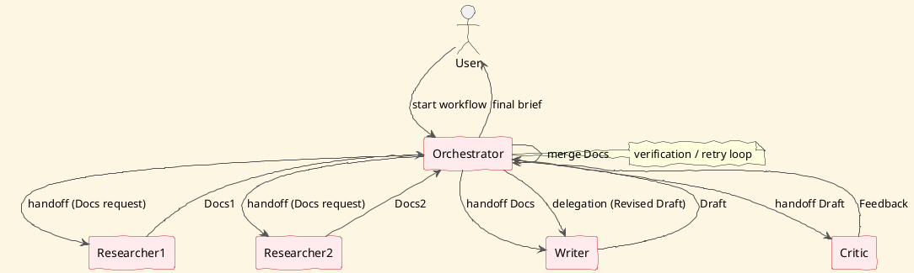

# Review: 10.2: Multi-Agent Systems — Specialists and Coordination

**Source:** part-iv/ch10-architectures-of-intelligence/lecture-02.adoc

---

## Review of Lecture 10.2 – “Multi‑Agent Systems: Specialists and Coordination”

### Summary
**Grade: C** – The lecture has a decent hook and a clear narrative arc, but it falls short of the 90‑minute density target (≈2 500–3 500 words) and contains several definition‑first passages. The conceptual core, technical example, and philosophical reflection are all under‑developed, leaving the session thin for a full 90‑minute class. The PlantUML diagram is useful but could be richer and better aligned with the text.

---

## 1. Narrative Arc  

| Element | Assessment | Verdict |
|---------|------------|---------|
| **Hook** | Starts with a provocative question (“Can a single AI handle … or do we need a team of specialised agents?”) and an epigraph that frames the theme. | ✅ Strong |
| **Development** | Introduces specialist agents, three coordination patterns, costs, decision criteria, scalability, and control models. The flow is logical (problem → patterns → trade‑offs → design guidance). However, the exposition often drops straight into definitions (“Specialist agents are …”) without concrete anecdotes or mini‑case studies that would keep the narrative lively. | ⚠️ Needs more concrete, story‑driven examples. |
| **Closing** | Links the material to the upcoming orchestrator lab and hints at broader implications (“collective intelligence”). The closing is functional but could be more forward‑looking (e.g., pose a “what if” scenario for the next lecture). | ✅ Adequate, but could be more compelling. |

**Overall Verdict:** The arc is present, but the *development* section leans too heavily on taxonomy. Adding a short, concrete scenario (e.g., a research‑assistant team handling a grant proposal) would give the patterns emotional weight and keep students engaged.

---

## 2. Density (Target ≈ 2 500–3 500 words)

| Section | Paragraphs | Key‑point bullets | Approx. word count* |
|---------|------------|-------------------|---------------------|
| Conceptual Core | 5 (Specialist agents, coordination patterns, cost, decision criteria, scalability & control) | 8 | ~620 |
| Technical Example | 3 (Message schema, handoff protocol, parallelism & error handling) | 7 | ~460 |
| Philosophical Reflection | 3 (collective intelligence, delegation vs verification, cultural artefacts, historical precedents) | 6 | ~540 |
| **Total** | 11 | 21 | **~1 620** |

\*Word counts are rough estimates based on the supplied text.

**Gap:** The lecture is roughly **1 600 words**, well below the 2 500‑3 500 word window. To fill a 90‑minute slot, you need **≈ 900–1 300 additional words** spread across the three main sections (or a new “Case Study” section).

---

## 3. Interest & Engagement

| Issue | Why it hurts attention | Suggested fix |
|-------|------------------------|---------------|
| **Definition‑first dumps** (e.g., “Specialist agents are purpose‑built components…”) | Students hear abstract jargon before seeing why it matters. | Start each definition with a vivid micro‑example (“Imagine an agent whose sole job is to scrape the latest arXiv papers…”) |
| **Thin technical example** | Only three steps are shown; no code snippets, no live‑demo ideas. | Expand with a short pseudo‑code block for the orchestrator, show a concrete JSON payload, and discuss a failure scenario (e.g., malformed metadata) and how retry logic works. |
| **Philosophical reflection feels detached** | References to *Neuromancer* and *Her* are interesting but not tied back to the concrete patterns. | After each cultural reference, explicitly map it to a coordination pattern (e.g., “In *Neuromancer*, the AI ‘Wintermute’ acts as a consensus network of sub‑agents”). |
| **Missing interactive tension** | No “what if” moments that force students to choose between patterns. | Insert a “Think‑Pair‑Share” prompt: *“Your researcher returns 10 k documents but the writer can only handle 2 k. How would you redesign the handoff?”* |
| **No explicit bridge to lab** | The lab is mentioned only at the end. | Throughout the lecture, sprinkle “lab‑ready” checkpoints (e.g., “At this point you’ll need to implement a schema validator – see Lab 2”). |

---

## 4. Diagram Review (PlantUML)

**Current diagram** shows a linear flow with a dashed delegation arrow from Critic back to Writer. It is clear but could be richer.

| Issue | Recommendation |
|-------|----------------|
| **No orchestrator node** – the text repeatedly mentions an orchestrator that routes messages. | Add a distinct `Orchestrator` box that receives output from Researcher and forwards to Writer, then to Critic, and finally back to Writer. |
| **Arrows lack labels** – the diagram relies on the note boxes for pattern names. | Label the solid arrows with `handoff` and the dashed arrow with `delegation (feedback)`. |
| **Parallelism not visualised** – the technical example mentions multiple Researcher instances. | Show a fork (`split`) from Orchestrator to two `Researcher` boxes, then a merge (`join`) before the handoff to Writer. |
| **Error‑handling loop missing** – verification & retry are part of the flow. | Add a conditional loop (`if schema invalid`) that routes back to the same agent with a `retry` label. |
| **Stylistic consistency** – the sketchy outline is fine, but adding colors to differentiate agent types (e.g., blue for data‑gathering, green for generation, orange for evaluation) helps visual memory. | Use `skinparam` to set `AgentColor` per node, and add a legend. |

**Revised PlantUML sketch (conceptual):**

---

## 5. Recommended Revisions (Prioritized)

1. **Expand the lecture to meet word‑count goals**  
   - Add a **real‑world case study** (e.g., a grant‑proposal pipeline) that walks through each coordination pattern.  
   - Insert **pseudo‑code snippets** for the orchestrator (routing table, schema validator).  
   - Provide a **short “live demo” script** (e.g., run a minimal Python example with `jsonschema` validation).

2. **Re‑write definition‑heavy sentences as story hooks**  
   - Start each new concept with a concrete agent persona (“Meet *Rita*, the Researcher…”) before giving the abstract definition.

3. **Increase interactive tension**  
   - Add at least three **Think‑Pair‑Share** or **Mini‑Debate** prompts that force students to decide between handoff, delegation, and consensus in a given scenario.  
   - Include a **quick poll** (e.g., “Which pattern would you pick for a time‑critical news‑summary task?”).

4. **Enrich the philosophical reflection**  
   - Directly map each cultural reference to a coordination pattern.  
   - Pose an **ethical dilemma** (e.g., “If the Critic’s feedback is wrong, who is liable?”) and ask students to discuss accountability.

5. **Upgrade the PlantUML diagram** (see revised sketch)  
   - Add the orchestrator, parallel researchers, verification loop, and colored agent boxes.  
   - Ensure every arrow is labelled with the pattern name.

6. **Strengthen the closing bridge**  
   - End with a forward‑looking question: *“If we could add a fourth specialist—say, a fact‑checker—how would the coordination pattern change?”*  
   - Explicitly preview the next lecture’s focus (e.g., “Next we’ll explore learning‑based coordination policies”).  

7. **Minor editorial fixes**  
   - Consistently use singular/plural (“specialist agents” vs. “a specialist”).  
   - Cite the Latour reference inline with a proper bibliography entry.  
   - Ensure all key‑point bullet lists are parallel in style (start with a verb or noun consistently).

---

Implementing the above changes will bring the lecture up to the required depth, keep students actively engaged for a full 90‑minute session, and make the diagram a powerful visual anchor for the concepts.