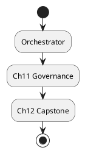
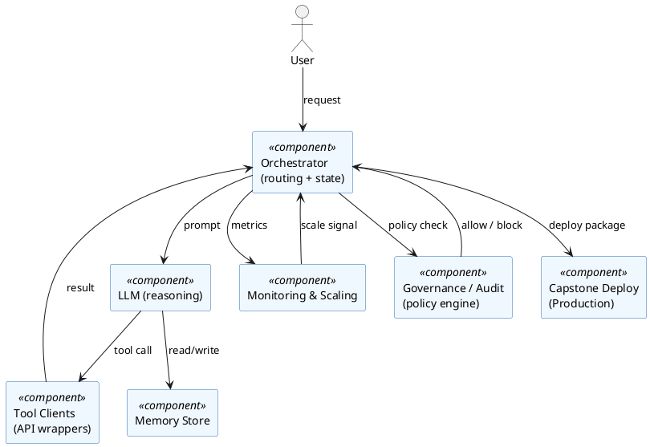

# Review: 10.8: Lab Integration — Agent Orchestrator

**Source:** part-iv/ch10-architectures-of-intelligence/lecture-08.adoc

---

## Review of Lecture 10.8 – *Lab Integration — Agent Orchestrator*  

**Grade: D** – The lecture falls far short of the 90‑minute, narrative‑driven, and engaging standards required for the AIPA textbook.

---

### 1. Narrative Arc  

| Element | Verdict | Comments |
|--------|---------|----------|
| **Hook** | ❌ Weak / missing | The opening line (“The orchestrator is the spine of the student’s AI…”) is a bland statement, not a concrete scenario, provocative question, or tension‑creating anecdote. |
| **Development** | ❌ Under‑developed | The “Conceptual Core” merely recaps previous chapters; there is no clear problem → solution → limitation progression. The technical example is a one‑sentence to‑do list, and the philosophical reflection repeats the same slogan. |
| **Closing / Bridge** | ❌ Minimal | The discussion prompts are useful but feel tacked on; there is no narrative payoff that ties the orchestrator to the upcoming labs, governance, or capstone in a way that propels the student forward. |

**Overall Verdict:** The lecture lacks a coherent story. It reads as a checklist rather than a lesson that builds curiosity, explains why the orchestrator matters, shows it in action, and leaves the learner eager to try the lab.

---

### 2. Density (Target ≈ 2 500‑3 500 words)

| Section | Paragraphs (actual) | Target | Key‑point items (actual) | Target |
|---------|----------------------|--------|--------------------------|--------|
| Conceptual Core | 1 | 4‑6 | 5 | 6‑12 |
| Technical Example | 1 | 2‑3 | 3 | 5‑8 |
| Philosophical Reflection | 1 | 2‑3 | 3 | 5‑8 |

**Word count** – Roughly 250 words total, < 10 % of the required density. The lecture would need **≈ 12‑15 times** more content to fill a 90‑minute session.

---

### 3. Interest  

* **What would hold attention?**  
  * A vivid opening vignette: *“You are the AI ops manager for a startup that just received a $5 M seed round. Overnight the product team asks you to spin up a customer‑support agent that can read tickets, query internal tools, and propose resolutions, all while complying with GDPR.”*  
  * A “mystery” problem: the student’s earlier modules work in isolation but fail when combined (e.g., memory loss, tool‑call dead‑ends). The orchestrator is presented as the *solution* that restores coherence.  
  * Incremental “live‑coding” walk‑through: show a minimal orchestrator file, run it, observe logs, then add monitoring, then add a governance hook, highlighting the emergent behavior each time.

* **Thin / definition‑first sections** – All three core sections start with a definition‑style recap. Replace these with **story‑driven exposition** (problem → attempted fix → orchestrator design → observed limitation → next step).

* **Concrete ways to add tension** –  
  * Pose a “what‑if” scenario: *What happens if the governance policy blocks a tool call that the LLM thinks is essential?*  
  * Show a short failure trace (e.g., a loop that dead‑locks) and ask students to debug it using the orchestrator’s monitoring hooks.

---

### 4. Diagram Review  

**Current PlantUML (Diagram 1)**  

| Issue | Recommendation |
|-------|----------------|
| **Over‑simplified flow** – only three boxes, no data or control arrows. | Add **component boxes** for *Memory*, *LLM*, *Tool Clients*, *Monitoring*, *Scaling*, *Audit Service*. |
| **No directionality** – start → orchestrator → governance → capstone is ambiguous. | Use **solid arrows** for data flow (e.g., “request → orchestrator → tool → response”) and **dashed arrows** for policy feedback (governance → orchestrator). |
| **Missing labels** – boxes lack descriptive text (what does “Orchestrator” actually do?). | Label each box with a short verb phrase, e.g., “Orchestrator (routing + state mgmt)”. |
| **No feedback loops** – governance and audit are only downstream. | Add a **feedback loop** from *Governance* back to *Orchestrator* (“policy enforcement”) and from *Monitoring* back to *Orchestrator* (“auto‑scale trigger”). |
| **Stylistic** – “sketchy‑outline” theme is fine, but the diagram should be **readable at lecture size**. | Increase font size, use consistent colors (e.g., blue for data, orange for control), and add a legend. |

**Suggested revised PlantUML (excerpt)**  

---

### 5. Recommended Revisions (Prioritized)

1. **Create a compelling hook** (first 5‑10 minutes).  
   *Start with a real‑world scenario or a “what‑if” problem that forces the need for an orchestrator.*  
2. **Expand the Conceptual Core** to 4‑6 paragraphs (~800 words).  
   *Explain the orchestration problem, the design decisions (routing, state, observability), and the trade‑offs (latency vs. flexibility). Include a short code snippet of the orchestrator’s main loop.*  
3. **Develop a step‑by‑step technical example** (2‑3 paragraphs, ~600 words).  
   *Walk through deploying a minimal orchestrator, adding a tool client, enabling monitoring, then inserting a governance rule. Show console output and a debugging moment.*  
4. **Deepen the Philosophical Reflection** (2‑3 paragraphs, ~500 words).  
   *Connect the orchestrator to the “metabolism thesis” (Chapter 1) and discuss how a system that can self‑regulate embodies a primitive form of agency.*  
5. **Add a “Live Lab Preview”** (≈ 5 minutes).  
   *Present the Lab 3 checklist as a narrative: “Your mission is to turn the prototype into a production‑ready service that passes the audit.”*  
6. **Rewrite all discussion prompts** to reference the new hook and the technical walk‑through, encouraging students to predict failure modes and policy impacts.  
7. **Replace the current diagram** with the revised PlantUML (see above). Ensure it appears **right after the technical example** so students can visually map the code they just saw.  
8. **Insert short “reflection boxes”** after each major subsection (e.g., “Why does routing matter?”) to keep the narrative active.  
9. **Check word count** – target ~2 800 words across the three main sections. Use bullet‑point expansions, example logs, and a small “FAQ” at the end to reach the target.  
10. **Proofread for consistency** – ensure every term (orchestrator, governance, capstone, metabolism) is defined once early and then used consistently.

---

### Closing Note  

With the above revisions, Lecture 10.8 will transform from a terse checklist into a **story‑driven, hands‑on, and philosophically grounded** session that comfortably fills a 90‑minute class, keeps students engaged, and prepares them for the upcoming labs and capstone.