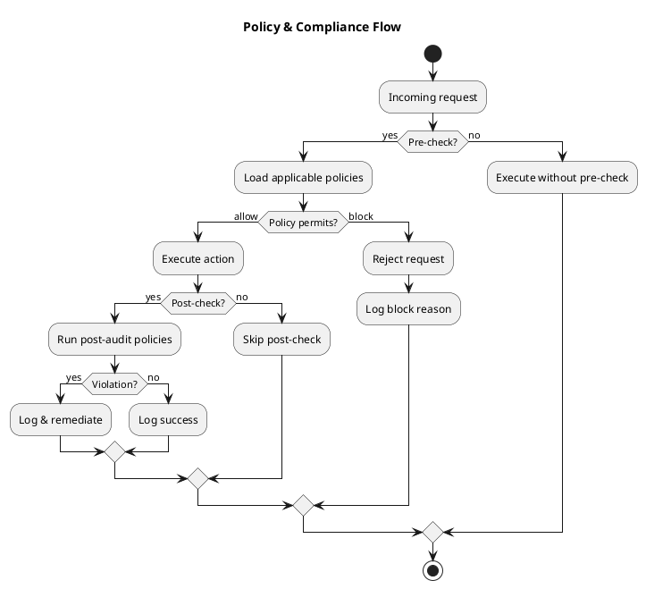

# Review: 11.1: Governance — Policies and Constraints

**Source:** part-iv/ch11-ai-in-institutions/lecture-01.adoc

---

# Review of Lecture 11.1 – “Governance — Policies and Constraints”

**Grade: C** – The lecture contains the essential ideas but falls short of a 90‑minute, engaging session. The narrative hook is weak, the material is under‑dense, and the sole diagram does not reinforce the conceptual story.

---

## 1. Narrative Arc  

| Element | Assessment | Suggested Fix |
|---------|------------|---------------|
| **Hook** | Starts with a Foucault epigraph and a one‑sentence statement. No concrete scenario, provocative question, or tension that pulls students in. | Open with a vivid “what‑if” story: *“A medical‑assistant chatbot just answered a patient’s query, but the response contained the patient’s SSN. Who is responsible? How could a policy have prevented it?”* Follow with the question “What makes a system *the* system it is?” |
| **Development** | The conceptual core explains policies, representation, trade‑offs, and politics, but the flow is a list of ideas rather than a problem → response → limitation progression. | Structure the middle as a three‑step narrative: <br>1. **Problem** – uncontrolled AI outputs cause concrete harms (PII leak, rate‑limit abuse). <br>2. **Response** – introduce a governance layer (policy schema, enforcement points). <br>3. **Limits** – discuss safety vs. utility, latency, and political ownership of policies. Use the example prompts as the “problem” and the policy schema as the “response”. |
| **Closing / Bridge** | Ends by restating the opening claim and mentions upcoming chapters. The bridge is present but feels abrupt. | End with a forward‑looking “design challenge”: *“In the next lab you will build a policy engine. Think now: whose voice will you let speak in that engine?”* This creates a clear transition to the lab and the next lecture (cost & fairness). |

**Verdict:** Hook needs a concrete, emotionally resonant scenario; development should be a tighter problem‑solution‑limitation arc; closing should explicitly set up the lab and next lecture.

---

## 2. Density (Target ≈ 2,500–3,500 words)

| Section | Approx. Paragraphs | Approx. Key Points | Word Count Estimate | Meets Target? |
|---------|-------------------|-------------------|---------------------|---------------|
| Conceptual Core | 5 (large block) | 6 | ~600–800 | **No** – far below 2,500‑3,500 words. |
| Technical Example | 3 | 3 | ~350–500 | **No** – needs expansion. |
| Philosophical Reflection | 2 | 3 | ~300–400 | **No** – under‑dense. |
| **Total** | ~10 | ~12 | ~1,300–1,700 | **Below** target by ~1,000 words. |

**What’s missing:**  
* More detailed walkthroughs of policy representation (e.g., JSON schema snippet, DSL grammar).  
* A step‑by‑step simulation of a request flowing through pre‑check → action → post‑check, with latency numbers.  
* A short case‑study (e.g., “OpenAI’s content‑filter controversy”) to illustrate real‑world stakes.  
* A reflective paragraph linking governance to the broader sociotechnical context (power, accountability, audit trails).  

---

## 3. Interest & Engagement  

| Issue | Why it hurts attention | Concrete improvement |
|-------|------------------------|----------------------|
| **Definition‑first style** (e.g., “Policies are rules, constraints, guardrails”) | Students hear a list before seeing why it matters. | Introduce each term through a live demo: ask the class to write a policy that blocks “password” in outputs, then show the system reject a request. |
| **Thin technical example** | Only three bullet‑point policies; no code, no data flow. | Add a runnable pseudo‑code snippet that parses a policy JSON and evaluates a request. Show a timer to illustrate latency trade‑off. |
| **Lack of tension** | No sense of stakes or conflict. | Pose a debate: *“Should a policy be able to block a user’s request for a medical diagnosis?”* Let students argue, then reveal the governance design implications. |
| **Missing interactive element** | 90 min lecture needs at least one hands‑on or think‑pair‑share. | Insert a 10‑minute “policy‑design sprint”: groups draft a policy for a given scenario and present the trade‑offs. |
| **Monotonous reading** | Long prose without visual breaks. | Break the conceptual core into sub‑headings (Problem, Representation, Trade‑offs, Political Dimension) and insert a quick poll or clicker question after each. |

---

## 4. Diagram Review  

**Current PlantUML (Figure 11.1)**  

```
start
:Policy;
:Check;
:Action;
:Allow;
:Block;
stop
```

- **Issues**  
  1. No decision node – the flow suggests both *Allow* and *Block* happen sequentially, which is misleading.  
  2. No indication of **pre‑check vs. post‑check**.  
  3. No representation of **policy schema** or **policy engine**.  
  4. No feedback loop for audit/logging.  

- **Suggested redesign**  



**Improvements**  
* Decision diamonds clearly separate *allow* vs. *block*.  
* Shows optional pre‑check and post‑check branches (tension between safety and latency).  
* Includes logging/audit feedback loops, reinforcing the “constitutive” claim.  
* Title and brief labels make the diagram self‑explanatory even without surrounding text.

---

## 5. Recommended Revisions (Prioritized)

1. **Rewrite the opening hook**  
   *Add a 2‑sentence “what‑if” scenario that illustrates a concrete failure caused by missing governance.*  

2. **Restructure the conceptual core into a problem‑solution‑limit narrative**  
   *Three sub‑sections with headings, each ending with a rhetorical question that leads to the next.*  

3. **Expand word count to ≥ 2,500**  
   *Insert a 200‑word case study, a 150‑word policy‑schema example (JSON snippet), and a 200‑word discussion of latency vs. safety.*  

4. **Enrich the technical example**  
   *Provide pseudo‑code for policy evaluation, a small table of latency measurements, and a step‑by‑step walk‑through of a request.*  

5. **Add an interactive activity**  
   *10‑minute “policy design sprint” with a shared Google Doc or whiteboard.*  

6. **Deepen the philosophical reflection**  
   *Quote a recent governance controversy (e.g., EU AI Act) and ask students to map the power dynamics.*  

7. **Replace the current PlantUML diagram** with the revised flowchart (see above).  
   *Add labels for “pre‑check”, “post‑check”, “audit log”, and a decision node.*  

8. **Insert at least two clicker/poll questions** (e.g., “Should a policy be able to block a user’s request for a medical diagnosis?”) to break up the lecture and maintain attention.  

9. **Link explicitly to the upcoming lab** in the closing paragraph: *“When you build your policy schema in Lab 1, think about who will author each rule and how you will expose audit logs.”*  

10. **Proofread for consistency** (e.g., ensure “policy” vs. “governance” terminology is used uniformly, and that key‑point lists match the expanded content).  

---

**Overall:** With a stronger hook, richer examples, more interactive moments, and a clearer diagram, Lecture 11.1 can meet the 90‑minute depth and keep students engaged while reinforcing the central claim that governance *constitutes* the AI system itself.