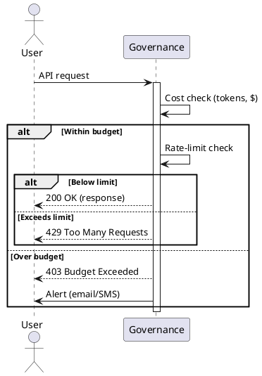

# Review: 11.2: Cost Control and Rate Limiting

**Source:** part-iv/ch11-ai-in-institutions/lecture-02.adoc

---

## Review of Lecture 11.2 – “Cost Control and Rate Limiting”

### Summary
**Grade: C** – The lecture touches an important topic, but it falls short of the 90‑minute instructional standards. The narrative arc is weak (the hook is a bare quote, the development is a list of facts, and the closing is a thin lab pointer). The core, technical, and philosophical sections are under‑developed: each contains far fewer than the required 4‑6 paragraphs and 5‑8 key‑point items, and the total word count is well under the 2 500‑3 500 word target. The sole PlantUML diagram is overly simplistic and does not reinforce the concepts. Substantial restructuring is needed to make the lecture engaging and dense enough for a full session.

---

## 1. Narrative Arc  

| Element | Verdict | Comments |
|---------|---------|----------|
| **Hook** | ❌ Weak | The epigraph (“Every API call has a cost”) is a quotation, not a concrete scenario or provocative question. Students are not immediately drawn into a problem they can picture. |
| **Development** | ❌ Fragmented | The “Conceptual Core” reads like a definition dump. It mentions cost tracking, rate limiting, budgets, and design tricks, but there is no clear problem → solution → limitation progression. |
| **Closing / Bridge** | ❌ Minimal | The lecture ends with a lab prompt and a discussion list, but there is no narrative “take‑away” that ties the material to broader institutional concerns or to the next lecture. |

**Overall narrative arc:** Incomplete. The lecture needs a stronger opening scenario, a step‑by‑step unfolding of the governance challenge, and a closing that explicitly links cost control to the upcoming topics (e.g., “budget‑aware model selection” or “fairness‑vs‑cost trade‑offs”).

---

## 2. Density (Target vs. Actual)

| Section | Target Paragraphs | Actual Paragraphs | Target Key‑Points | Actual Key‑Points | Word‑Count (approx.) |
|---------|-------------------|-------------------|-------------------|-------------------|----------------------|
| Conceptual Core | 4‑6 | 1‑2 (single block) | 6‑12 | 5 | ~350 |
| Technical Example | 2‑3 | 2 (one block + lab note) | 5‑8 | 3 | ~250 |
| Philosophical Reflection | 2‑3 | 2 | 5‑8 | 3 | ~250 |
| **Total** | 8‑12 paragraphs | ~5‑6 | 16‑28 key‑points | 11 | **~850** words |

**Result:** The lecture is roughly a third of the required length and supplies only about half the required key‑point density. It will not fill a 90‑minute slot without substantial expansion (e.g., case studies, live demo, group activities).

---

## 3. Interest & Engagement  

- **Hook needs a concrete story.** Example: “A university research group launches an autonomous literature‑review agent. Within 24 hours the cloud bill spikes to $12 000, forcing the department to shut down the service.”  
- **Stepwise tension.** Pose a series of escalating questions: *What happens when an agent loops?* → *How does a budget alert change behavior?* → *What if the budget is too tight for a critical task?*  
- **Interactive elements.** Insert a short “think‑pair‑share” after the cost‑tracking explanation where students estimate the cost of a sample prompt.  
- **Live demo.** Show a minimal Python script that logs token usage and triggers a 429 response; let students modify the rate‑limit threshold in real time.  
- **Bridge to lab.** End the conceptual section with a “What if…” scenario that the lab will solve (e.g., “What if the token price doubles overnight?”).  

---

## 4. Diagram Review  

**Current PlantUML (Diagram 1)**  

```
start
:Request;
:Cost Check;
:Rate Limit;
stop
```

- **Issues**  
  1. **Too linear** – No representation of feedback (e.g., alerts, budget breach, fallback to cheaper model).  
  2. **Missing actors** – No user/API‑key context, no governance controller.  
  3. **No decision points** – Rate‑limit and cost‑check are shown as simple steps, not conditional branches.  
  4. **No visual emphasis** on the two separate levers (cost tracking vs. rate limiting).  

- **Suggested improvements**  
  - Add a **decision diamond** after “Cost Check” → *Within budget?* → *Yes → continue* / *No → reject/alert*.  
  - Add a **decision diamond** after “Rate Limit” → *Below limit?* → *Yes → process* / *No → 429 response*.  
  - Include **actors**: “User/API key” sending the request, “Governance Service” performing checks.  
  - Label arrows with “tokens, $” and “req/min”.  
  - Show a **feedback loop** from “Alert” back to “User” (e.g., email/notification).  

**Revised PlantUML sketch (conceptual):**



---

## 5. Recommended Revisions (Prioritized)

1. **Rewrite the Hook (Top Priority)**
   - Begin with a vivid, time‑boxed case study (e.g., runaway costs of an autonomous agent). Pose a provocative question: *“How do we prevent a single AI service from draining an entire department’s budget in minutes?”*

2. **Expand the Conceptual Core to 4‑6 paragraphs**
   - Paragraph 1: Scenario → problem statement (hidden costs).  
   - Paragraph 2: Explain token‑based pricing & compute cost with concrete numbers.  
   - Paragraph 3: Introduce cost‑tracking mechanisms (metrics, dashboards).  
   - Paragraph 4: Introduce rate‑limiting fundamentals (burst vs. sustained limits).  
   - Paragraph 5: Discuss design patterns (caching, batching, model tiering).  
   - Paragraph 6: Connect economics to access control & sustainability.

3. **Increase Key‑Point Count to 6‑12**
   - Add points on *budget granularity (per project, per department)*, *alert channels*, *soft vs. hard stop policies*, *fallback to cheaper model*, *audit logs for compliance*, *cost‑impact of fine‑tuning*.

4. **Enrich Technical Example**
   - Provide a **code snippet** (Python) that logs token usage, computes cost, and raises a custom exception when budget exceeded.  
   - Add a **step‑by‑step walkthrough** of the rate‑limiter implementation (token bucket algorithm).  
   - Include **5‑8 key points** covering logging, aggregation, alerting, enforcement, testing, and simulation of price changes.

5. **Deepen Philosophical Reflection**
   - Add two more paragraphs: (a) *Equity implications* – who is left out when costs rise? (b) *Policy tension* – balancing innovation vs. fiscal responsibility.  
   - Expand key points to cover *fair pricing models*, *public‑good AI services*, *regulatory mandates*, *long‑term sustainability*, *trade‑offs with performance*.

6. **Revise Diagram**
   - Replace the current linear flow with the decision‑branch diagram above.  
   - Add labels, actors, and feedback loops. Ensure the figure is referenced in the text (“see Figure 11.2 for the governance decision flow”).

7. **Add Interactive Elements**
   - Insert a **quick poll** (e.g., “What budget would you allocate to a research‑grade LLM?”).  
   - Include a **mini‑exercise** where students calculate cost for a sample prompt using a provided price table.

8. **Strengthen Closing / Bridge**
   - Conclude with a forward‑looking statement: *“In the next lecture we will explore how cost‑aware decisions influence model selection and fairness metrics.”*  
   - Tie the lab objectives back to the opening scenario (“Will your implementation keep the department’s bill under $500 this week?”).

9. **Word‑Count Check**
   - After revisions, target **≈2 800‑3 200 words** across the three main sections to satisfy the 90‑minute density requirement.

---

**By implementing the above changes, Lecture 11.2 will transform from a thin definition list into a compelling, richly detailed session that fully occupies a 90‑minute class, engages students with real‑world stakes, and provides concrete technical practice.**