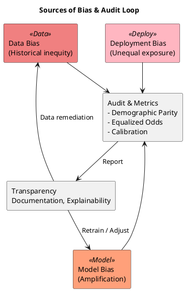

# Review: 11.3: Responsible AI — Fairness, Bias, Transparency

**Source:** part-iv/ch11-ai-in-institutions/lecture-03.adoc

---

## Review of Lecture 11.3 – “Responsible AI: Fairness, Bias, Transparency”

### Summary  
**Grade: C** – The lecture touches the right topics but falls short of the 90‑minute pacing and narrative expectations. The hook is modest, the core sections are far too thin (1‑2 paragraphs each), and the PlantUML diagram adds little insight. Substantial expansion, richer examples, and a clearer story‑line are needed before the material can sustain a full class session.

---

## 1. Narrative Arc  

| Element | Verdict | Comments / Suggested Fixes |
|---------|---------|----------------------------|
| **Hook** | *Weak* | The opening quote is nice, but the “Is this model fair?” question is presented as a rhetorical lead‑in rather than a concrete scenario. Start with a vivid case (e.g., a loan‑approval algorithm that denied 70 % of applications from a minority group) or a short video clip. |
| **Development** | *Partial* | The lecture lists definitions and bias sources, but the flow is a flat enumeration. Build a step‑by‑step story: **Problem (real‑world unfair outcome) → Investigation (audit across groups) → Decision (choose a fairness metric) → Intervention (re‑weighting, post‑processing) → Outcome & trade‑off**. |
| **Closing / Bridge** | *Adequate* | The lab reference provides a bridge, but the closing does not highlight why the next lecture (e.g., governance or accountability) matters. End with a provocative question: “If we can measure fairness, should we always enforce it?” or a short “future‑look” paragraph linking to policy‑level governance. |

**Overall Verdict:** The lecture has the ingredients but lacks a compelling narrative arc. Re‑frame the material around a single, concrete story that runs through the conceptual, technical, and philosophical sections.

---

## 2. Density (Target: 2,500‑3,500 words; 4‑6 paragraphs per main section)

| Section | Current Paragraphs | Target Paragraphs | Current Key Points | Target Key Points |
|---------|-------------------|-------------------|--------------------|-------------------|
| Conceptual Core | 1 | 4‑6 | 5 | 6‑12 |
| Technical Example | 1 | 2‑3 | 2 | 5‑8 |
| Philosophical Reflection | 1 | 2‑3 | 3 | 5‑8 |

**Word Count Estimate:** ~850 words total (≈300 words per section). This is far below the 2,500‑3,500‑word target for a 90‑minute lecture.

**Implication:** The material will run out in ~15‑20 minutes, leaving most of the class time for filler or unrelated activities.

---

## 3. Interest & Engagement  

| Issue | Why it hurts attention | Concrete remedy |
|-------|------------------------|-----------------|
| **Definition‑first dump** (e.g., “Demographic parity: equal approval rates…”) | Students hear abstract formulas before seeing why they matter. | Introduce each definition through a short, real‑world vignette (e.g., a hiring tool that satisfies demographic parity but harms qualified candidates). |
| **Thin technical example** | No step‑by‑step walk‑through; students cannot see the audit in action. | Provide a mini‑code snippet (pseudocode) that computes TPR/FPR per group, plus a screenshot of the bias‑audit report generated by the governance simulator. |
| **Philosophical reflection is a recap** | Repeats earlier points without deepening the debate. | Add a “debate” prompt: split the class into two teams defending “fairness as equality of outcomes” vs. “fairness as equality of opportunity.” |
| **Lack of interactive tension** | No moment where students must make a trade‑off decision. | Insert a quick “live poll” (e.g., “If fixing bias would drop overall accuracy by 5 %, would you accept it?”) and discuss results. |
| **Missing visual storytelling** | The single diagram is a bland flowchart. | Replace with a richer diagram (see below) and a short animation or storyboard showing bias entering at each stage. |

---

## 4. Diagram Review  

**Current PlantUML (Diagram 1)**  

```
start
:Data Bias;
:Model;
:Model Bias;
:Deployment Bias;
:Audit;
stop
```

| Issue | Impact on Narrative | Suggested Improvement |
|-------|---------------------|-----------------------|
| **Linear chain, no branching** | Implies bias flows only one way; hides the fact that data, model, and deployment biases are parallel sources. | Use three parallel boxes feeding into a central **Audit** node. |
| **Missing stakeholder loop** | No visual cue that audit results trigger redesign or documentation. | Add an arrow from **Audit** back to **Model** (or **Data Collection**) labeled “Mitigation / Retraining”. |
| **No labels for metrics** | Students cannot see what is measured. | Inside **Audit**, list “TPR, FPR, Demographic Parity, Calibration”. |
| **No indication of transparency** | Transparency is a separate pillar, not shown. | Add a side node **Transparency** linked to **Audit** and **Documentation**. |
| **Stylistic** | Sketchy outline is fine, but the diagram is too sparse to be useful. | Use `skinparam` to add colors for bias types (red for data, orange for model, purple for deployment) and a legend. |

**Re‑written PlantUML (example)**  



This diagram now **mirrors** the narrative: three bias sources converge on an audit, whose output feeds transparency and triggers mitigation loops.

---

## 5. Recommended Revisions (Prioritized)

1. **Rewrite the Hook**  
   - Begin with a 2‑minute case study (e.g., COMPAS recidivism scores, facial‑recognition gender error rates). Show a striking statistic and ask “Is this fair?”  
   - Optionally embed a short video or news clip.

2. **Expand Conceptual Core to 4‑5 paragraphs**  
   - Paragraph 1: Hook recap → definition of fairness as a design problem.  
   - Paragraph 2: Formal definitions with concrete examples (e.g., loan‑approval numbers).  
   - Paragraph 3: Sources of bias (data, model, deployment) illustrated with a mini‑story.  
   - Paragraph 4: Trade‑off discussion (fairness vs. accuracy, legal constraints).  
   - Paragraph 5: Role of transparency & documentation.

3. **Add 6‑8 concrete Key Points** (e.g., “Fairness definitions can be mutually exclusive”, “Bias can be introduced during feature engineering”, “Post‑processing adjusts predictions without retraining”, etc.).

4. **Enrich Technical Example**  
   - Provide a step‑by‑step audit workflow (load data → split by group → compute metrics → visualise disparity).  
   - Include a small code snippet (pseudocode or Python) and a screenshot of the bias‑audit report.  
   - Add 3‑4 more key points (e.g., “Statistical significance testing”, “Intersectional groups”, “Automated audit pipelines”).

5. **Deepen Philosophical Reflection**  
   - Add a paragraph on “fairness as a political choice” with reference to Rawls vs. Nozick.  
   - Add a paragraph on “algorithmic transparency vs. proprietary IP”.  
   - Add a paragraph on “future governance: auditing standards and regulatory frameworks”.  
   - Expand key points to at least 5 (e.g., “Stakeholder pluralism”, “Power dynamics”, “Regulatory implications”, etc.).

6. **Integrate Interactive Elements**  
   - Live poll on fairness‑accuracy trade‑off.  
   - Small‑group debate on competing fairness definitions.  
   - Quick “think‑pair‑share” on how they would document limitations for a given model.

7. **Replace Diagram 1 with the revised PlantUML** (see above). Ensure the figure is referenced in the text (“Figure 11.3 illustrates the three bias sources feeding into the audit loop”).

8. **Close with a Forward‑Looking Bridge**  
   - One‑paragraph “What’s next?” linking to the upcoming lecture on **Governance & Accountability** and hinting at policy‑level tools (e.g., model‑cards, impact assessments).

9. **Word‑count Check**  
   - After revisions, target ~2,800 words total (≈900 words per main section). Use a readability tool to keep sentences concise but substantive.

---

### Final Note  
Implementing the above changes will transform Lecture 11.3 from a skeletal outline into a fully‑fledged, 90‑minute class session that engages students, provides concrete technical skills, and stimulates critical reflection on the politics of fairness. The revised diagram will serve as a visual anchor, reinforcing the story of bias detection and mitigation throughout the lecture.