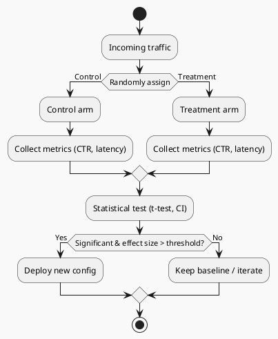

# Review: 11.4: Experimental AI — A/B Testing and Statistical Rigor

**Source:** part-iv/ch11-ai-in-institutions/lecture-04.adoc

---

## Review of Lecture 11.4 – “Experimental AI: A/B Testing and Statistical Rigor”

### Summary  
**Grade: C** – The lecture contains the right ingredients (A/B testing, p‑values, lab tie‑in) but it falls short of a 90‑minute, engaging session. The narrative starts with a quotation rather than a vivid scenario, the core concepts are crammed into a single paragraph, and the key‑point lists are undersized. Word‑count is well below the 2 500‑3 500 target, and the PlantUML diagram is overly simplistic. Substantial restructuring and enrichment are needed before the material can sustain a full class period.

---

## 1. Narrative Arc  

| Element | Verdict | Comments / Suggested Fix |
|--------|---------|--------------------------|
| **Hook** | ❌ Weak | The epigraph is nice, but there is no concrete, relatable “story‑in‑the‑making”. Start with a real‑world A/B test (e.g., “When Netflix changed its thumbnail algorithm, 2 % more users clicked, but the change cost $1 M – how did they know it was worth it?”) or a provocative question (“What if a seemingly tiny 0.2 % lift in click‑through rate actually harms a billion‑user platform?”). |
| **Development** | ⚠️ Fragmented | The Conceptual Core is a single wall‑of‑text. It should be broken into 4–6 short paragraphs that follow a clear problem → method → limitation progression: <br>1. The need for comparison (anecdote). <br>2. How A/B testing works (randomisation, traffic split). <br>3. Interpreting results (p‑value, CI, effect size). <br>4. Pitfalls (multiple testing, type I/II errors). <br>5. Ethical/reporting considerations. |
| **Closing / Bridge** | ✅ Present but thin | The lab mention is the only bridge. Strengthen it by explicitly stating the learning outcome (“By the end of Lab 2 you will be able to design, run, and report an A/B experiment that could be deployed in a production AI service”). Also hint at the next lecture (e.g., “Next we will look at causal inference beyond simple A/B splits”). |

**Overall Verdict:** The lecture has a skeleton narrative but lacks a compelling hook and a step‑wise development that keeps students oriented.

---

## 2. Density (Target ≈ 2 500‑3 500 words)

| Section | Paragraphs | Key‑point items | Approx. word count* |
|---------|------------|----------------|----------------------|
| Conceptual Core | 1 (should be 4‑6) | 5 (target 6‑12) | ~250 |
| Technical Example | 1‑2 (target 2‑3) | 3 (target 5‑8) | ~200 |
| Philosophical Reflection | 1 (target 2‑3) | 4 (target 5‑8) | ~180 |
| **Total** | **~3** | **12** | **≈ 630** |

\*Rough estimate based on visible text; clearly below the required 2 500‑3 500 range.

**Verdict:** The lecture is far too terse. It needs roughly **4‑5×** more explanatory prose, more illustrative examples, and expanded key‑point lists.

---

## 3. Interest & Engagement  

* **Thin sections** – Each major block is a single paragraph; students will have little time to absorb or discuss before moving on.  
* **Definition‑first** – Concepts such as “p‑value” and “confidence interval” are introduced without a concrete illustration (e.g., a simulated click‑through‑rate distribution).  
* **Missing tension** – No story of a failed or controversial A/B test, no “what could go wrong” scenario that sparks curiosity.  

**Concrete ways to raise interest**

1. **Start with a case study** (Netflix, Facebook, or a medical AI trial) that ended badly because statistical rigor was ignored.  
2. **Live demo** – Show a tiny Python notebook that generates two synthetic streams of data, runs a t‑test, and visualises the confidence interval.  
3. **Interactive poll** – Ask students to guess whether a 0.3 % lift is “real” before revealing the statistical analysis.  
4. **Debate prompt** – “Is a p‑value of 0.049 enough to ship a new model?” – let small groups argue for/against.  
5. **Narrative “what‑if”** – Walk through the decision tree a product manager follows after seeing the A/B result (go live, iterate, roll back).  

---

## 4. Diagram Review (PlantUML)

**Current diagram**  

```
start
:Traffic;
:Control;
:Metrics A;
:Treatment;
:Metrics B;
:Compare;
stop
```

**Issues**

| Issue | Why it matters | Suggested improvement |
|-------|----------------|-----------------------|
| Linear flow with no **randomisation** step | Random assignment is the core of A/B testing. | Insert a decision node “Randomly assign → Control / Treatment”. |
| No **traffic split** proportion shown | Learners need to see 50/50 (or configurable) split. | Add a label “50 % → Control, 50 % → Treatment”. |
| Metrics boxes are unlabeled (A/B) | Ambiguity about which metrics belong to which arm. | Rename to “Collect metrics (Control)” and “Collect metrics (Treatment)”. |
| No **statistical analysis** block | The “Compare” step should explicitly indicate hypothesis test. | Add a box “Statistical test (t‑test / permutation) → p‑value, CI”. |
| No **feedback / decision** outcome | The diagram ends abruptly; students need to see “Accept / Reject”. | Add a decision diamond “Is result significant & meaningful?” → “Deploy” / “Iterate”. |
| Visual style – “sketchy‑outline” is fine, but add **color** to differentiate arms (e.g., blue for control, orange for treatment). | Improves readability. | Use `skinparam` to colour nodes or add `#color` tags. |

**Revised PlantUML sketch (conceptual)**  



---

## 5. Recommended Revisions (Prioritized)

1. **Rewrite the opening hook** – Begin with a vivid, real‑world A/B test story (≈150 words).  
2. **Expand Conceptual Core** to 4‑6 paragraphs, each ending with a “take‑away” sentence; increase key‑point list to 7‑9 items (add “randomisation”, “sample size planning”, “confidence vs. prediction interval”, etc.).  
3. **Add a concrete numerical example** (synthetic data) that walks through data collection, hypothesis testing, effect‑size calculation, and interpretation.  
4. **Boost Technical Example** to 2‑3 paragraphs, include a short code snippet (Python/pandas) and a table of sample results; enlarge key‑point list to 5‑7 items (e.g., “choose appropriate test”, “check assumptions”, “report power”).  
5. **Deepen Philosophical Reflection** to 2‑3 paragraphs, discuss ethical implications of “p‑hacking” and pre‑registration; expand key‑points to 5‑6 items.  
6. **Insert a 5‑minute in‑class activity** (poll or quick debate) after the Conceptual Core to maintain engagement.  
7. **Redesign the PlantUML diagram** per the suggestions above; replace the current linear flow with a decision‑tree that shows randomisation, split, statistical test, and deployment decision.  
8. **Word‑count check** – Aim for ~2 800 words total across the three main sections (≈900 words each).  
9. **Link to next lecture** – Add a forward‑looking sentence (“Next we will explore causal inference methods that go beyond simple A/B splits”).  
10. **Proofread for terminology consistency** (e.g., use “null hypothesis” before “p‑value”, keep “effect size” defined once).  

Implementing these changes will transform Lecture 11.4 into a coherent, content‑rich, and engaging 90‑minute session that meets the textbook’s pedagogical standards.