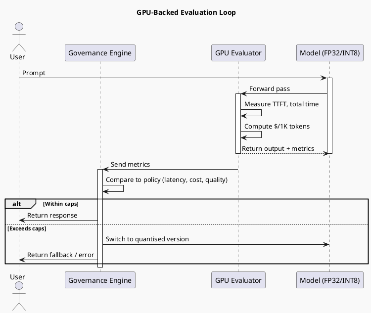

# Review: 11.5: GPU-Backed Evaluation — Latency, Cost, Quantization

**Source:** part-iv/ch11-ai-in-institutions/lecture-05.adoc

---

## Review of Lecture 11.5 – “GPU‑Backed Evaluation: Latency, Cost, Quantization”

**Grade: C‑**  
The lecture contains the right ingredients (latency, cost, quantisation, governance) but it falls short of a 90‑minute, engaging session. The narrative arc is weak, the word‑count is roughly half the target, and the sole diagram is too abstract to reinforce the story. Below is a detailed audit and a prioritized list of concrete edits.

---

### 1. Narrative Arc  

| Element | What the lecture does | Verdict |
|--------|-----------------------|---------|
| **Hook** | Starts with an epigraph and three “example prompts”. No concrete scenario, tension, or provocative question. | **Missing** – the hook should plunge students into a real‑world pain point (e.g., a startup that blows its budget because a model is too slow). |
| **Development** | Lists concepts (latency, cost, quantisation, governance) and gives a high‑level “how‑to‑measure” recipe. The flow is a series of bullet points rather than a problem‑solution narrative. | **Weak** – the lecture jumps from “every inference costs time and money” to “here’s what to measure” without a clear problem → attempted response → observed limits structure. |
| **Closing / Bridge** | Mentions Lab 2‑3 and a “discussion prompt” list, but there is no explicit “what you’ll take away” or preview of the next lecture (e.g., moving from evaluation to policy enforcement). | **Insufficient** – a closing should restate the stakes (“If you can’t measure latency you can’t meet SLA‑level contracts”) and point to the next step (e.g., “Next we’ll use these metrics to drive automated throttling”). |

**Overall narrative verdict:** *Fragmented.* The lecture needs a tighter story arc: a concrete opening scenario → why naive evaluation fails → the GPU‑backed solution → its limits (quantisation trade‑offs) → how governance closes the loop.

---

### 2. Density (Target ≈ 2 500‑3 500 words)

| Section | Approx. paragraphs | Approx. key points | Word count estimate |
|---------|-------------------|-------------------|---------------------|
| Conceptual Core | 4 | 7 | ~800 |
| Technical Example | 2 | 4 | ~300 |
| Philosophical Reflection | 2 | 4 | ~250 |
| **Total** | 8 | 15 | **≈ 1 350** |

**Gap:** ~1 200‑2 200 words missing. To reach the 90‑minute depth you need:

* **Conceptual Core:** 6‑8 paragraphs, 10‑12 key points (add a case study, a “what‑if” failure, a short math sketch of cost‑per‑token formula, and a comparison table of hardware‑vs‑model scaling).  
* **Technical Example:** 3‑4 paragraphs, 6‑8 key points (show a concrete benchmark script, a sample output table, and a troubleshooting checklist).  
* **Philosophical Reflection:** 3 paragraphs, 6‑8 key points (link to broader AI‑governance literature, discuss “measurement as power”, and raise ethical dilemmas of cost‑driven model selection).  

---

### 3. Interest & Engagement  

| Issue | Why it hurts attention | Suggested fix |
|-------|------------------------|---------------|
| **Definition‑first dump** (e.g., “*Inference latency* is the time from request to response.”) | Students hear a textbook definition before they care why it matters. | Start the section with a vivid anecdote: “When the chatbot answered a loan‑application query in 8 seconds, the applicant abandoned the process, costing the bank $12 k in lost fees.” |
| **Lack of concrete numbers** | No real‑world benchmark numbers (e.g., “Model X on an A100: TTFT = 0.42 s, cost = $0.00012 per 1 K tokens”). | Insert a small “benchmark box” with actual measurements from a public model (e.g., Llama‑2‑7B). |
| **No interactive element** | The lecture is a monologue; students are not prompted to predict outcomes. | Add a “quick poll” after the latency definition: “If we double the prompt length, which metric will degrade more—TTFT or total latency? Why?” |
| **Sparse storytelling** | The governance angle is mentioned but never illustrated. | Include a short narrative of a compliance officer receiving an alert because a model exceeded the $X/day cost cap, and how the evaluation numbers saved the organization. |
| **Lab tie‑in is vague** | Lab 2‑3 is referenced but not linked to the concepts. | End the technical example with a “lab preview” that walks through the exact three steps they will code (load model, run benchmark, assert policy). |

---

### 4. Diagram Review  

**Current PlantUML (Diagram 1)**  

```
start
:Model;
:Latency;
:Cost/token;
:Quantization;
:Benchmark;
stop
```

| Issue | Why it’s insufficient | Concrete improvement |
|-------|----------------------|----------------------|
| **Linear, no feedback** | The lecture stresses a *governance loop* (measure → decide → enforce → re‑measure). The diagram shows a one‑way flow. | Add a decision node after “Benchmark” that feeds back to “Model” with arrows labeled “Select quantisation level” and “Apply policy caps”. |
| **Missing actors** | No mention of “Governance Engine”, “Developer”, or “User”. | Introduce swim‑lanes or separate boxes: *User request → Model → GPU evaluator → Metrics → Governance policy → Action (accept/reject)*. |
| **No quantitative annotation** | The diagram does not illustrate that latency and cost are *metrics* derived from the GPU run. | Attach notes to the “Latency” and “Cost/token” boxes: “Measured in ms, $/1K tokens”. |
| **Stylistic** | Theme “sketchy‑outline” is fine, but the diagram is too terse for a 90‑min lecture. | Use `@enduml` with `legend` to explain each step, and add a small table icon showing “benchmark suite”. |
| **Alignment with narrative** | The narrative talks about “realistic conditions”, “percentiles”, “quantisation trade‑offs”. The diagram does not reflect these. | Insert a sub‑process “Run under realistic load (batch size, temperature)” before “Latency”. Add a branch “Full‑precision vs INT8” feeding into “Benchmark”. |

**Re‑draw suggestion (PlantUML sketch):**



This diagram visualises the **measurement → policy → adaptation** loop that the lecture should emphasise.

---

### 5. Recommended Revisions (Prioritized)

1. **Rewrite the opening hook**  
   *Add a 2‑paragraph case study (e.g., a customer‑service bot that costs $15 k/day because of latency) and pose the question “How can we guarantee both speed and budget?”*  

2. **Expand the Conceptual Core to ~6–8 paragraphs**  
   *Introduce a simple cost‑per‑token formula, a table of hardware vs. latency, and a short “what‑if” scenario where quantisation breaks a downstream metric.*  

3. **Insert concrete benchmark data**  
   *Provide a real‑world table (model, hardware, TTFT, $/1K) and a mini‑exercise where students predict the impact of halving precision.*  

4. **Re‑structure the Technical Example**  
   *Step‑by‑step walkthrough of a Python script (`torch.cuda.synchronize()`, `time.perf_counter()`, `torch.cuda.memory_allocated()`). Include a sample output snippet and a “debug checklist”.*  

5. **Deepen the Philosophical Reflection**  
   *Add a paragraph linking measurement to “algorithmic governance” literature (e.g., Selbst & Barocas 2018) and a short debate prompt about “cost‑driven bias”.*  

6. **Revise the diagram** (see PlantUML sketch above).  
   *Replace the current linear flow with the feedback loop diagram; add labels for latency, cost, and policy decision.*  

7. **Tie the Lab explicitly to the concepts**  
   *At the end of the Technical Example, list the three lab tasks with bullet points that map directly to the key points (e.g., “Task 1: record TTFT → populate `metrics.latency`”).*  

8. **Add interactive moments**  
   *Insert two quick polls or think‑pair‑share questions (one after latency, one after quantisation) to keep attention for 90 minutes.*  

9. **Check word count**  
   *Aim for ~2 800 words total. Use the “Key Points” boxes as a checklist to ensure each paragraph introduces a new idea rather than repeating bullets.*  

10. **Proofread for consistency**  
    *Standardise terminology (use “time‑to‑first‑token (TTFT)” everywhere) and ensure all citations (Mehrabi 2019) have a full reference in the reading list.*  

---

### Closing Thought

If the lecture is reshaped around a **real‑world problem → measurement → governance loop → trade‑off decision**, it will naturally fill the 90‑minute slot, keep students engaged, and provide a solid bridge to the hands‑on lab. The revised diagram will then act as a visual anchor for that story, reinforcing the “measurement‑as‑governance” theme that is central to the textbook’s post‑modern perspective.