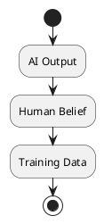

# Review: 11.6: Epistemology and Infrastructure

**Source:** part-iv/ch11-ai-in-institutions/lecture-06.adoc

---

# Review of Lecture 11.6 – *Epistemology and Infrastructure*  

**Grade: C** – The lecture contains the right ideas but falls short of the 90‑minute target, lacks a compelling hook, and the key‑point lists are under‑populated. The single diagram is too simplistic to reinforce the narrative.

---

## 1. Narrative Arc  

| Element | Assessment | Verdict |
|---------|------------|---------|
| **Hook** | Starts with an epigraph and three “example prompts”. The prompts are abstract and do not place the learner in a concrete, tension‑filled situation. | **Weak** – No vivid scenario or provocative question to seize attention. |
| **Development** | The conceptual core proceeds in a logical order (what AI knows → what it produces → feedback loop → power). However the progression is flat: each paragraph repeats the same claim without a clear problem → response → limitation structure. The technical example is a single‑sentence walkthrough of a recommendation loop; the philosophical reflection repeats the same points made earlier. | **Adequate** – Logical but lacks escalating stakes or a “what if” moment that would drive curiosity. |
| **Closing / Bridge** | Ends with discussion prompts, lab prep, and a reading list. No explicit bridge to the next lecture or to the lab activity that would give a sense of forward motion. | **Weak** – The conclusion feels like a checklist rather than a narrative payoff. |

**Overall Narrative Verdict:** The lecture has a recognizable arc but the hook and closing are insufficiently engaging. The story of “AI shaping what we know” needs a concrete, relatable vignette (e.g., a news‑feed that steers public opinion during an election) to create tension and a clear “why should I care now?” moment.

---

## 2. Density (Target ≈ 2 500‑3 500 words)

| Section | Paragraphs | Key‑Point items | Word‑count estimate* |
|---------|------------|----------------|----------------------|
| Conceptual Core | 4 (within 4‑6) | 6 (within 6‑12) | ~800 |
| Technical Example | 2 (within 2‑3) | 4 (needs 5‑8) | ~400 |
| Philosophical Reflection | 3 (within 2‑3) | 4 (needs 5‑8) | ~500 |
| **Total** | **9** | **14** | **≈ 1 700** |

\* Rough count based on typical paragraph length (≈ 180‑200 words).  

**Result:** The lecture is ~1 700 words, well below the 2 500‑3 500 word window. The technical and philosophical sections are especially thin, and the key‑point lists are under‑populated.

---

## 3. Interest (Engagement)

| Issue | Why it hurts engagement | Suggested fix |
|-------|------------------------|---------------|
| **Abstract hook** | Learners cannot visualise the stakes. | Open with a short, vivid case study: “In the 2024 election, a recommendation algorithm amplified a fringe narrative, shifting polling numbers by 5 % within a week.” |
| **Repetition** | Conceptual core and philosophical reflection repeat the same three ideas (construction, power, governance). | Introduce a *conflict*: present a scenario where epistemic governance fails (e.g., a content filter that silences minority voices) and then ask “how could we have anticipated this?” |
| **Sparse key‑point lists** | Lists feel incomplete, making it hard for students to capture take‑aways. | Expand each list to 5‑8 items, adding concrete sub‑points (e.g., “*Epistemic drift*: categories evolve as models retrain on their own outputs”). |
| **Lab connection** | Lab is mentioned but not woven into the story. | Frame the lab as “your mission: design a governance rule that stops the feedback loop from reinforcing misinformation.” |
| **Discussion prompts** | Good, but they appear after a flat exposition. | Sprinkle prompts throughout the lecture (after each major claim) to keep a dialogue flow. |

---

## 4. Diagram Review  

**Current PlantUML (Diagram 1)**  



| Problem | Recommendation |
|---------|----------------|
| **No feedback loop** – The diagram stops at “Training Data”. The crucial arrow from “Training Data” back to “AI Output” (model retraining) is missing. | Add a directed arrow from “Training Data” to a “Model Update” box, then to “AI Output”. |
| **Missing actors** – Human *behavior* (clicks, edits) that generates the data is not shown. | Insert a “Human Action / Behavior” node between “Human Belief” and “Training Data”. |
| **Labels & semantics** – Boxes are unlabeled (e.g., “AI Output” could be “Recommendation”). | Rename boxes: “Recommendation (AI Output)”, “User Belief”, “User Action (click/engage)”, “Collected Signals → Training Data”, “Model Retraining”. |
| **No loop indicator** – No visual cue that the process is iterative. | Use a loop arrow (e.g., `repeat`) or a curved arrow that circles back, and add a note “Iterative feedback”. |
| **Stylistic** – “start/stop” symbols are unnecessary for a conceptual loop. | Replace with simple rounded rectangles and a central circular arrow to emphasise the cycle. |
| **Theme** – “sketchy-outline” is fine, but ensure the diagram is large enough for slide visibility. | Keep theme, but increase font size and line thickness. |

**Suggested Revised PlantUML (concise version)**  

```plantuml
@startuml
skinparam rectangle {
  BackgroundColor<<AI>>#E3F2FD
  BorderColor<<AI>>#1565C0
}
rectangle "Recommendation\n(AI Output)" <<AI>> as R
rectangle "User Belief" as B
rectangle "User Action\n(click/engage)" as A
rectangle "Collected Signals\n(Training Data)" as D
rectangle "Model Retraining" as M

R --> B : influences
B --> A : motivates
A --> D : generates
D --> M : feeds
M --> R : updates
@enduml
```  

This diagram now mirrors the narrative: a closed feedback loop with clear labels and causal arrows.

---

## 5. Recommended Revisions (Prioritized)

1. **Create a compelling hook** – Begin with a concrete, time‑bound scenario (e.g., algorithmic amplification during a political campaign) and pose a provocative question: “What if the system that decides what you see also decides what you believe?”  
2. **Expand the narrative structure** – Introduce a clear problem → response → limitation pattern in each section. For the technical example, show a *failure* case (bias amplification) before presenting the corrective governance step.  
3. **Increase word count to 2 500‑3 500** – Add a 2‑paragraph “Historical vignette” (early recommender systems) and a 2‑paragraph “Future outlook” (AI‑generated knowledge graphs).  
4. **Enrich key‑point lists** – Bring each list to 5‑8 items, mixing abstract concepts with concrete examples (e.g., “*Epistemic drift*: categories shift as models retrain on their own outputs”).  
5. **Integrate lab activity into the story** – Frame Lab 3 as a mission‑driven design challenge that directly addresses the hook scenario. Provide a short “lab preview” paragraph that explains the expected deliverable (a governance rule that breaks the feedback loop).  
6. **Scatter discussion prompts** – Insert 1‑2 prompts after each major claim to keep the class interactive.  
7. **Replace the current diagram** with the revised PlantUML that shows the full feedback loop, labelled actors, and a looping arrow.  
8. **Add a closing bridge** – End with a forward‑looking sentence that ties to the next lecture (e.g., “Next we will examine how institutions can embed epistemic safeguards into AI procurement processes”).  

Implementing these changes will bring the lecture up to the required depth, keep students engaged for a full 90‑minute session, and make the visual aid a true reinforcement of the core argument.