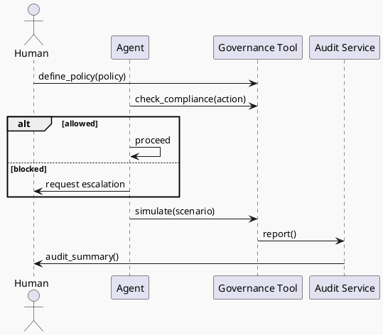

# Review: 11.7: The governance Tool

**Source:** part-iv/ch11-ai-in-institutions/lecture-07.adoc

---

## Review of Lecture 11.7 – “The Governance Tool”

### Summary  
**Grade: C** – The lecture covers the essential concepts but falls short of the 90‑minute instructional goals. The narrative lacks a compelling hook and a clear forward‑moving arc, the material is far too terse (≈ 800 words vs. the 2 500‑3 500 word target), and the sole diagram is a bare‑bones flow that does not reinforce the story. Substantial restructuring and enrichment are needed before the lecture can sustain a full class period.

---

## 1. Narrative Arc  

| Element | Verdict | Comments / Suggested Fix |
|---------|---------|--------------------------|
| **Hook** | ❌ Weak | The opening epigraph and a list of “example prompts” are not a hook. Students need a concrete, high‑stakes scenario (e.g., “A customer‑service bot is about to expose private data – can it stop itself?”) or a provocative question (“Can an AI be its own regulator?”). |
| **Development** | ✅ Adequate but flat | The lecture lists the four operations and mentions integration with the audit tool, but it proceeds as a definition dump. It should build a problem → solution → limitation narrative: <br>1. **Problem**: uncontrolled agents cause cost overruns / privacy breaches. <br>2. **Response**: introduce a governance tool that the agent can call before acting. <br>3. **Limits**: self‑audit cannot catch everything; external oversight remains. |
| **Closing / Bridge** | ❌ Missing | The philosophical reflection ends with a set of bullet points, but there is no explicit bridge to the lab or to the next lecture. A closing paragraph should state: “In the next lab you will embed this tool into the agent loop, and in Lecture 11.8 we will explore how governance interacts with orchestration.” |

**Overall Verdict:** The arc is present in outline but not realized in prose. The lecture needs a stronger opening scenario, a step‑by‑step problem‑solution narrative, and a clear “what’s next” signpost.

---

## 2. Density (Target ≈ 2 500‑3 500 words)

| Section | Approx. Word Count | Target Range | Gap |
|---------|-------------------|--------------|-----|
| Conceptual Core | ~250 | 1 200‑1 800 | – ≈ 950 words missing |
| Technical Example | ~150 | 600‑900 | – ≈ 450 words missing |
| Philosophical Reflection | ~130 | 400‑600 | – ≈ 270 words missing |
| **Total** | **≈ 530** | **2 500‑3 500** | **≈ 2 000 words short** |

The lecture is far below the required density. It needs additional **explanatory paragraphs**, **worked examples**, **comparative tables**, and **mini‑case studies** to reach the target.

---

## 3. Interest (Engagement)

| Issue | Why it hurts attention | Concrete remedy |
|-------|------------------------|-----------------|
| **Definition‑first style** | Students hear “four operations” before seeing why they matter. | Start with a vivid incident (e.g., a bot that accidentally sent a €10 000 invoice) and ask “What could have stopped it?” |
| **Thin technical example** | Only a high‑level description of the API; no code or walkthrough. | Provide a short Python snippet showing `governance.check_compliance(action)` returning `{'allow': False, 'reason': 'cost limit'}` and a live demo of the simulator. |
| **Philosophical reflection is a list** | No narrative tension; feels like a recap. | Frame as a debate: “Self‑governance vs. external audit – who wins when the agent can hide its own violations?” Include a short role‑play prompt. |
| **Lack of visual storytelling** | The diagram is a linear list, not a story. | Redesign the diagram to show a decision node (allow/block), a feedback loop to the orchestrator, and an external audit arrow. |
| **Missing bridge to lab** | Students may not see the relevance of the lab. | End the lecture with a “What you’ll build today” teaser and a preview of the lab deliverable. |

---

## 4. Diagram Review  

**Current PlantUML (Diagram 1)**  

```
@startuml
start
:Agent;
:governance;
:define_policy;
:check_compliance;
:simulate;
stop
@enduml
```

| Problem | Suggested Improvement |
|---------|-----------------------|
| **Linear, no flow** – shows only a vertical list of components. | Replace with a **sequence diagram** or **activity diagram** that depicts: <br>1. Agent → `governance.check_compliance(action)` <br>2. Decision node → *Allow* → proceed; *Block* → abort or escalate. <br>3. Optional call to `governance.simulate(scenario)` for policy testing. |
| **Missing external actors** – no audit tool, no human overseer. | Add arrows from **Audit Service** (receiving `report()`) and **Human Operator** (invoking `define_policy`). |
| **No labels / data** – boxes are unlabeled, no indication of inputs/outputs. | Label each operation with its signature, e.g., `check_compliance(action) → {allow, reason}`. |
| **No feedback loops** – governance is static. | Show a loop from `report()` back to `define_policy` (policy refinement). |
| **Styling** – “sketchy-outline” is fine, but the diagram should be larger and clearer for a slide. | Increase font size, use distinct colors for **agent**, **governance**, **audit**, and **human**. |

**Proposed PlantUML (high‑level sketch)**  



This diagram visualises the **call‑and‑response**, the **decision point**, and the **feedback to external audit**, directly supporting the narrative.

---

## 5. Recommended Revisions (Prioritized)

1. **Create a strong opening hook** (≈ 200 words).  
   *Example:* a real‑world incident where an AI‑driven financial service overspent because it lacked pre‑action checks. Pose the question “What if the bot could refuse its own request?”

2. **Expand the Conceptual Core** to 4–5 paragraphs (≈ 1 200 words).  
   * Include a **problem statement**, **design rationale**, **step‑by‑step walk‑through** of each operation, and a **comparison table** (governance vs. audit vs. external oversight).

3. **Enrich the Technical Example** (≈ 600 words).  
   * Provide a **code snippet** (Python/JS) for each API call, a **debug trace** showing a blocked action, and a **mini‑exercise** where students modify a policy and observe the effect.

4. **Deepen the Philosophical Reflection** (≈ 400 words).  
   * Frame as a short debate, cite concrete **EU AI Act** and **NIST RMF** clauses, and discuss **gaming** the governance tool.

5. **Redesign the diagram** (see PlantUML suggestion).  
   * Replace the current linear flow with a **decision‑oriented activity diagram** that includes external audit and human policy definition.

6. **Add a closing bridge** (≈ 150 words).  
   * Summarise key take‑aways, preview Lab 3 deliverables, and tease the next lecture (e.g., “Next we’ll explore how governance interacts with orchestration and multi‑agent coordination”).

7. **Insert discussion prompts** throughout the lecture (not only at the end).  
   * After each major concept, pose a quick “Think‑pair‑share” question to keep students active.

8. **Adjust key‑point lists** to avoid redundancy and to reflect the expanded content.  

9. **Proofread for consistency** (e.g., ensure “governance.check_compliance” is uniformly formatted, and that all citations (EU2024, NIST2023) are linked).

---

### Final Note  
With the above revisions, Lecture 11.7 will meet the 90‑minute depth requirement, provide a compelling narrative that keeps students engaged, and visually reinforce the core ideas through a clearer diagram. The faculty author should treat the current draft as a skeleton and flesh it out according to the outlined priorities.