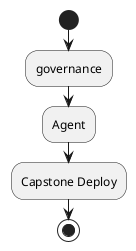
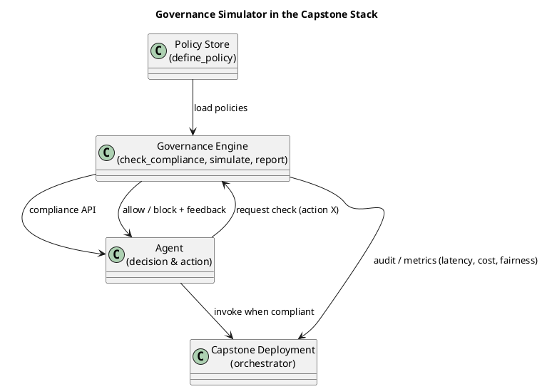

# Review: 11.8: Lab Integration — AI Governance Simulator

**Source:** part-iv/ch11-ai-in-institutions/lecture-08.adoc

---

# Review of Lecture 11.8 – “Lab Integration — AI Governance Simulator”

**Grade: C** – The lecture contains the required material but falls short on narrative drive, depth, and visual support for a 90‑minute session. It needs a stronger hook, richer development, more concrete key‑point granularity, and a more informative diagram.

---

## 1. Narrative Arc  

| Element | Verdict | Comments |
|---------|---------|----------|
| **Hook** | **Weak** | The opening is an epigraph and a list of prompts. There is no concrete scenario, provocative question, or tension‑creating anecdote that would grab students for a full class period. |
| **Development** | **Partial** | The “Conceptual Core” explains the simulator, recaps the chapter, and states that governance is “built‑in”. The flow is more a list of statements than a problem → response → limitation progression. The technical example shows a single compliance check; the philosophical reflection repeats the same idea without deepening the argument. |
| **Closing / Bridge** | **Adequate** | The lecture points to Chapter 12 (the capstone) as the next step, but the bridge is thin – it does not tease the challenges students will face or the broader implications (e.g., regulatory pressure, public trust). |
| **Overall Arc** | **Needs work** | A 90‑minute class should start with a vivid “what‑if” story (e.g., a real AI failure caused by missing governance), then walk students through the problem, the simulator as a solution, its limits (performance overhead, policy ambiguity), and finish with a forward‑looking question (“Will built‑in governance become a legal requirement?”). |

---

## 2. Density (Target ≈ 2,500‑3,500 words)

| Section | Paragraphs (actual / target) | Key‑point items (actual / target) |
|---------|------------------------------|-----------------------------------|
| **Conceptual Core** | 3 / 4‑6 | 6 / 6‑12 |
| **Technical Example** | 2 / 2‑3 | 4 / 5‑8 |
| **Philosophical Reflection** | 2 / 2‑3 | 4 / 5‑8 |

*Word count* is roughly 1,200 – 1,400 words total, well below the 2,500‑3,500 word target for a 90‑minute lecture. The material would be exhausted in ~30 minutes, leaving a large gap for activity or filler.

---

## 3. Interest & Engagement  

* **Thin sections** – The “Technical Example” collapses the whole compliance loop into a single bullet. Students will need more concrete code snippets, a walkthrough of a failing policy, and a live demo of the simulator’s report.  
* **Definition‑first** – The lecture repeatedly defines the governance tool by listing its functions before showing *why* those functions matter. The first paragraph of the Conceptual Core is essentially a definition dump.  
* **Missing tension** – No mention of trade‑offs (e.g., latency vs. thoroughness, false‑positives blocking legitimate user actions).  
* **No active learning hook** – The discussion prompts are at the end, but there is no structured activity (e.g., “debug a policy violation” or “design a new fairness metric”).  

**Concrete ways to add interest**  

1. **Opening vignette** – Start with a short news clip or case study (e.g., a credit‑scoring AI that denied loans because a policy was missing). Pose the question: *“What could have prevented this?”*  
2. **Step‑by‑step walkthrough** – Show a minimal agent code, then insert `check_compliance` and run the simulator live, highlighting the output.  
3. **Trade‑off debate** – Split the class: one side argues for strict compliance (zero‑risk), the other for performance/innovation. Use the simulator’s latency report as evidence.  
4. **Mini‑lab within lecture** – Give students a broken policy file; ask them to fix it in 5 minutes and see the simulator’s “redress” report.  
5. **Future‑oriented speculation** – End with a “What‑if” scenario: regulators mandate built‑in governance for all deployed agents. How would that reshape the capstone?  

---

## 4. Diagram Review  

**Current PlantUML (Diagram 1)**  

*Issues*  

* **Over‑simplified** – Only three boxes, no arrows, no labels, no indication of data flow or feedback.  
* **Missing key concepts** – No representation of `define_policy`, `check_compliance`, `simulate`, `report`, nor the loop where the agent queries the simulator before actions.  
* **No visual of the “institutional layer”** – The diagram should show the relationship between the governance tool, the institutional policies, and the agent’s decision pipeline.  

*Suggested improvements*  

* Add **labels** on arrows (e.g., “policy query”, “compliance result”).  
* Show **feedback loop** from `GE` back to `AG` (blocked → alternative path).  
* Include a **reporting arrow** to the capstone orchestrator, emphasizing that governance data is part of the deployment artifact.  

---

## 5. Recommended Revisions (Prioritized)

1. **Rewrite the opening (Hook).** Insert a 2‑minute real‑world incident or provocative question that frames the need for built‑in governance.  
2. **Expand Conceptual Core to 4–5 paragraphs.**  
   * Paragraph 1: Vignette → problem statement.  
   * Paragraph 2: Introduce the governance simulator as the *solution* (high‑level architecture).  
   * Paragraph 3: Walk through the four API functions with brief code snippets.  
   * Paragraph 4: Discuss limits (performance, policy ambiguity).  
   * Paragraph 5: Bridge to Chapter 12 (capstone) with a forward‑looking question.  
3. **Add 2–3 more key‑point bullets per section** (aim for 7–8 total). Include items such as “policy‑conflict resolution”, “latency overhead of compliance checks”, “audit trail generation”, “user‑redress workflow”.  
4. **Enrich Technical Example.**  
   * Provide a concrete code block (≈ 8 lines) showing `check_compliance` before a paid API call.  
   * Show a sample simulator report (table with cost, latency, fairness score).  
   * Add a “what‑went‑wrong” mini‑scenario and how the simulator helped fix it.  
5. **Deepen Philosophical Reflection (5–6 bullets).**  
   * Discuss “anticipatory governance” vs. “reactive compliance”.  
   * Bring in a second philosophical source (e.g., O’Neil on “Weapons of Math Destruction”).  
   * Pose ethical tension: “When should an agent refuse to act?”  
6. **Replace the current diagram with the improved PlantUML** (see suggestion). Ensure the figure is referenced in the text (“see Figure 11.8 for the data flow”).  
7. **Insert an in‑lecture activity** (5‑minute policy‑debugging exercise) and tie it to the discussion prompts.  
8. **Adjust word count** – flesh out sections to reach ~2,800 words total, ensuring each paragraph contains ~150‑180 words.  
9. **Proofread for redundancy** – many sentences repeat “governance is built‑in”. Consolidate to avoid monotony.  

---

**Bottom line:** With a compelling opening story, richer step‑by‑step exposition, more granular key points, a functional diagram, and an active learning component, Lecture 11.8 can become a fully engaging 90‑minute session that not only teaches the mechanics of the governance simulator but also situates it within the broader ethical and institutional landscape of AI deployment.