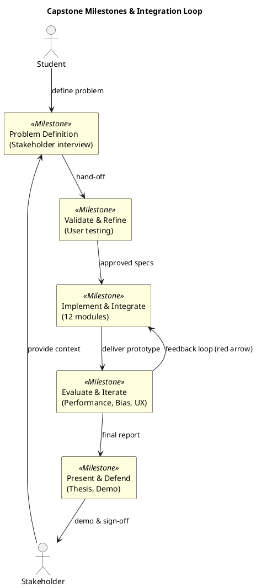

# Review: 12.1: Capstone Overview — The Student's AI

**Source:** part-iv/ch12-the-students-artificial-intelligence/lecture-01.adoc

---

# Review of Lecture 12.1 – “Capstone Overview: The Student’s AI”

**Grade: C** – The lecture contains the required material but falls short of the 90‑minute, narrative‑driven, engaging style expected for a capstone overview. It is too terse, definition‑heavy, and under‑worded; the hook is weak, the developmental arc is flat, and the sole diagram does not reinforce the learning story.

---

## 1. Narrative Arc  

| Element | Assessment | Verdict |
|---------|------------|---------|
| **Hook** | Begins with an epigraph (“You are no longer studying AI…”) and a one‑sentence statement. It is inspirational but abstract; there is no concrete scenario, provocative question, or tension that pulls the student into *their* future project. | **Insufficient** |
| **Development** | The “Conceptual Core” lists the capstone purpose, problem definition, and milestones in a bullet‑ish fashion. The “Technical Example” merely tells the student to “assemble sub‑modules”. The “Philosophical Reflection” repeats the same loop language without adding new tension or conflict. The progression is **problem → solution → claim of mastery**, but the steps are not dramatized nor linked to a real‑world narrative. | **Weak** |
| **Closing / Bridge** | Ends with a simple flow‑chart and a set of discussion prompts. The bridge to the first lab is present, but the transition feels abrupt; there is no explicit “next‑step” story (e.g., “Tomorrow you will meet your stakeholder and run the first end‑to‑end test”). | **Adequate but could be stronger** |

**Overall Verdict:** The lecture lacks a compelling story arc. It needs a concrete opening vignette, a series of escalating challenges, and a clear “what‑happens‑next” hook that ties the conceptual, technical, and philosophical sections together.

---

## 2. Density (Target ≈ 2 500‑3 500 words)

| Section | Paragraphs | Key‑point items | Word‑count estimate* |
|---------|------------|----------------|----------------------|
| Conceptual Core | **3** (target 4‑6) | 7 (target 6‑12) | ~350 |
| Technical Example | **2** (target 2‑3) | 4 (target 5‑8) | ~250 |
| Philosophical Reflection | **2** (target 2‑3) | 4 (target 5‑8) | ~300 |
| **Total** | **7** | **15** | **≈ 900‑1 000** words |

\*Rough estimate based on typical paragraph length (≈ 120‑150 words).  

**Result:** The lecture is **well below** the required word count (≈ 2 500‑3 500). It needs roughly **1 500‑2 000 additional words**, distributed across the three main sections, to fill a 90‑minute session.

---

## 3. Interest & Engagement  

| Issue | Why it hurts attention | Suggested fix |
|-------|------------------------|--------------|
| **Abstract hook** | Students cannot picture themselves “building an AI” without a concrete story. | Open with a short vignette: *“Imagine you are a junior data‑engineer at a midsize retailer. The CEO asks you to automate the weekly inventory‑reconciliation process. You have just finished the AIPA course—how do you turn the 12‑module student‑ai repo into a production‑grade solution?”* |
| **Definition‑first style** | Lists of tools and milestones feel like a checklist rather than a narrative. | Interleave each milestone with a *mini‑conflict*: e.g., “When you validate the problem, you discover the stakeholder’s data is siloed—how do you adapt?” |
| **Sparse technical detail** | Lab 1 is mentioned but not contextualised; students may wonder *what* they will actually do. | Expand the technical example with a walkthrough of a single end‑to‑end task (e.g., “Generate a sales‑forecast report using the search + LLM + reasoning modules”). |
| **Philosophical reflection repeats earlier language** | No new insight, feels like filler. | Pose a provocative question: “What does it mean to ‘own’ an AI? Does ownership imply responsibility for bias, security, and maintenance?” Follow with a brief discussion of ethical stewardship. |
| **Lack of pacing cues** | No indication of where to spend 20 min vs 40 min. | Add suggested timing blocks (e.g., “30 min: story & problem definition; 20 min: technical walk‑through; 15 min: philosophical debate; 15 min: lab prep”). |

---

## 4. Diagram Review (PlantUML Figure 12.1)

**Current diagram:** Linear flow `Problem → Validate → Implement → Evaluate → Present`.  

**Problems**

1. **No feedback loops** – Real capstone work iterates; evaluation often feeds back into implementation or even problem re‑definition.
2. **Missing actors** – No indication of *students*, *stakeholders*, or *tools* that participate at each stage.
3. **No visual emphasis on integration** – The diagram does not highlight the 12 modules or the “student‑ai” repository.

**Suggested improvements**

*Add a red feedback arrow from **Evaluate** back to **Implement** to show iteration.*  
*Label each rectangle with the milestone name and a brief subtitle.*  
*Include the two actors to remind learners who is involved.*  

---

## 5. Recommended Revisions (Prioritized)

1. **Rewrite the Hook (Top of Lecture)**
   - Insert a 150‑word concrete scenario (real‑world stakeholder, tangible pain point).
   - End the hook with a provocative question: “Can you turn the student‑ai repo into a solution that saves your company $200 k per year?”

2. **Expand Conceptual Core to 4‑5 paragraphs**
   - Paragraph 1: Hook recap & capstone purpose.
   - Paragraph 2: Detailed problem‑definition process (interviews, user stories, constraints).
   - Paragraph 3: Milestones as a *journey* with tension (e.g., “validation often reveals hidden data gaps”).
   - Paragraph 4: The “artifact of learning” – why integration matters for future AI engineers.
   - Add ~400 words.

3. **Enrich Technical Example (≈ 300 words)**
   - Walk through a specific end‑to‑end task (e.g., “auto‑generate a weekly sales‑summary report”) showing how each module contributes.
   - Provide a mini‑code snippet or pseudo‑pipeline diagram.
   - Increase key‑point list to 6 items (add “pipeline orchestration”, “error handling”, “logging”).

4. **Deepen Philosophical Reflection (≈ 300 words)**
   - Pose two philosophical questions about ownership, ethics, and long‑term maintenance.
   - Offer a brief anecdote (e.g., a past student’s AI that caused unexpected bias).
   - Expand key‑point list to 6 items (add “ethical stewardship”, “continuous learning”).

5. **Add Timing Guidance**
   - Insert a “Suggested class schedule” box (30 min story, 20 min technical walk‑through, 15 min discussion, 15 min lab prep).

6. **Revise Figure 12.1**
   - Replace current linear flow with the feedback‑loop diagram above.
   - Ensure the PlantUML block includes the updated code.
   - Add a caption: “Figure 12.1 – Iterative capstone milestones and stakeholder interaction”.

7. **Boost Word Count to Target**
   - After the above expansions, the lecture should be ~2 200‑2 500 words. Add a short “Frequently Asked Questions” section (≈ 200 words) to reach the 2 500‑3 500 range.

8. **Polish Language**
   - Replace repetitive phrasing (“12 courses, 12 tools, one integrated system”) with varied expressions.
   - Use active voice and present‑tense verbs to keep momentum.

---

### Final Note
Implementing these revisions will transform Lecture 12.1 from a checklist‑style summary into a **story‑driven, interactive, and appropriately dense** session that motivates students, clarifies the capstone workflow, and sets the stage for the hands‑on labs that follow.