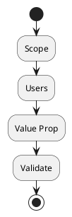

# Review: 12.2: Problem Definition and User Validation

**Source:** part-iv/ch12-the-students-artificial-intelligence/lecture-02.adoc

---

## Review of Lecture 12.2 – *Problem Definition and User Validation*

### Summary  
**Grade: D** – The lecture is far too short for a 90‑minute session (≈ 800 w vs 2 500‑3 500 w target) and lacks a compelling narrative hook. It reads like a list of definitions and bullet points, with only a thin “story” about problem construction. The single PlantUML diagram is overly simplistic and does not reinforce the conceptual flow. Substantial restructuring, expansion, and richer examples are needed before the material can sustain a full class period.

---

## 1. Narrative Arc  

| Element | Verdict | Comments / Suggested Fix |
|---------|---------|--------------------------|
| **Hook** | ❌ Weak | The lecture opens with two epigraphs, which are nice literary flourishes but do not *grab* students. There is no concrete scenario, provocative question, or tension that makes them care about “problem definition.” |
| **Development** | ⚠️ Minimal | The “Conceptual Core” jumps straight into three dimensions (scope, users, value) and then into user research. The progression is flat: problem → research → validation. No problem‑oriented story is followed, and the “politics” paragraph appears abruptly. |
| **Closing / Bridge** | ❌ Missing | The lecture ends with a discussion prompt and lab prep, but there is no explicit bridge that ties the conceptual core to the technical example, the philosophical reflection, and the upcoming lab. The closure feels tacked on. |

**Overall Narrative Verdict:** The lecture does not have a clear arc. It needs a *situated opening* (e.g., a real capstone project that went wrong because of poor problem definition), a *step‑by‑step escalation* (identify ambiguous problem → stakeholder clash → validation loop), and a *forward‑looking conclusion* (how today’s work will shape the rest of the semester).

---

## 2. Density (Target 2 500‑3 500 words)

| Section | Approx. Word Count | Target Range | Key‑Point Count | Target KP |
|---------|-------------------|--------------|----------------|----------|
| Conceptual Core | ~250 | 1 200‑1 800 | 8 | 6‑12 |
| Technical Example | ~120 | 600‑900 | 5 | 5‑8 |
| Philosophical Reflection | ~130 | 600‑900 | 4 | 5‑8 |
| **Total** | **≈ 500** | **2 500‑3 500** | **≈ 25** | **≈ 30** |

**Verdict:** The lecture is **~80 % under‑length**. Paragraphs are too brief, and many key points are merely restatements of the same idea. To reach the required density, each core section should be expanded to 4‑6 substantive paragraphs, with richer examples, case studies, and mini‑exercises.

---

## 3. Interest (Engagement)

| Issue | Why it hurts attention | Concrete remedy |
|-------|------------------------|-----------------|
| Definition‑first dump | Students hear “Scope = …” before they care *why* it matters. | Start with a *real* capstone failure (e.g., a chatbot that never got used because the “problem” was mis‑identified). |
| Lack of tension | No conflict or decision point to keep curiosity alive. | Pose a provocative question early: “What if the users you interview say they need X, but the data shows they never use it?” |
| Thin technical example | Only a checklist; no demonstration of *how* to synthesize interview data. | Walk through a short transcript, highlight coding of pain points, and show a simple affinity‑diagram. |
| Philosophical reflection feels tacked on | No link to the concrete work students will do. | Connect the reflection to the lab: “Your documentation will become the evidence you cite in your thesis—how will you make it trustworthy?” |
| No active learning moments | All content is passive reading. | Insert a 5‑minute “pair‑share” where students draft a one‑sentence problem statement for a given scenario, then critique each other. |

---

## 4. Diagram Review  

**Diagram 1 – “Problem definition framework”**  

| Aspect | Evaluation | Suggested Improvement |
|--------|------------|-----------------------|
| **Relevance** | Shows the four steps linearly, but the lecture stresses *iteration* and *negotiation* (scope ↔ users ↔ value ↔ validation). The diagram does not capture feedback loops. | Add arrows that loop back from **Validate** to **Scope**, **Users**, and **Value Prop** (e.g., “validation → refine scope”). |
| **Labels / Clarity** | Nodes are unlabeled beyond the word; no indication of *who* performs each step. | Include actors: `:Define Scope (Team)`, `:Identify Users (Stakeholder)`, `:Craft Value Prop (Product Owner)`, `:Validate (User Interviews)`. |
| **Stylistic** | Uses default “sketchy‑outline” theme, which is fine, but the diagram is too minimal to be a teaching aid. | Use `skinparam` to add colors for different categories (e.g., blue for design, green for validation) and a note explaining the loop. |
| **Pedagogical Fit** | As a stand‑alone figure, it does not reinforce the “politics” or “social‑construct” ideas. | Add an optional side‑box: “Stakeholder Power Dynamics” linked to **Scope** and **Users**. |

---

## 5. Recommended Revisions  

> **Priority 1 – Narrative & Hook**  
- Begin with a **case study** (2‑3 paragraphs) of a capstone project that failed because the problem was mis‑defined. End the case with a provocative question: “How could we have avoided this?”  
- Frame the lecture as a **detective story**: students are investigators who must uncover the *real* problem by interviewing stakeholders.

> **Priority 2 – Expand Core Sections**  
- **Conceptual Core**: 5 paragraphs (problem‑construction theory, stakeholder mapping, scope‑definition techniques, value‑prop canvas, validation loop). Include a mini‑exercise (e.g., “Map three stakeholder groups for X”).  
- **Technical Example**: Walk through a **real interview transcript** (≈ 200 w), show coding of themes, and produce a one‑page problem definition template.  
- **Philosophical Reflection**: Connect to **ethics of framing** (cite a short reading), discuss *performative validation*, and ask students to write a 2‑sentence “political implication” of their own problem statement.

> **Priority 3 – Add Active Learning**  
- Insert **pair‑share** and **small‑group debate** moments (5‑10 min each).  
- Provide a **template worksheet** for “Problem Definition Canvas” to be filled during class.

> **Priority 4 – Word‑Count Goal**  
- Target **≈ 2 800 w** total: ~1 200 w (Conceptual Core), ~800 w (Technical Example), ~800 w (Philosophical Reflection).  
- Ensure each bullet‑point list is accompanied by a short explanatory paragraph.

> **Priority 5 – Diagram Upgrade**  
- Redraw Diagram 1 with **feedback loops** and **actor labels**.  
- Add a **legend** and a **note** that the loop represents the iterative validation process.  
- Consider a second diagram: a **Stakeholder Influence Map** (matrix of power vs interest) to visualise the “politics” discussion.

> **Priority 6 – Reading & Resources**  
- Add a short **annotated bibliography** (2‑3 key articles on problem framing, user‑centered design, and the politics of AI).  
- Provide a **link** to a template (e.g., Miro board) that students can use for the lab.

> **Priority 7 – Closing Bridge**  
- End with a **“next‑step preview”**: “In Lab 1 you will apply today’s framework to your own capstone. The quality of your problem definition will determine the feasibility of the model you later build.”  

---

### Bottom Line
The lecture needs a **complete rewrite** to meet the 90‑minute, engaging‑learning standards of the AIPA textbook. By introducing a concrete hook, expanding each section with examples and activities, and improving the diagram to reflect iteration and stakeholder dynamics, the material will become both *dense enough* and *interesting enough* for a full class session.