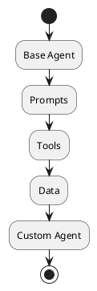

# Review: 12.3: Implementation — Customizing the Agent

**Source:** part-iv/ch12-the-students-artificial-intelligence/lecture-03.adoc

---

## Review of Lecture 12.3 – “Implementation — Customizing the Agent”

**Grade: C** – The lecture contains the right ingredients (conceptual core, technical example, philosophical reflection) but falls short of the 90‑minute density target, lacks a compelling narrative hook, and the sole diagram does not reinforce the story.

---

### 1. Narrative Arc  

| Element | Assessment | Verdict |
|---------|------------|---------|
| **Hook** | Starts with an epigraph (“The generic becomes specific through deployment”) and a one‑sentence “Adapt the agent for the specific problem.” No concrete scenario, provocative question, or tension that pulls the learner in. | **Weak** – needs a vivid opening. |
| **Development** | The “Conceptual Core” lists customization points, then the “Technical Example” shows a generic “extend the agent” workflow, and the “Philosophical Reflection” restates the generic→situated dichotomy. The progression is **problem → response → limit**, but it is very high‑level and lacks step‑by‑step scaffolding (e.g., “You have a capstone problem X; here’s the gap you discover; here’s the tool you add; here’s the test you run”). | **Adequate** – could be tighter. |
| **Closing** | Ends with discussion prompts, lab prep, and a reading link. No explicit bridge to the next lecture (e.g., “Next we’ll look at monitoring and continuous improvement”). | **Missing** – a forward‑looking sentence would improve closure. |

**Overall Narrative Verdict:** *Partial*. The lecture needs a stronger opening scenario, clearer incremental development, and an explicit “what’s next” signpost.

---

### 2. Density (Target ≈ 2,500‑3,500 words)

| Section | Approx. Word Count | Target Range | Comments |
|---------|-------------------|--------------|----------|
| Conceptual Core | ~180 words (4 paragraphs, 7 key points) | 4‑6 paragraphs, 6‑12 key points – **OK** on structure but far below the 1,200‑1,800 word range. |
| Technical Example | ~130 words (2 paragraphs, 5 key points) | 2‑3 paragraphs, 5‑8 key points – **OK** on shape but again too short for a 90‑min session. |
| Philosophical Reflection | ~150 words (2 paragraphs, 4 key points) | 2‑3 paragraphs, 5‑8 key points – **Slightly low** on key‑point count and word count. |
| **Total** | **≈ 460 words** | **≈ 2,500‑3,500 words** | **Severe under‑density** – the lecture would fill only ~10 minutes of speaking time. |

**Action:** Expand each section substantially (add concrete examples, step‑by‑step walkthroughs, mini‑case studies, and reflective questions) to reach the required word count.

---

### 3. Interest – Will it hold attention for 90 minutes?

| Issue | Why it hurts engagement | Suggested remedy |
|-------|------------------------|------------------|
| **Definition‑first style** – the “Conceptual Core” begins with “The student‑ai/agent is generic…”. | Learners hear abstract statements before seeing why they matter. | Start with a **real‑world vignette** (e.g., “A retail chain wants an AI assistant that can query inventory and place orders”). |
| **Thin technical example** – no concrete code snippets, no walkthrough of adding a tool. | Students cannot visualise the implementation work. | Provide a **mini‑lab walkthrough**: show a snippet of a custom tool (e.g., a Python wrapper for a product‑catalog API), then demonstrate how to register it in the orchestrator. |
| **Philosophical reflection repeats the same phrasing** (“generic → specific”). | Redundant; reduces curiosity. | Pose a **provocative question**: “If we keep adding custom tools, do we lose the benefits of a ‘general’ agent? Where is the line?” |
| **No tension or decision point** – the lecture never asks the learner to choose between alternatives. | Lack of mental stakes. | Insert a **decision‑making scenario**: “You have two ways to retrieve product data – a fast cache or a slower database query. Which should the agent call, and why?” |
| **Missing forward link** – no preview of the next topic (e.g., monitoring, scaling). | Learners may feel the session ends abruptly. | End with a **bridge sentence**: “Having built a situated agent, the next challenge is ensuring it stays reliable as data and usage evolve – that’s our focus in Lecture 12.4.” |

---

### 4. Diagram Review  

**Diagram 1 (PlantUML)**  

| Issue | Assessment | Recommendation |
|-------|------------|----------------|
| **Narrative mismatch** – the diagram shows a linear flow from “Base Agent” → “Prompts” → “Tools” → “Data” → “Custom Agent”. The lecture describes **customization points** (prompts, tools, data) that *branch* off a base agent, not a strict sequence. | The figure does not illustrate where the designer intervenes. | Redraw as a **central “Base Agent” node** with three **customization branches** (Prompts, Tools, Data) feeding into a **“Custom Agent”** box. |
| **Missing labels** – no indication of “Customization point” or “Integration”. | Learners cannot map the diagram to the key points. | Add labels: “Prompt customization”, “Tool integration”, “Domain data”. |
| **No feedback loop** – real agents often need to **re‑query** after a tool call. | Diagram oversimplifies the runtime behavior. | Include an arrow from “Tools” back to “Base Agent” (or “Orchestrator”) labeled “Result → next step”. |
| **Stylistic** – theme “sketchy‑outline” is fine, but the diagram is too minimal for a 90‑min lecture. | It looks like a placeholder. | Use **colored boxes** (e.g., blue for core, orange for customization) and a **legend**. |
| **Missing context** – no mention of external APIs, databases, or user interaction. | The lecture stresses integration. | Add small external icons (e.g., “API”, “DB”) connected to the “Tools” node. |

---

### 5. Recommended Revisions (Prioritized)

1. **Add a compelling hook (30 % of lecture).**  
   - Open with a concrete capstone scenario (e.g., “A logistics company needs an AI that can schedule shipments”).  
   - Pose a provocative question: “How do we turn a generic AI into a domain‑specific decision maker?”

2. **Expand the Conceptual Core to ~1,200 words.**  
   - Break into 5‑6 paragraphs: (a) generic agent recap, (b) why customization matters, (c) detailed prompt design (system prompt vs. few‑shot), (d) tool integration patterns (wrapper, async, rate‑limit), (e) data ingestion (knowledge graph, vector store), (f) design checklist.  
   - Increase key points to 9‑10, adding items such as “Prompt engineering guidelines”, “Tool interface contract”, “Data freshness strategy”.

3. **Enrich the Technical Example (~1,200 words).**  
   - Provide a step‑by‑step code walk‑through (registering a custom tool, updating the orchestrator routing table).  
   - Include a small “before/after” table showing task success rates.  
   - Add a mini‑lab narrative that students can follow in class.

4. **Deepen the Philosophical Reflection (~500 words).**  
   - Introduce a tension: “Generality vs. specificity – the trade‑off curve”.  
   - Cite a short philosophical source (e.g., Latour’s “actor‑network” notion) and connect to design decisions.  
   - Pose reflective questions for discussion.

5. **Insert a forward‑looking closing paragraph.**  
   - “Having customized our agent, the next step is to monitor its performance in production – see Lecture 12.4.”  

6. **Redesign Diagram 1.**  
   - Central “Base Agent” node with three outward arrows to “Prompt customization”, “Tool integration”, “Domain data”.  
   - Arrow from each customization back to “Custom Agent”.  
   - Add external icons for “API”, “Database”.  
   - Include a legend and color coding.

7. **Add a “Decision Point” activity (5‑10 min).**  
   - Present two alternative tool designs; ask students to vote and justify.  
   - Use this to illustrate the design trade‑off.

8. **Update discussion prompts to reference the new hook and decision point.**  
   - Align them with the concrete scenario introduced at the start.

9. **Proofread for consistency (e.g., “student‑ai/ agent” → “student‑AI agent”).**  

---

**Bottom line:** By inserting a vivid opening scenario, fleshing out each section to meet the 2,500‑3,500‑word target, and redesigning the diagram to mirror the customization workflow, Lecture 12.3 will become a robust 90‑minute session that keeps students engaged and prepares them for the subsequent lab and lecture.