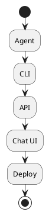

# Review: 12.4: Interface and Deployment

**Source:** part-iv/ch12-the-students-artificial-intelligence/lecture-04.adoc

---

## Review of Lecture 12.4 – *Interface and Deployment*  

**Grade: C** – The material covers the right topics, but the lecture is far too thin for a 90‑minute session, the narrative arc lacks a compelling hook, and the sole diagram does not reinforce the concepts. Substantial expansion and restructuring are needed before it can sustain student attention for a full class period.

---

### 1. Narrative Arc  

| Element | Assessment | Verdict |
|---------|------------|---------|
| **Hook** | The lecture opens with an epigraph and a list of “example prompts”.  No concrete scenario, story, or provocative question is presented. The hook therefore does **not** create tension or curiosity. | ❌ |
| **Development** | The three core sections (Conceptual Core → Technical Example → Philosophical Reflection) are present, but each is a single paragraph that jumps from “the agent must be accessible” to “deploy to cloud” without a step‑by‑step problem → solution → limitation progression. The flow feels like a definition dump rather than a narrative. | ❌ |
| **Closing / Bridge** | The discussion prompts and lab prep act as a closing, but they are merely checklist items. There is no explicit “so what now?” statement that ties the deployment choices back to the broader course theme (e.g., “how deployment shapes ethical responsibility”). | ❌ |
| **Overall arc** | **Missing** a clear narrative thread that starts with a real‑world pain point, walks through design trade‑offs, shows a concrete failure case, and ends with a forward‑looking implication for the capstone project. | ❌ |

**Recommendation:** Begin with a short, vivid vignette (e.g., a chatbot that works in a lab but crashes when a user sends a malformed JSON request). Pose a question: *“How do we turn a brilliant model into a reliable service that real users can trust?”* Then let the three sections answer that question in order: (1) choosing the right interface for the stakeholder, (2) engineering a deployment pipeline, (3) reflecting on the social impact of that exposure.

---

### 2. Density (Target ≈ 2 500‑3 500 words)

| Section | Approx. word count | Paragraphs | Key‑point bullets | Target range | Verdict |
|---------|-------------------|------------|-------------------|--------------|---------|
| Conceptual Core | ~120 | 1 | 7 | 4‑6 paragraphs, 6‑12 key points | **Too short** |
| Technical Example | ~100 | 1 | 5 | 2‑3 paragraphs, 5‑8 key points | **Too short** |
| Philosophical Reflection | ~130 | 2 | 4 | 2‑3 paragraphs, 5‑8 key points | **Too short** |
| **Total** | **≈ 350** | **4** | **≈ 16** | **≈ 2 500‑3 500** | **Severely under‑dense** |

The lecture supplies only ~350 words of substantive content—roughly **1/8** of the required density. It will not fill a 90‑minute slot even with extended discussion.

---

### 3. Interest & Engagement  

| Issue | Why it hurts engagement | Suggested fix |
|-------|------------------------|---------------|
| **Definition‑first style** (e.g., “The agent must be accessible. Interface options: CLI, API, chat UI.”) | Students hear a list before they care *why* it matters. | Start with a **problem scenario** (e.g., a user who can’t reach the agent because the API is undocumented). |
| **Lack of concrete examples** (only a one‑line CLI command) | No visual or hands‑on anchor; students can’t picture the workflow. | Provide a **step‑by‑step walkthrough**: write a tiny Flask endpoint, curl it, see the response, then show the same request via a Docker container. |
| **No failure case** | No tension; students never see the stakes of a bad interface. | Introduce a **buggy deployment** (e.g., missing CORS header) and ask students to diagnose it. |
| **Discussion prompts are isolated** | They feel tacked on rather than integrated. | Interleave the prompts after each sub‑section, using them as *reflection checkpoints* that directly relate to the preceding material. |
| **Diagram is a bland flowchart** | It does not illustrate relationships (e.g., “CLI → Agent”, “API ↔ Cloud Load Balancer”). | Redesign the diagram to show **components, data flow, and security boundaries** (auth, rate‑limit). |

---

### 4. Diagram Review  

**Current PlantUML (Diagram 1)**  



| Issue | Impact | Suggested improvement |
|-------|--------|-----------------------|
| **No arrows / data flow** – boxes are listed sequentially but the diagram does not show *how* the CLI, API, and Chat UI connect to the Agent. | Students cannot see the architecture. | Add directed arrows: `CLI --> Agent`, `API --> Agent`, `Chat UI --> Agent`. |
| **Missing deployment layer** – “Deploy” is a generic box with no context (cloud, Docker, etc.). | The term “deployment” stays abstract. | Replace with a **container** symbol (`node "Docker Container" as D`) and a **cloud** node (`cloud "AWS / GCP" as Cloud`). Show `Agent` inside the container, and arrows from the container to the three interfaces. |
| **No security elements** – auth, rate‑limit, validation are discussed in text but absent visually. | Missed opportunity to reinforce a key point. | Add a **firewall** or **gateway** node labeled “Auth / Rate‑limit” between the external interfaces and the Agent. |
| **Styling** – theme “sketchy‑outline” is fine, but labels are missing. | Diagram looks like a placeholder. | Include clear labels on each arrow (e.g., “HTTP POST /ask”, “CLI command”). |
| **Overall narrative** – the diagram does not convey the *boundary* concept. | The epigraph’s claim is unsupported. | Add a surrounding **boundary box** titled “Interface Layer” that encloses CLI, API, Chat UI, illustrating that the Agent sits *inside* the boundary. |

A revised diagram would therefore look like:

```
@startuml
skinparam backgroundColor #FDF6E3
skinparam handwritten true

node "Interface Layer" as IF {
  rectangle "CLI\n(agent ask \"…\")" as CLI
  rectangle "REST API\nPOST /ask" as API
  rectangle "Chat UI\nWebsocket" as UI
}
cloud "Cloud / Docker" as Deploy
rectangle "Auth / Rate‑limit" as Sec

CLI --> Sec
API --> Sec
UI  --> Sec
Sec --> Deploy : request
Deploy --> IF : response
@enduml
```

---

### 5. Recommended Revisions (Prioritized)

1. **Create a strong opening hook**  
   - Write a 2‑paragraph vignette of a real‑world failure (e.g., a health‑assistant bot that crashes when a user sends an emoji).  
   - Pose a guiding question: *“What does it take to move from a prototype to a production‑ready service?”*

2. **Expand the Conceptual Core to 4–5 paragraphs**  
   - Paragraph 1: Stakeholder analysis (developers vs. end‑users).  
   - Paragraph 2: Detailed comparison of CLI, API, and chat UI (pros/cons, UX implications).  
   - Paragraph 3: Deployment options with concrete cloud services and Docker commands.  
   - Paragraph 4: Security considerations (auth models, rate‑limiting, input sanitisation) with short code snippets.  
   - Paragraph 5: Summarise the “boundary” metaphor and preview the technical walk‑through.

3. **Develop a full technical walkthrough (≈ 3 paragraphs, 6–8 key points)**  
   - Build a minimal Flask (or FastAPI) endpoint, test with `curl`.  
   - Show a Dockerfile, `docker build` / `docker run` commands, and a quick deployment to a free tier (e.g., Render, Fly.io).  
   - Include a short “debugging checklist” (log level, health‑check endpoint, CORS).  

4. **Enrich the Philosophical Reflection**  
   - Add a paragraph on *trust* (how interface design signals reliability).  
   - Add a paragraph on *responsibility* (exposing a model to the public is an ethical act).  
   - Provide 2–3 discussion questions that directly tie back to the opening vignette.

5. **Re‑design the PlantUML diagram** (see above) and embed it after the Technical Example. Ensure each component is labelled and arrows illustrate data flow and security boundaries.

6. **Integrate discussion prompts as “checkpoint” activities**  
   - After the Interface comparison: small‑group debate on “CLI vs. Chat UI for non‑technical users”.  
   - After the deployment walk‑through: quick live debugging of a broken container.  
   - After the philosophical reflection: a 5‑minute think‑pair‑share on “What does a trustworthy interface look like?”

7. **Add a “Lab Bridge” paragraph** (≈ 150 words) that explicitly maps the lecture content to Lab 2 deliverables (e.g., “Your lab submission must include a README that explains the chosen interface, the deployment steps, and the security measures you implemented”).  

8. **Word‑count check** – Aim for **≈ 2 800 words** across the three main sections (≈ 900 words each). Use the key‑point bullet lists (6‑12 items per section) to guide the expansion.

9. **Proofread for consistency** – Ensure terminology (interface, boundary, deployment) is used uniformly; replace “agent” with the specific project name used in the capstone (e.g., “your tutoring bot”).

---

### Closing Note  

With the above revisions, Lecture 12.4 will transform from a skeletal checklist into a story‑driven, hands‑on session that comfortably occupies a 90‑minute class, keeps students engaged, and directly prepares them for the capstone interface lab.