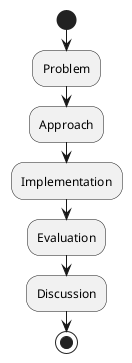

# Review: 12.6: The Written Thesis

**Source:** part-iv/ch12-the-students-artificial-intelligence/lecture-06.adoc

---

## Review of Lecture 12.6 – “The Written Thesis”

### Summary  
**Grade: C** – The lecture covers the essential checklist for a thesis but it lacks a narrative hook, sufficient depth, and the pacing required for a 90‑minute session. The three main sections (Conceptual Core, Technical Example, Philosophical Reflection) are each a single paragraph, far below the target 4‑6 paragraphs per section, and the key‑point lists are uneven. The only visual aid is a linear flowchart that does not reflect the iterative nature of writing. With major expansion and a stronger story‑line, the lecture could become engaging and pedagogically sound.

---

## 1. Narrative Arc  

| Element | Verdict | Comments |
|--------|---------|----------|
| **Hook** | ❌ Missing | The lecture opens with an epigraph and a blunt statement (“The thesis documents the journey and the result”). There is no concrete scenario, provocative question, or tension to pull students in. |
| **Development** | ❌ Weak | The three core blocks present *what* a thesis contains, but they do not show *why* each part is challenging, how students typically stumble, or how the writing process interacts with the research workflow. The progression feels like a definition dump. |
| **Closing / Bridge** | ❌ Absent | The lecture ends with a list of discussion prompts and a lab prep reminder, but there is no forward‑looking statement that ties the thesis to the next lecture (e.g., “defending the thesis” or “publishing the work”). |

**Overall Narrative Verdict:** The lecture needs a clear story‑arc: start with a vivid anecdote (e.g., a student’s defense gone wrong because the thesis lacked reproducibility), move through the problem → iterative writing → accountability → future work, and finish by previewing the upcoming defense lab.

---

## 2. Density (Target ≈ 2,500‑3,500 words)

| Section | Current Paragraphs | Target Paragraphs | Current Key Points | Target Key Points |
|---------|-------------------|-------------------|--------------------|-------------------|
| Conceptual Core | 1 | 4‑6 | 8 | 6‑12 (OK) |
| Technical Example | 1 | 2‑3 | 4 | 5‑8 |
| Philosophical Reflection | 1 | 2‑3 | 5 | 5‑8 |

**Word Count Estimate:** ~450 words total (≈ 150 words per paragraph). The lecture is therefore **~80 % under‑length**. To reach the 90‑minute target, each section should be expanded to at least 800‑1,000 words, with richer examples, mini‑case studies, and reflective questions woven throughout.

---

## 3. Interest  

| Issue | Why it hurts engagement | Suggested remedy |
|-------|------------------------|------------------|
| **Definition‑first dump** | Students hear “here’s the list” before caring why it matters. | Begin with a story: a reviewer rejects a thesis because the evaluation section is missing raw data. |
| **Thin sections** | No room for in‑class activities or discussion. | Insert a 5‑minute “peer‑review sprint” where pairs critique a mock abstract. |
| **Lack of tension** | No sense of stakes (deadline, reproducibility crisis). | Pose a provocative question: “What would happen if every graduate failed to make their code reproducible?” |
| **No visual variety** | Only one static flowchart. | Add a timeline graphic, a “feedback loop” diagram, and a sample page layout. |
| **No bridge to lab** | Lab prep repeats the same checklist. | Use a short video of a real thesis defense, then ask students to spot missing elements. |

---

## 4. Diagram Review  

**Figure 12.6 – Thesis structure template** (PlantUML)

| Issue | Recommendation |
|-------|----------------|
| **Linear flow only** – does not show iteration or feedback. | Add arrows from each block back to “Problem” or “Approach” labelled “revision after review”. |
| **No labels for artifacts** – students may not see where figures, code, or data belong. | Insert swim‑lanes (e.g., “Narrative”, “Artifacts”, “Evidence”) and place “Figures” and “Code snippets” inside the appropriate lanes. |
| **Missing “Draft → Feedback → Revise” cycle** | Add a diamond decision node “Advisor feedback?” with Yes/No branches looping to the preceding block. |
| **Stylistic** – theme “sketchy‑outline” is fine, but add a legend. | Include a small legend explaining the symbols (diamond = decision, arrow = flow, loop = iteration). |
| **Size** – currently fits on a single line; may be too cramped for a slide. | Break the diagram into two panels: (1) “Initial outline” and (2) “Iterative refinement”. |

---

## 5. Recommended Revisions  

**High‑Priority (must‑do before next semester)**  

1. **Create a hook story (≈ 300 words).**  
   *Example:* “Maya submitted her thesis two weeks before the deadline. The committee praised her results but rejected the work because the evaluation section lacked raw data and the code was not archived. Maya spent the next month rewriting the entire chapter, learning that a thesis is *part* of the research, not an after‑thought.”  
   Place this at the very start, followed by the provocative question: *“How can you avoid Maya’s nightmare?”*

2. **Expand each core section to 4‑6 paragraphs.**  
   - **Conceptual Core:** discuss each component (problem, approach, etc.) with a mini‑case study, common pitfalls, and a “quick‑check” rubric.  
   - **Technical Example:** walk through a concrete thesis outline (e.g., a vision‑transformer for medical imaging) with sample headings, figure captions, and a short excerpt of code in the implementation section.  
   - **Philosophical Reflection:** deepen the accountability theme with a brief history of reproducibility crises, and connect writing to scientific integrity.

3. **Add interactive micro‑activities.**  
   - 5‑minute “abstract rewrite” where students improve a vague abstract.  
   - 10‑minute peer‑review of a mock “Evaluation” paragraph using a checklist.

4. **Revise the diagram** (see above) to illustrate the **iterative loop** and **feedback**. Replace the current linear flow with a looped process diagram and a legend.

5. **Bridge to the next lecture.** End with a forward‑looking paragraph: “In the next session we will turn this written artifact into a live defense, learning how to present, answer questions, and turn criticism into future work.” Include a teaser image of a defense slide.

**Medium‑Priority**

- Insert a short video clip (2‑3 min) of a real thesis defense highlighting a strong “Discussion” section.  
- Provide a downloadable thesis template (LaTeX/Word) and ask students to fill in one section before class.  
- Add a “Common Mistake” call‑out box (e.g., “Don’t put raw data tables in the main body”).

**Low‑Priority / Nice‑to‑Have**

- Include a timeline graphic showing when to start each chapter (Month 1‑Problem, Month 2‑Approach, …).  
- Offer a “self‑assessment checklist” at the end of the lecture for students to track progress.  
- Provide a QR code linking to a reproducibility checklist (e.g., the “Reproducibility Badges” website).

---

### Quick Implementation Checklist for the Author  

- [ ] Write a 300‑word opening anecdote + provocative question.  
- [ ] Expand Conceptual Core to ≥ 4 paragraphs, each with a concrete example.  
- [ ] Expand Technical Example to ≥ 3 paragraphs, include a real‑world thesis excerpt.  
- [ ] Expand Philosophical Reflection to ≥ 2 paragraphs, add historical context.  
- [ ] Redesign Figure 12.6 with loops, swim‑lanes, and legend (new PlantUML code).  
- [ ] Insert two micro‑activities (abstract rewrite, peer review).  
- [ ] Add a closing paragraph that previews the defense lab.  
- [ ] Verify total word count ≈ 2,800 words.  

Implementing these changes will transform Lecture 12.6 from a checklist into a compelling, interactive session that comfortably fills a 90‑minute class and prepares students for the real‑world demands of thesis writing.