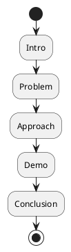

# Review: 12.7: The Formal Presentation

**Source:** part-iv/ch12-the-students-artificial-intelligence/lecture-07.adoc

---

## Review of Lecture 12.7 – “The Formal Presentation”

### Summary
**Grade: D** – The lecture falls short of the 90‑minute instructional target. It lacks a compelling hook, contains only a single paragraph in each major section, and offers too few key points to sustain a full session. The narrative arc is weak, the density is far below the 2 500‑3 500‑word range, and the only diagram is a bare‑bones flowchart that does not reinforce the pedagogical message. Substantial restructuring is required before this material can fill a 90‑minute class and keep students engaged.

---

## 1. Narrative Arc  

| Element | Assessment | Verdict |
|---------|------------|---------|
| **Hook** | Starts with an epigraph (“To present is to make the work public”) but no concrete scenario, provocative question, or tension. Students are not asked *why* presentation matters for their capstone or how a bad demo can ruin a project. | **Missing** |
| **Development** | The lecture proceeds as a checklist of format, audience, and rehearsal steps. It does not build a problem → response → limitation story (e.g., “You have built an agent, but stakeholders can’t see it; a live demo bridges that gap, yet live demos can fail”). | **Weak** |
| **Closing / Bridge** | Ends with a list of discussion prompts and a lab reminder, but no forward‑looking implication (e.g., “Your presentation will be the gateway to real‑world deployment” or “Next week we’ll analyse audience feedback”). | **Insufficient** |

**Overall Verdict:** The narrative arc is under‑developed. The lecture reads like a handout rather than a story that guides learners through a challenge and its resolution.

---

## 2. Density (Target: 2 500‑3 500 words; 4‑6 paragraphs per core section)

| Section | Paragraph Count | Key‑Point Count | Word Approx. | Meets Target? |
|---------|----------------|----------------|--------------|---------------|
| Conceptual Core | **1** (≈120 w) | 8 | ~120 | **No** (needs 4‑6 paragraphs) |
| Technical Example | **1** (≈100 w) | 5 | ~100 | **No** (needs 2‑3 paragraphs) |
| Philosophical Reflection | **1** (≈110 w) | 4 | ~110 | **No** (needs 2‑3 paragraphs) |
| **Total** | 3 | 17 | ~330 | **Far below** the required 2 500‑3 500 words. |

The lecture is dramatically under‑dense. Even counting bullet‑point expansions, the material would not fill a 90‑minute session without extensive instructor improvisation.

---

## 3. Interest & Engagement  

| Issue | Why it hurts attention | Suggested Remedy |
|-------|------------------------|------------------|
| **Definition‑first dump** – The core section launches straight into “Presentation format: duration, structure…” | Students receive a list of facts before they understand *why* they matter. | Begin with a vivid case study: a student’s live demo crashes, the audience’s reaction, and the stakes of a good presentation. |
| **Lack of concrete scenario** – No story, no problem to solve | No tension to keep learners listening. | Pose a provocative question: “What would happen if you could not demonstrate your agent at the capstone?” |
| **Sparse examples** – Only a generic “rehearse” checklist | Learners may skim the bullets. | Include a short video clip (or a narrated animation) of a successful demo followed by a “what went wrong” clip. |
| **No forward motion** – Ends abruptly with discussion prompts | Learners don’t see the relevance to upcoming labs or assessments. | Conclude with a “next step” teaser: “In Lab 3 you will record a 5‑minute demo and submit a reflection on audience feedback.” |
| **Minimal interaction** – No in‑class activity beyond discussion prompts | 90 min needs active work. | Add a 10‑minute “pair‑practice” where students outline a 5‑minute demo on a given agent and critique each other’s timing. |

---

## 4. Diagram Review  

**Figure 12.7 – Presentation outline (PlantUML)**  

| Issue | Assessment | Recommendation |
|-------|------------|----------------|
| **Over‑simplified flow** – Only linear steps, no decision points or feedback loops. | Does not illustrate the critical “fallback” or “Q&A” stages that the text stresses. | Add a decision node after **Demo**: `if (Demo works?) then (yes) else (no) -> Show backup recording`. Also include a **Q&A** node after **Conclusion**. |
| **Missing timing cues** – No indication of allocated minutes. | Students cannot see where the bulk of the presentation lies. | Annotate each step with `(≈ X min)` e.g., `:Intro (1 min);`. |
| **No audience perspective** – No element showing “Audience receives”. | The performance aspect is not visualised. | Insert a parallel “Audience” swimlane that receives the output of each step, emphasizing the communication flow. |
| **Stylistic** – Theme “sketchy‑outline” is fine, but labels are cramped. | Reduces readability. | Use `:Intro;\n(1 min)` or separate label and note. |

---

## 5. Recommended Revisions (Prioritized)

1. **Create a strong opening hook**  
   - Start with a 2‑minute narrative (real or fictional) of a capstone demo that fails spectacularly. Pose the question: *“How could you have avoided that disaster?”*  

2. **Expand each major section to meet density targets**  
   - **Conceptual Core:** 4‑5 paragraphs (problem definition, audience analysis, structure rationale, performance metaphor, accountability).  
   - **Technical Example:** 2‑3 paragraphs (demo preparation workflow, live vs recorded trade‑offs, fallback strategy).  
   - **Philosophical Reflection:** 2‑3 paragraphs (performance theory, visibility, ethics of accountability, future implications).  

3. **Increase key‑point count**  
   - Aim for 6‑12 bullet points per section. Add points such as “Identify the core story you want the demo to tell”, “Design visual aids that complement the live run”, “Prepare a 30‑second ‘plan B’ script”.  

4. **Integrate active learning activities**  
   - Pair‑work outline exercise (10 min).  
   - Live‑poll on “Live vs recorded demo” preferences (5 min).  
   - Quick “role‑play” Q&A where one student acts as a skeptical stakeholder.  

5. **Revise Figure 12.7**  
   - Add decision node for demo success/failure.  
   - Include Q&A step.  
   - Annotate time allocations.  
   - Optionally use a swimlane diagram to show audience interaction.  

6. **Add forward‑looking closure**  
   - End with a teaser: “Next week you will submit a 5‑minute recorded demo and a reflective essay on audience feedback.”  

7. **Word‑count check**  
   - Draft the revised sections and run a word‑count; target **≈ 2 800 words** total for the three core sections.  

8. **Supplementary media**  
   - Insert a short (1‑minute) video clip of a successful demo and a “what went wrong” clip to illustrate stakes and fallback planning.  

By implementing these changes, the lecture will achieve the required length, present a clear narrative arc, and provide enough engaging material to sustain a 90‑minute class.