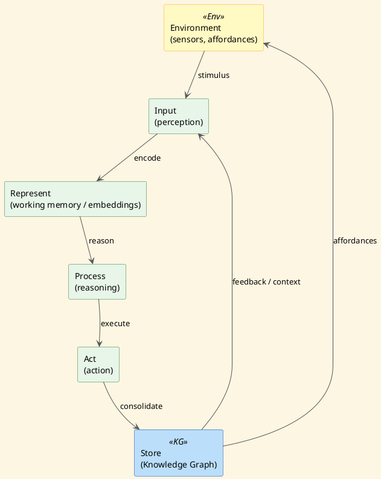

# Review: 1.3: The Cognitive Turn — Minds as Information Processors

**Source:** part-i/ch01-intelligence-as-process/lecture-03.adoc

---

## Review of Lecture 1.3 – *The Cognitive Turn: Minds as Information Processors*

### Summary
**Grade: B‑**  
The lecture has a solid narrative hook and a clear arc that moves from a concrete crossword‑puzzle scenario to historical foundations, critiques, and modern hybrids, ending with a lab bridge. However, the overall word count is well below the 2 500‑3 500 word target for a 90‑minute session, and several sections (especially the “Philosophical Reflection”) are terse. The content leans heavily on definition‑style statements rather than sustained argumentation, which may make a 90‑minute lecture feel thin. The PlantUML diagram is appropriate but could be tightened to reinforce the loop metaphor.

---

## 1. Narrative Arc  

| Element | Evaluation | Verdict |
|---------|------------|---------|
| **Hook** | Starts with a vivid crossword‑puzzle vignette and a provocative question (“What invisible machinery…?”). This is concrete, relatable, and creates immediate tension. | ✅ Strong |
| **Development** | – Historical frustration with behaviorism → birth of cognitivism. – Physical Symbol System Hypothesis (GPS, GPS example). – Information‑processing loop (5‑stage model). – Critiques (embodiment, situated cognition). – Connectionist challenge → modern hybrids. | The progression is logical, but the “development” is split into many short paragraphs that read like a list of facts rather than a story that builds on the initial puzzle. | ⚠️ Needs more connective narrative (e.g., “When the GPS failed on a simple crossword, what did researchers learn?”) |
| **Closing** | Bridge to Lab 2, discussion prompts, and a “map vs. territory” take‑away. The closing ties back to the hook and points to the next activity. | ✅ Effective, but could be more explicit about the *implication* for the students (e.g., “What will you discover when you trace your own query through the loop?”) |
| **Overall Arc** | Hook → historical context → critique → modern synthesis → lab bridge. The arc is present but the **tension** dissipates after the historical paragraph; the lecture would benefit from a “problem → attempted solution → failure → new insight” pattern that repeats. | ⚠️ Improve narrative momentum. |

---

## 2. Density (Target ≈ 2 500‑3 500 words)

| Section | Paragraphs | Key‑point bullets | Approx. word count* |
|---------|------------|-------------------|---------------------|
| Conceptual Core | 4 | 8 | ~800‑900 |
| Technical Example | 2 | 7 | ~500‑600 |
| Philosophical Reflection | 2 | 5 | ~400‑500 |
| **Total** | 8 | 20 | **≈ 1 700‑2 000** |

\*Word count estimated from the supplied text.  

**Result:** The lecture falls **~800‑1 200 words short** of the 90‑minute target. To fill a 90‑minute slot (including discussion, demo, and lab prep) you need roughly **2 500‑3 500 words** in the main sections.

---

## 3. Interest & Engagement  

| Issue | Why it matters | Suggested fix |
|-------|----------------|---------------|
| **Sparse narrative flow** – many sentences are definition‑first (“Physical Symbol System Hypothesis: …”). | Learners may lose focus after the hook; definitions feel static. | Re‑frame each definition as a *problem* the researchers faced. Example: “Newell & Simon needed a way to explain why a machine could *solve* puzzles; they proposed the Physical Symbol System Hypothesis as a testable claim.” |
| **Thin philosophical reflection** – only two paragraphs, limited depth. | Philosophical stakes are a major source of intrigue for a 90‑min class. | Expand with a short “thought experiment” (e.g., the “Chinese Room” or “Brain‑in‑a‑Vat”) and ask students to argue for/against. |
| **Demo description is brief** – the rule‑based chatbot demo is mentioned but not elaborated. | Live demos are a key hook for sustained attention. | Provide a concrete script: show a sample puzzle, walk through rule firing, display the trace, then contrast with a transformer’s attention map. |
| **Discussion prompts are good but could be timed** – no guidance on how much class time each should consume. | Without timing, the 90‑min schedule may drift. | Add a “Suggested timing” box (e.g., 5 min hook, 15 min history, 10 min critique, 15 min demo, 10 min philosophical debate, 20 min lab bridge, 5 min wrap‑up). |
| **Lack of “forward motion”** – after the hybrid systems paragraph, the lecture jumps to the lab bridge. | Students may feel the lecture ends abruptly. | Insert a short “future outlook” paragraph: “What will the next generation of cognitive architectures look like? How does the current debate shape the design of knowledge‑graph explorers?” |

---

## 4. Diagram Review (PlantUML)

**Current diagram** – a linear chain `Environment → Input → Represent → Process → Act → Store → (feedback to Input)`.  

| Issue | Impact on narrative | Concrete improvement |
|-------|---------------------|----------------------|
| **Linear layout** – the loop is drawn as a straight line, which obscures the cyclical nature of the cognitive process. | Students may not see the feedback loop as a *cycle*. | Rearrange nodes in a circular layout (e.g., place `Input`, `Represent`, `Process`, `Act`, `Store` around a circle, with `Environment` outside feeding into `Input`). |
| **Missing labels on arrows** – only the first arrow is labeled (“stimulus”). Others are unlabeled, leaving the flow ambiguous. | Reduces clarity of the five‑stage loop. | Add concise labels: `perceive`, `encode`, `reason`, `execute`, `consolidate`, `feedback/context`. |
| **Environment box style** – uses a different skin‑param but no explicit connection back to `Store` (feedback arrow is vague). | The “environment ↔ store” relationship is a key point of situated cognition. | Draw a bidirectional arrow between `Store` and `Environment` labeled “contextual affordances”. |
| **No representation of “knowledge‑graph”** – the diagram is abstract, while the lecture repeatedly mentions graphs. | Missed opportunity to tie the visual to the lab. | Add a small icon or label inside `Store` (e.g., “Knowledge Graph”) and perhaps a note on `Represent` (“Working Memory / Embeddings”). |
| **Stylistic consistency** – theme “sketchy‑outline” is fine, but colors could be more distinct for readability. | Improves visual hierarchy. | Use a brighter accent for the feedback arrow (e.g., orange) to highlight the loop’s closure. |

**Revised PlantUML sketch (suggested)**  

---

## 5. Recommended Revisions (Prioritized)

1. **Expand the Core Narrative (≈ 800 words)**  
   * Insert a “problem → attempted solution → failure → insight” sub‑story after the GPS example (e.g., GPS gets stuck on a simple crossword, prompting the hypothesis).  
   * Flesh out the critique section with concrete embodiment experiments (iCub, robot hand‑eye coordination) and a short anecdote.

2. **Lengthen the Philosophical Reflection (≈ 400 words)**  
   * Add a brief “Chinese Room” thought experiment and a guided debate prompt.  
   * Discuss the “hard problem of consciousness” and link it back to the crossword’s satisfaction.

3. **Enrich the Technical Demo Description**  
   * Provide a step‑by‑step script of the rule‑based chatbot demo, including sample input, rule firing trace, and a screenshot of the output.  
   * Contrast with a transformer attention‑heatmap on the same puzzle.

4. **Add a “Future Outlook” paragraph**  
   * Pose the question: “What will the next cognitive architecture look like when it fully integrates embodiment, symbolic reasoning, and deep learning?”  
   * Tie this to the upcoming labs (graph explorer, embodied robot).

5. **Insert a Timing Box**  
   * Suggest a minute‑by‑minute breakdown to help instructors pace the 90‑minute session.

6. **Revise the PlantUML diagram** (as shown above)  
   * Convert to a circular layout, label all arrows, add “Knowledge Graph” label, and include a bidirectional arrow to Environment.

7. **Increase Key‑Point Lists**  
   * For each section, aim for 6‑8 bullet points (the current counts are acceptable but could be more granular, e.g., split “Embodiment” into “sensorimotor loop” and “developmental learning”).

8. **Polish Language for Flow**  
   * Replace definition‑first sentences with “Why did researchers propose …?” or “What problem does … solve?” to keep the narrative forward‑moving.

---

### Closing Note
With the above expansions and visual tweaks, Lecture 1.3 will comfortably fill a 90‑minute slot, maintain student engagement through a clear story arc, and provide concrete hooks that tie directly to the lab activities. The revised diagram will serve as a visual anchor for the cognitive loop, reinforcing the lecture’s central metaphor.