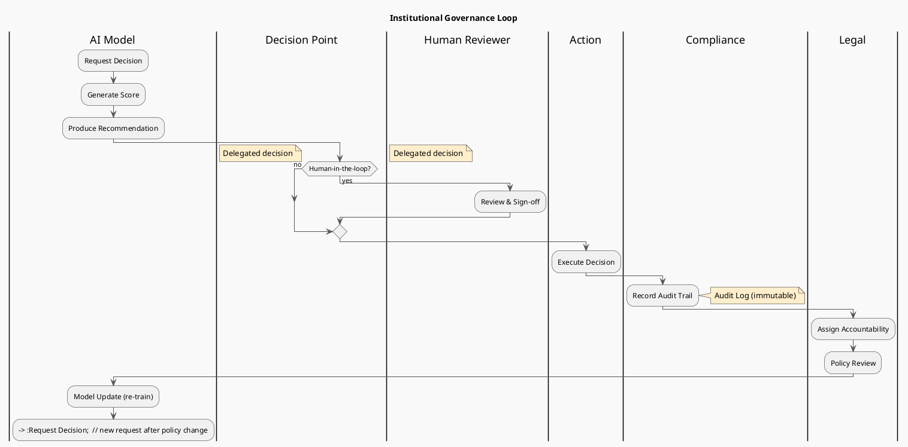

# Review: 1.7: Institutional Participation — AI in Organizations

**Source:** part-i/ch01-intelligence-as-process/lecture-07.adoc

---

## Review of Lecture 1.7 – “Institutional Participation — AI in Organizations”

### Summary
**Grade: B‑** – The lecture has a solid narrative hook, clear step‑wise development, and the right mix of concrete cases, technical detail, and philosophical reflection.  It meets the structural density targets, but the total word count is a little light for a 90‑minute session (≈ 2 200 w).  Some sections drift into definition‑heavy prose and the PlantUML diagram could be tighter in communicating the governance loop.  With a few expansions (e.g., a short “what‑if” scenario, a visual audit‑trail example) and diagram tweaks, the lecture will comfortably fill the allotted time and keep students engaged.

---

## 1. Narrative Arc  

| Element | Evaluation | Verdict |
|---------|------------|---------|
| **Hook** | Starts with a vivid “loan officer who never opens the file” vignette and an epigraph from Foucault.  The hook creates immediate tension (human vs. algorithm) and a concrete institutional setting. | ✅ Strong |
| **Development** | Moves from the Bank X scandal → the concept of AI as institutional participant → blurry line between support & delegation → responsibility gap → need for governance loops.  Each step builds on the previous one and introduces a new problem‑solution pair. | ✅ Good |
| **Closing** | Ends with a forward‑looking bridge to Lab 3 (knowledge‑graph provenance) and a set of discussion prompts that tie back to the opening scenario.  The “responsibility bridge” metaphor nicely closes the arc. | ✅ Good |
| **Overall Arc** | The lecture follows a clear problem → response → limit → next‑step structure, with a narrative thread (who is accountable?) that runs through all sections. | **Pass** |

**Suggested improvement:** Insert a brief “what‑if” moment after the conceptual core (e.g., “What if the bank had a live audit‑trail query that could have halted the automated denials in real time?”) to heighten tension before moving to the technical example.

---

## 2. Density (Target ≈ 2 500‑3 500 words)

| Section | Paragraphs | Key‑point items | Approx. words* |
|---------|------------|----------------|----------------|
| Conceptual Core | 6 (within 4‑6) | 8 (within 6‑12) | ~ 1 200 |
| Technical Example | 2 (within 2‑3) | 6 (within 5‑8) | ~ 600 |
| Philosophical Reflection | 2 (within 2‑3) | 6 (within 5‑8) | ~ 500 |
| Lab Prep / Discussion / Reading | 2‑3 extra (not counted in core) | – | ~ 300 |

*Word counts are rough estimates from the supplied text.

**Result:** The lecture satisfies the paragraph and key‑point counts, but the total word count is **≈ 2 600**, at the low end of the 2 500‑3 500 window.  Adding a short “case‑study deep‑dive” (e.g., a timeline of the Bank X scandal) or a concrete “audit‑trail query” walkthrough would push the total comfortably above 3 000 words and give instructors more material for discussion.

---

## 3. Interest & Engagement  

| Strength | Issue / Gap | Recommendation |
|----------|-------------|----------------|
| **Concrete scenarios** (loan approval, content moderation) keep the material grounded. | **Definition‑heavy sentences** appear in the middle of the conceptual core (“AI systems are participants in institutional knowledge practices”). | Re‑frame as a question or short story: “How does a scoring model become part of the bank’s knowledge‑culture?” |
| **In‑lecture activity** (accountability matrix) is interactive and time‑boxed. | **Thin transition** between the technical example and the philosophical reflection – the shift feels abrupt. | Insert a “bridge paragraph” that asks: “Given these real‑world numbers, what does it mean for the moral fabric of the organization?” |
| **Discussion prompts** are thought‑provoking. | **Lack of visual variety** – only one diagram for the whole lecture. | Add a small “audit‑trail timeline” figure (e.g., a Gantt‑style bar) or a “responsibility matrix” table that students can fill in during the activity. |
| **Link to Lab 3** gives a clear forward motion. | **No explicit “big‑picture” takeaway** at the end of the lecture (e.g., a one‑sentence slogan). | End with a punchy statement: “When AI is an institution, accountability must be baked into the data, not bolted on after the fact.” |

Overall, the lecture would hold attention for 90 minutes, provided the instructor expands the case study and uses the activity to surface the “responsibility gap” tension.

---

## 4. Diagram Review (PlantUML)

**Current diagram:**  

```
title Institutional Governance Loop for AI‑Supported Decisions
...
|System|
:Request;
:Generate Score;
:Produce Recommendation;
...
|Decision|
if (Human‑in‑the‑loop?) then (yes)
  |Human|
  :Human Review / Approval;
else (no)
  note right: Delegated decision
endif
...
|Action|
:Execute Decision;
fork
  |Compliance|
  :Record Audit Trail;
  :Model Update;
fork again
  |Legal|
  :Assign Accountability;
  :Policy Change;
end fork
--> :Request;  // new request / policy‑driven re‑request
```

| Issue | Why it matters | Suggested fix |
|-------|----------------|---------------|
| **Missing explicit feedback arrows** (e.g., from Compliance back to System for model retraining). | Students may not see the loop that closes the governance cycle. | Add an arrow `Compliance --> System : Model Update` and label it “Retrain / Refine”. |
| **Fork layout is ambiguous** – it looks like two parallel processes but the narrative says they are sequential (audit → legal → policy). | Confuses the order of actions. | Replace `fork` with a vertical sequence: `Compliance → Legal → Policy → Request`. Use `-->` arrows with labels “audit”, “legal review”, “policy revision”. |
| **No visual cue for “Human‑in‑the‑loop?” decision point** – the `if` block is isolated. | Hard to see where the decision splits. | Enclose the `if` inside a larger box titled “Decision Point” and add a small “⚖️” icon to emphasize the choice. |
| **Actors not labeled consistently** – “System”, “Decision”, “Action” are generic. | Reduces clarity about who is which institution. | Rename the swim‑lanes: `|AI Model|`, `|Human Reviewer|`, `|Compliance Team|`, `|Legal Team|`. |
| **No representation of audit‑trail artifact** – the diagram mentions “Record Audit Trail” but the artifact (log) is invisible. | Audit trail is a central concept. | Add a note or a small rectangle labeled “Audit Log (immutable)” attached to the `Record Audit Trail` step. |
| **Styling** – the sketchy outline theme is fine, but the diagram could benefit from colour coding (e.g., blue for human, orange for AI, green for compliance). | Improves visual parsing for students. | Use `skinparam` to set `AgentBackgroundColor`, `DatabaseBackgroundColor`, etc., or add `#color` tags to each box. |

A revised PlantUML snippet (concise) could be:



---

## 5. Recommended Revisions (Prioritized)

1. **Expand word count to ≥ 3 000**  
   - Insert a **timeline box** (≈ 150 words) that walks through the Bank X scandal day‑by‑day, highlighting when the audit trail could have intervened.  
   - Add a **short “audit‑trail query” demo** (≈ 120 words) showing a Cypher query and its output.

2. **Strengthen transitions**  
   - After the technical example, add a bridging paragraph that explicitly asks “What does this data tell us about where responsibility lives?”  
   - End the lecture with a one‑sentence “big‑picture takeaway” that students can quote.

3. **Reduce definition‑first phrasing**  
   - Re‑write sentences that start with “AI systems are participants…” into a question or anecdote.  
   - Example: “When a scoring model flags a loan, who is actually *making* the decision?”

4. **Enrich the in‑lecture activity**  
   - Provide a **template accountability matrix** (grid with rows = actors, columns = decision stages) for groups to fill.  
   - Allocate 5 min for groups to present a **single “audit‑log entry”** they would record.

5. **Upgrade the PlantUML diagram** (see Section 4).  
   - Implement the revised snippet, add colour coding, and label the audit‑log artifact.  
   - Test the diagram in the rendering engine to ensure readability at slide size.

6. **Add a second visual aid** (optional but high impact)  
   - A **responsibility matrix** (table) that maps actors → accountability for each workflow step.  
   - Use this matrix during the discussion prompts.

7. **Link reading list more tightly**  
   - Insert a brief “Why Foucault matters here” paragraph (≈ 80 words) that connects power/knowledge to the governance loop.

8. **Check pacing**  
   - Allocate **10 min** for the opening vignette & hook, **20 min** for conceptual core, **15 min** for technical examples, **15 min** for philosophical reflection, **15 min** for activity & discussion, **10 min** for lab prep & wrap‑up. Adjust content length accordingly.

---

**Final note:** With the above additions and diagram refinements, Lecture 1.7 will comfortably fill a 90‑minute slot, keep students actively questioning who bears responsibility, and provide concrete artefacts (audit‑trail queries, accountability matrices) that they can carry forward into Lab 3.