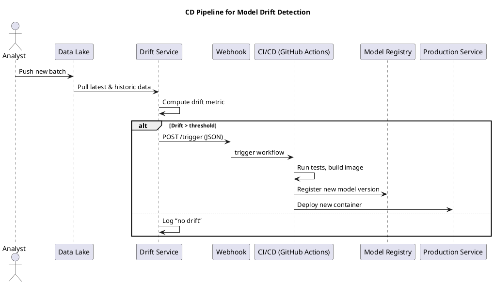

# Review: CD pipeline (e.g., via webhook)

**Source:** part-i/ch02-ai-in-practice/lecture-03.adoc

---

## Review of Lecture – “CD pipeline (e.g., via webhook)”

### Summary  
**Grade: D** – The current material is a three‑line code fragment with no narrative, no contextual framing, and far below the required word count. It lacks a hook, development, and closing, and provides no pedagogical scaffolding for a 90‑minute session. No diagrams are present, and the content would not sustain student attention.

---

## 1. Narrative Arc  

| Element | Verdict | Comments |
|---------|---------|----------|
| **Hook** | ❌ Missing | The lecture opens with raw Python code; there is no concrete scenario, provocative question, or tension to capture curiosity. |
| **Development** | ❌ Missing | No problem statement (e.g., “Why does model performance degrade in production?”), no step‑by‑step explanation of drift detection, no description of how a webhook triggers a CI/CD pipeline, and no discussion of failure modes. |
| **Closing / Bridge** | ❌ Missing | No implication, no preview of a lab exercise, nor a link to the next lecture (e.g., monitoring, model governance). |

**Overall narrative arc:** *Absent.* The lecture reads like a definition‑first dump rather than a story.

---

## 2. Density (Target: 2,500‑3,500 words; 4‑6 paragraphs + 6‑12 key points per main section)

| Section | Current | Target | Gap |
|---------|---------|--------|-----|
| Conceptual Core | 0 paragraphs, 0 key points | 4‑6 paragraphs, 6‑12 points | **Complete gap** |
| Technical Example | 1 paragraph (the code block), ~2 key points (drift calc, threshold) | 2‑3 paragraphs, 5‑8 points | **Missing 1‑2 paragraphs & 3‑6 points** |
| Philosophical Reflection | 0 | 2‑3 paragraphs, 5‑8 points | **Complete gap** |
| **Word Count** | ≈30 words | 2,500‑3,500 | **~2,470‑3,470 words missing** |

---

## 3. Interest  

- **Engagement:** A 90‑minute class cannot be built around a single snippet. Students will lose focus within minutes.  
- **Thin sections:** No explanation of *why* drift matters, no real‑world example (e.g., credit‑scoring model degrading after a pandemic), no interactive element.  
- **Definition‑first:** The code is presented without context, violating the “no definition‑first dump” rule.  

**What would make it interesting?**  
1. Start with a vivid scenario (e.g., a bank’s loan‑approval AI suddenly approves risky applicants).  
2. Pose a provocative question: “How can we know when our model is no longer trustworthy?”  
3. Walk through the detection pipeline step‑by‑step, showing live dashboards, alerts, and the webhook call.  
4. Include a short in‑class demo where students modify the threshold and see the pipeline fire.  
5. End with a discussion of the ethical stakes of silent model decay.

---

## 4. Diagram Review  

- **No PlantUML diagrams are present.**  
- A lecture on CD pipelines *needs* at least one diagram: a flowchart of data → drift detection → webhook → CI build → automated tests → redeployment.  

---

## 5. Recommended Revisions  

> **Priority 1 – Build a narrative scaffold**  
- **Hook (5‑7 min):** Open with a real‑world case study (e.g., a self‑driving car misclassifying pedestrians after a seasonal lighting change). Pose a question: “What went wrong?”  
- **Problem statement (5‑10 min):** Explain model drift, its impact on business/ethics, and why manual monitoring is insufficient.  

> **Priority 2 – Expand Conceptual Core**  
- Write 4‑5 paragraphs covering:  
  1. Definition of data drift & concept drift.  
  2. Statistical metrics (e.g., population stability index, KL divergence).  
  3. Threshold setting (statistical vs business‑driven).  
  4. Role of CI/CD in ML Ops.  
  5. Risks of over‑reacting (pipeline thrashing).  
- Provide 6‑8 bullet‑point key takeaways per paragraph.  

> **Priority 3 – Enrich Technical Example**  
- Keep the existing code as a *starting point* but add:  
  - Data loading explanation, sanity checks, visualisation of distributions (histograms).  
  - A function `detect_drift(train, live)` returning a boolean and a drift score.  
  - A mock webhook payload (JSON) and a simple Flask endpoint that would receive it.  
  - Show how the webhook triggers a GitHub Actions workflow (YAML snippet).  
- Break into 2‑3 paragraphs, each with 2‑3 concrete key points.  

> **Priority 4 – Add Philosophical Reflection**  
- 2‑3 paragraphs discussing:  
  1. Trustworthiness of automated retraining.  
  2. Human‑in‑the‑loop vs fully autonomous pipelines.  
  3. Governance, auditability, and regulatory compliance (e.g., GDPR “right to explanation”).  
- Include 5‑6 reflective questions for class debate.  

> **Priority 5 – Insert PlantUML Diagram**  

- **Improvements:**  
  - Add labels on arrows (e.g., “drift score”, “webhook payload”).  
  - Use a loop arrow to show periodic polling.  
  - Highlight the feedback loop from production back to the drift service (monitoring).  

> **Priority 6 – Word‑count & Structure Check**  
- Aim for **≈2,800 words** total.  
- Use headings: `=== Hook`, `=== What is Drift?`, `=== Detecting Drift in Code`, `=== From Detection to Deployment`, `=== Ethical & Governance Considerations`.  
- Insert **6‑8 key‑point boxes** (e.g., `*Key point:* …`) after each major paragraph.  

> **Priority 7 – Pedagogical Activities**  
- Short in‑class coding exercise (modify threshold, observe webhook call).  
- Pair‑programming to write a simple GitHub Actions YAML.  
- Discussion prompts at the end of the philosophical section.  

---

### Final Checklist for the Author  

- [ ] Add a concrete opening scenario (≤ 2 min reading).  
- [ ] Write 4‑5 conceptual paragraphs with 6‑12 bullet key points.  
- [ ] Expand the code example into a multi‑step walkthrough with visualisations and a webhook payload.  
- [ ] Provide a 2‑3 paragraph philosophical reflection with discussion questions.  
- [ ] Insert at least one PlantUML diagram (as above) and ensure it is referenced in the narrative.  
- [ ] Reach 2,500‑3,500 words total (≈2,800 is ideal).  
- [ ] Include explicit “closing” that bridges to the next lecture (e.g., “Next: Automated model monitoring dashboards”).  

Implementing these revisions will transform the lecture from a bare code dump into a cohesive, engaging 90‑minute session that meets the AIPA textbook standards.