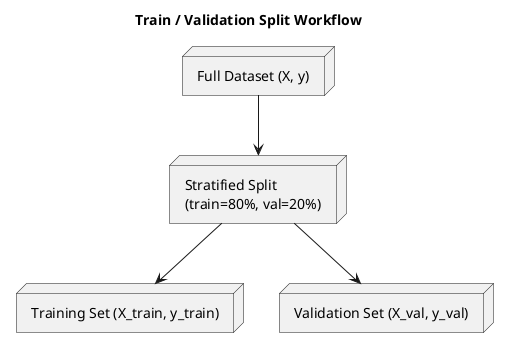

# Review: python
from sklearn.model_selection import train_test_split
X_train, X_val, y_train, y_val = train_test_split(
    X, y, test_size=0.2, stratify=y if is_classification else None, random_state=42)

**Source:** part-ii/ch04-learning-from-data/lecture-01.adoc

---

## Review of Lecture **“python”** (part‑ii/ch04‑learning‑from‑data/lecture‑01.adoc)

### Summary  
**Grade: D** – The current “lecture” is a single two‑line code snippet. It contains no narrative hook, no conceptual development, no pedagogical scaffolding, and no diagrams. It falls far short of the 90‑minute, 2 500‑3 500‑word target and would not sustain student attention.

---

## 1. Narrative Arc  

| Element | Verdict | Comments |
|---------|---------|----------|
| **Hook** | ❌ Missing | There is no concrete scenario, provocative question, or tension to draw learners in. |
| **Development** | ❌ Missing | No problem statement (e.g., why we need a validation set), no step‑by‑step reasoning, no discussion of stratification, random seeds, or data leakage. |
| **Closing / Bridge** | ❌ Missing | No implication for downstream modelling, no segue to the next lab or lecture. |

**Overall:** No narrative arc at all.

---

## 2. Density (Target ≈ 2 500‑3 500 words)  

| Section | Expected Content | Current Content | Gap |
|---------|------------------|----------------|-----|
| **Conceptual Core** (4‑6 paragraphs, 6‑12 key points) | What is a train/validation split? Why 80/20? Stratified sampling? Risks of data leakage? | 0 paragraphs, 0 key points | **Complete absence** |
| **Technical Example** (2‑3 paragraphs, 5‑8 key points) | Walk‑through of `train_test_split` with a toy dataset, visualising the split, inspecting class distributions before/after. | 0 paragraphs, 0 key points | **Complete absence** |
| **Philosophical Reflection** (2‑3 paragraphs, 5‑8 key points) | How does the split embody the scientific method? What does “validation” mean for model trust? | 0 paragraphs, 0 key points | **Complete absence** |

**Word count:** ~10 words (the code). **Shortfall:** > 2 500 words.

---

## 3. Interest  

- **Engagement:** A lone code line cannot hold attention for 90 minutes.  
- **Thin/Vague:** No explanation of *why* the code matters, no connection to real‑world problems (e.g., medical diagnosis, spam detection).  
- **Definition‑first:** Not applicable yet, but the eventual material must avoid dumping definitions before motivation.

**Concrete ways to add interest:**  

1. **Start with a story** – “Imagine you are building a model to predict whether a patient will develop sepsis. How do you know your model will work on future patients?”  
2. **Pose a tension** – “If we train on all data, we risk over‑optimistic performance. How can we guard against that?”  
3. **Show a visual** – a histogram of class distribution before/after stratified split.  
4. **Interactive demo** – ask students to predict the split size, then reveal the code.  

---

## 4. Diagram Review  

> **No PlantUML blocks are present.**  

Because the lecture currently lacks any diagram, we cannot evaluate alignment. However, a well‑placed diagram is essential for this topic (e.g., a flowchart of data preparation → split → train → evaluate).  

**Suggested diagram:**  

- Add labels for *stratify* and *random_state*.
- Show a feedback loop from validation results back to model tuning.

---

## 5. Recommended Revisions (Prioritized)

1. **Create a narrative hook (30 min)**  
   - Open with a real‑world case study (e.g., credit‑card fraud detection).  
   - Pose a question: *“How can we trust a model that has never seen new data?”*  

2. **Develop a conceptual core (30 min)**  
   - Define **training**, **validation**, and **test** sets conceptually (no jargon dump).  
   - Explain **why** we split data (prevent overfitting, estimate generalisation).  
   - Introduce **stratified sampling** and its importance for imbalanced classes.  
   - List 6‑8 key points (e.g., “random_state ensures reproducibility”).  

3. **Add a detailed technical example (15 min)**  
   - Load a small, interpretable dataset (e.g., Iris or a synthetic binary classification).  
   - Show the code, then print class counts before and after the split.  
   - Visualise with a bar chart (use `matplotlib`).  

4. **Insert a philosophical reflection (10 min)**  
   - Discuss the scientific method: hypothesis → experiment → validation.  
   - Reflect on the ethical stakes of deploying a model without proper validation.  

5. **Design and embed at least one diagram**  
   - Use PlantUML (or hand‑drawn) to illustrate the split workflow, including stratification and random seed.  
   - Reference the diagram in the text (“see Figure 1”).  

6. **Close with a bridge to the next lab**  
   - Outline the upcoming lab: training a classifier on the training set, tuning hyper‑parameters using the validation set, and finally evaluating on a held‑out test set.  

7. **Expand word count to 2 800‑3 200 words**  
   - Aim for 5 paragraphs in the conceptual core, 2‑3 in the technical example, and 2 in the reflection.  

8. **Add interactive checkpoints**  
   - Short “think‑pair‑share” questions after each major point to keep students engaged.  

---

### Final Note
Transforming this lecture from a solitary code line into a full 90‑minute session requires **substantial content creation**. Follow the prioritized list above, and you will meet the AIPA textbook standards for narrative, density, and student interest.