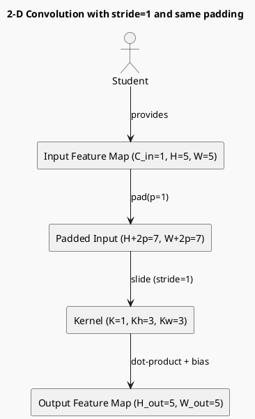

# Review:  stride + 1
    out = zeros((N, K, out_h, out_w))
    for i in range(out_h):
        for j in range(out_w):
            patch = x_padded[:, :, i*stride:i*stride+Kh, j*stride:j*stride+Kw]
            out[:, :, i, j] = (patch * w).sum(axis=(1,2,3)) + b
    return out

**Source:** part-ii/ch05-neural-systems-and-representation/lecture-04.adoc

---

## Review of Lecture: **“stride + 1”** (part‑ii/ch05‑neural‑systems‑and‑representation/lecture‑04)

### Summary  
**Grade: D** – The lecture consists almost entirely of a raw Python implementation of a 2‑D convolution forward pass. There is no narrative hook, no conceptual framing, no pedagogical scaffolding, and the word count is far below the 2 500‑3 500‑word target for a 90‑minute session. Without additional context, students will struggle to see *why* this code matters, what the underlying mathematics are, or how it connects to later labs or philosophical discussions.

---

## 1. Narrative Arc  

| Element | Verdict | Comments |
|---------|---------|----------|
| **Hook** | ❌ Missing | The lecture opens with a code block; no concrete scenario (e.g., “How does a self‑driving car detect edges in a camera image?”) or provocative question is presented. |
| **Development** | ❌ Missing | No step‑by‑step exposition of the problem (why we need padding/stride), the algorithmic response (how convolution works), or its limits (computational cost, border effects). |
| **Closing / Bridge** | ❌ Missing | No concluding remarks, no link to a lab exercise (e.g., implementing a CNN layer) or to the next lecture (e.g., back‑propagation). |

**Overall:** The lecture lacks any narrative structure. It reads as a “definition‑first dump” of code.

---

## 2. Density (Target: 2 500‑3 500 words, 4‑6 paragraphs, 6‑12 key points)

| Section | Current | Target | Gap |
|---------|---------|--------|-----|
| Conceptual Core | 0 paragraphs, 0 key points | 4‑6 paragraphs, 6‑12 key points | **Complete absence** |
| Technical Example | 1 short code block (≈30 words) | 2‑3 paragraphs, 5‑8 key points | **Missing explanatory text** |
| Philosophical Reflection | 0 | 2‑3 paragraphs, 5‑8 key points | **Missing** |

The lecture is essentially a 30‑word snippet; it does not meet any density criteria.

---

## 3. Interest  

- **Engagement:** A 90‑minute class cannot be sustained by a single code listing. Students will lose focus within minutes.  
- **Thin/Vague Sections:** All sections are thin; there is no explanation of what `pad`, `zeros`, `stride`, `padding='same'` mean, nor why the output dimensions are computed as they are.  
- **Definition‑first:** The code is presented before any definition of convolution, receptive fields, or the role of stride/padding.  

**Concrete ways to add hook and tension:**  

1. **Start with a real‑world image‑processing problem** (e.g., “Detecting edges in satellite imagery to locate roads”). Pose the question: *“How can a neural network scan an image while preserving spatial resolution?”*  
2. **Introduce a visual illustration** of a small 5×5 input, a 3×3 kernel, and show the effect of stride = 1 vs stride = 2.  
3. **Create a “mystery bug”**: Show a broken output shape and ask students to diagnose why the dimensions are off—this drives curiosity about padding and stride.  

---

## 4. Diagram Review  

There are **no PlantUML diagrams** in the current lecture. Adding at least one diagram is essential to visualise the sliding‑window operation and the effect of padding/stride.

**Suggested diagram:**  

*Improvements:* label the stride arrows, show the receptive field for a single output cell, and add a feedback loop indicating how the same operation repeats across the spatial grid.

---

## 5. Recommended Revisions  

| Priority | Action |
|----------|--------|
| **1️⃣** | **Add a narrative hook** (real‑world scenario or provocative question) before the code. |
| **2️⃣** | **Write a conceptual core** (4‑6 paragraphs) covering:  ‑ What a convolution does mathematically (cross‑correlation).  ‑ Role of padding (`same` vs `valid`).  ‑ Meaning of stride and its effect on output size.  ‑ Example with small numbers (showing dimensions). |
| **3️⃣** | **Expand the technical example**: walk through the code line‑by‑line, explain each variable, and illustrate with a concrete numeric example (e.g., input = 1‑channel 4×4, kernel = 2×2). Include a table of intermediate shapes. |
| **4️⃣** | **Insert at least one PlantUML diagram** visualising the sliding window, padding, and stride. Ensure labels for `i*stride`, `j*stride`, and output cell coordinates. |
| **5️⃣** | **Add a closing section** that (a) summarises key take‑aways, (b) poses a forward‑looking question (e.g., “How will back‑propagation compute gradients through this operation?”), and (c) links to the upcoming lab where students implement `conv2d_forward` from scratch. |
| **6️⃣** | **Provide a short philosophical reflection** (2‑3 paragraphs) on how convolution embodies the principle of *locality* and *translation invariance* in perception, connecting to post‑modern ideas of “distributed representation”. |
| **7️⃣** | **Check word count**: aim for ~2 800 words across the three sections. Use bullet‑point key‑point lists (6‑12 per section) to aid note‑taking. |
| **8️⃣** | **Proofread for terminology**: define `H`, `W`, `Kh`, `Kw`, `pad`, `stride`, `out_h`, `out_w` before they appear in equations. |

---

### Bottom Line  
The current lecture is a bare‑bones code dump that cannot sustain a 90‑minute class. By embedding the code within a compelling narrative, expanding conceptual explanations, adding visual diagrams, and linking to subsequent labs and philosophical context, the lecture can be transformed into an engaging, pedagogically sound session.