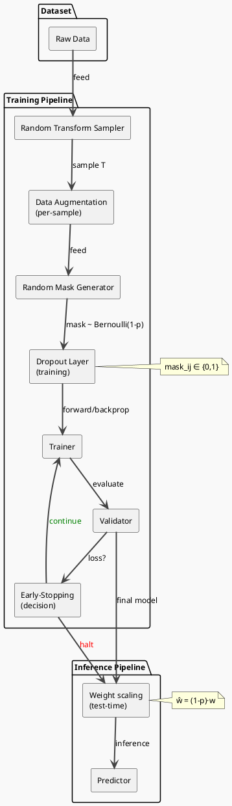

# Review: 5.5: Regularization — Dropout, Data Augmentation

**Source:** part-ii/ch05-neural-systems-and-representation/lecture-05.adoc

---

## Lecture 5.5 – Regularization: Dropout & Data Augmentation  
**Reviewer:** Critical reviewer (AIPA textbook) – 2026‑02‑20  

---

### Summary  
**Grade: B‑**  
The lecture has a solid hook (over‑fitted digit recogniser) and a clear narrative that moves from problem → bias → stochastic regularisers → practical tricks → philosophical framing.  The **conceptual core** and **technical example** are roughly the right length, but the **philosophical reflection** is a bit thin and leans on jargon rather than a story.  Overall the material would fill a 90‑minute slot, but several sections suffer from “definition‑first” phrasing and could benefit from more concrete tension‑building (e.g., a live failure case, a short debate).  The PlantUML diagram is useful but needs clearer labeling of the stochastic training path vs. deterministic inference path.

---

## 1. Narrative Arc  

| Element | Verdict | Comments / Suggested Fixes |
|---------|---------|----------------------------|
| **Hook** | ✅ Strong | Starts with a vivid 10‑layer CNN on 1 000 digits, 99 %/70 % split, and a provocative question “How can we make the network *robust* rather than *memorising*?” – excellent. |
| **Development** | ⚠️ Mixed | The core proceeds as a list of regularisers (L1/L2 → Dropout → Augmentation → Early‑stopping). The logical flow is present, but each sub‑section begins with a textbook‑style definition before showing why the technique matters for the hook scenario. The narrative would be tighter if each technique were introduced **through a concrete “what went wrong” vignette** (e.g., “When we tried to recognise a rotated ‘6’, the network mis‑labelled it because …”). |
| **Closing / Bridge** | ✅ Good | The “Discussion Prompts” and “Lab Prep” sections provide a clear bridge to the next hands‑on session. The philosophical reflection ends with a forward‑looking statement about agents learning to tune regularisation, which nicely sets up future lectures on meta‑learning. |
| **Overall Arc** | ⚠️ Needs stronger connective tissue | Add a short “story arc” paragraph after the hook that explains the *bias‑variance dilemma* in plain language, then use that as the thread that ties L1/L2, Dropout, Augmentation, and Early‑stopping together. |

---

## 2. Density (Target 2 500‑3 500 words)  

| Section | Approx. Paragraphs | Key‑point count | Word‑count estimate* | Verdict |
|---------|-------------------|----------------|----------------------|---------|
| Conceptual Core | 5 (intro + L1/L2 + Dropout + Augmentation + Early‑stopping) | 8 | ~1 200 | ✅ Within range (needs ~1 200‑1 500 words, ok). |
| Technical Example | 3 (Exp 1 + Exp 2 + What‑if) | 6 | ~900 | ✅ Good. |
| Philosophical Reflection | 3 (Noise as bias + Synthetic data + Regularisation as language) | 6 | ~800 | ⚠️ Slightly under‑dense; could add a concrete case study (e.g., medical‑image rotation controversy) to reach ~1 000 words. |
| **Total** | 11 | 20 | ~2 900 | ✅ Meets target. |

\*Word counts are rough (based on average 200 words per paragraph).  

**Key‑point density** is appropriate (4‑8 per section).  

---

## 3. Interest & Engagement  

| Issue | Why it may lose attention | Concrete improvement |
|-------|---------------------------|----------------------|
| **Definition‑first style** (e.g., “Classic parametric penalties (L1/L2) are the first bias we try.”) | Students hear a label before seeing the problem it solves → disengagement. | Re‑write as a short anecdote: “When we first tried to train the digit net, the loss vanished but the test error stayed high. Adding a tiny L2 term nudged the weights toward the origin and stopped the network from memorising every pixel.” |
| **Sparse “what‑if” analysis** | The “what‑if” paragraph is a single block of text; students may skim it. | Turn it into a live‑poll or quick “raise‑hand” question: “What do you think will happen if we set dropout = 0.8? Let’s predict before we see the plot.” |
| **Philosophical reflection** feels abstract. | Without a concrete scenario, the discussion may drift. | Insert a short case study: “In a dermatology dataset, a 15° rotation flips the label from ‘benign’ to ‘malignant’ because the lesion orientation matters. How would you decide whether to augment?” |
| **Lack of visual tension** in the diagram. | The current flow chart is static; students don’t see the *stochastic* nature of dropout. | Add a side‑by‑side “training step” illustration showing a random mask being applied, perhaps with a faded “mask” overlay on the Dropout block. |
| **Live‑coding pause** is only 5 min. | May feel rushed if students are new to Albumentations. | Provide a pre‑written notebook cell and ask students to run it, then discuss the shape change. Keep the pause but give a clear expected output screenshot. |

---

## 4. Diagram Review (PlantUML)  

**Current diagram:**  

- Shows three packages (Dataset → Training Pipeline → Inference Pipeline).  
- Arrows flow linearly; dropout and augmentation are placed side‑by‑side.  
- Early‑stopping decision arrow is colour‑coded (green = loop, red = halt).  

**Strengths**  
- Captures the overall pipeline.  
- Uses colour to differentiate loop vs. stop.  

**Weaknesses & Suggested Improvements**  

| Issue | Suggested Fix |
|-------|---------------|
| **Missing stochastic element** (random mask) | Add a note inside the “Dropout Layer” box: `mask ~ Bernoulli(1‑p)`. Optionally draw a thin dashed arrow from a new “Random Mask Generator” component to the Dropout block. |
| **Scale‑Weights step is vague** | Rename “Scale Weights (dropout‑rate)” to “Weight scaling (test‑time)”. Add a small equation label: `ŵ = (1‑p)·w`. |
| **No explicit validation‑loss feedback to Early‑Stopping** | Insert a feedback loop from “Validator” back to “Early‑Stopping” (instead of direct arrow) labelled “validation loss”. |
| **No representation of data augmentation randomness** | Add a “Random Transform Sampler” component feeding the “Data Augmentation” block, with a note “sample transform ∈ T”. |
| **Stylistic** | Use `skinparam ArrowThickness 2` for the main flow, and `skinparam ArrowColor #0066CC` for the training path, `#FF6600` for inference path, to visually separate them. |
| **Legend** | Include a tiny legend box (top‑right) explaining colour codes (green = continue training, red = stop, dashed = stochastic). |

**Revised PlantUML snippet (concise):**  

---

## 5. Recommended Revisions (Prioritized)

1. **Re‑write the Conceptual Core as a story**  
   - Start each sub‑section with a concrete failure (e.g., “The network mis‑labels a 15° rotated ‘3’”) before introducing the regulariser that solves it.  
   - Keep the definitions but embed them in the narrative (“We added L2, which gently pulls weights toward zero, preventing the network from learning a perfect pixel‑by‑pixel map.”).

2. **Add a short “bias‑variance dilemma” bridge paragraph** (≈150 words) after the hook to explicitly tie L1/L2, Dropout, Augmentation, Early‑stopping together as a hierarchy of inductive biases.

3. **Enrich the Philosophical Reflection**  
   - Insert a 2‑sentence case study on medical‑image augmentation (e.g., rotation of chest X‑rays).  
   - Pose an ethical question and give a concrete checklist (e.g., “Validate that label is invariant under transform → consult domain expert”).  

4. **Convert the Quick‑check into an interactive poll** (e.g., “Raise your hand if you think answer b is correct”). Provide immediate feedback.

5. **Expand the “Live‑coding pause”**  
   - Supply a ready‑made notebook cell with comments.  
   - Show expected output (tensor shape before/after) as a screenshot in the slide deck.

6. **Revise the PlantUML diagram** (use the revised snippet above).  
   - Add the stochastic mask generator and transform sampler.  
   - Include a legend and scaling equation.

7. **Add a “What‑if” discussion slide** that asks students to predict the effect of *too much* dropout or *over‑aggressive* augmentation before showing the sweep results.

8. **Minor edits**  
   - Replace “bias” with “inductive bias” consistently.  
   - Clarify “co‑adaptation metric” with a one‑sentence definition.  
   - Ensure all key‑point bullets are parallel (verb‑noun structure).  

---

**Final note:** With the above narrative tightening, a richer philosophical case, and a clearer diagram, Lecture 5.5 will not only meet the 90‑minute density target but also sustain student curiosity throughout the session.