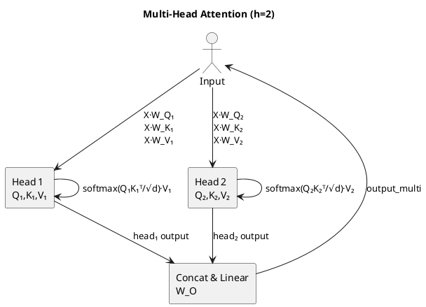

# Review: = wh.sum(axis=1, keepdims=True)
    weights_list.append(wh)
    heads.append(wh @ Vh)

# Concatenate and project back
concat = np.concatenate(heads, axis=1)   # (3, 4)
W_O = np.random.rand(4, 4)
output_multi = concat @ W_O

**Source:** part-ii/ch06-language-and-models/lecture-02.adoc

---

## Summary  
**Grade: D** – The lecture consists almost entirely of a raw code listing with no narrative hook, explanatory text, or pedagogical scaffolding. It fails to meet the 90‑minute session length, offers no clear learning arc, and would not sustain student interest. Diagrams are absent, and the material is far from the required 2,500‑3,500 word body.

---

## Narrative Arc  

| Element | Verdict | Comments |
|---------|---------|----------|
| **Hook** | ❌ Missing | There is no opening scenario, question, or tension. The reader is dropped straight into a loop that creates weight matrices. |
| **Development** | ❌ Missing | The code runs line‑by‑line without explaining *why* each step matters, how it relates to the single‑head case, or what problem multi‑head attention solves. |
| **Closing / Bridge** | ❌ Missing | No summary, implication, or segue to a lab or the next lecture. |

**Overall:** The lecture lacks any narrative structure. It reads like a copy‑paste from a notebook rather than a teaching script.

---

## Density  

| Section | Expected (words) | Actual (approx.) | Verdict |
|---------|-------------------|------------------|---------|
| Conceptual Core (4‑6 paras) | 2,500‑3,500 | 0 | ❌ |
| Technical Example (2‑3 paras) | 2,500‑3,500 | 1 short code block (≈50 words) | ❌ |
| Philosophical Reflection (2‑3 paras) | 2,500‑3,500 | 0 | ❌ |

The lecture is essentially a single code block (≈30 lines). It does not meet any of the required paragraph or key‑point counts.

---

## Interest  

* **Engagement:** A 90‑minute class cannot be sustained by staring at a loop that creates random matrices. Students will quickly disengage.  
* **Thin/Vague Areas:** Every line is “definition‑first” (e.g., `W_Qh, W_Kh, W_Vh = …`), with no intuition, no visualisation of attention heads, no real‑world analogy.  
* **Concrete ways to add hooks/tension:**  
  1. Open with a concrete problem (e.g., “How can a transformer simultaneously attend to “who” and “what” in a sentence?”).  
  2. Pose a provocative question: “What happens if we give the model multiple ‘eyes’?”  
  3. Use a short story or demo (e.g., translating a simple English sentence) that fails with a single head and succeeds with two heads.  

---

## Diagram Review  

No PlantUML diagrams are present. A visual representation is essential for multi‑head attention (showing parallel Q‑K‑V streams, concatenation, and final projection).  

**Suggested diagram:**  

*Add labels for dimensions, arrows showing the flow, and a note on the concatenation step.*

---

## Recommended Revisions  

1. **Create a strong opening hook (5‑10 min).**  
   - Begin with a real‑world example (e.g., “When translating “She ate the apple” the model must attend to both the subject and the object simultaneously”).  
   - Pose a question: “Can a single attention head capture both relationships?”  

2. **Write a conceptual core section (≈1,200 words).**  
   - Explain the limitation of a single head (capacity, representation of multiple sub‑spaces).  
   - Introduce the idea of “multiple eyes” and how it enables the model to learn diverse relational patterns.  
   - Provide 4–6 key points (definition of head, parallelism, dimensionality split, concatenation, final projection, computational trade‑offs).  

3. **Develop a step‑by‑step technical example (≈800 words).**  
   - Walk through the code line‑by‑line, but **precede each block with a short explanatory paragraph** (“We first create separate query/key/value matrices for each head”).  
   - Show a *tiny* concrete tensor (e.g., X = [[1,0,1],[0,1,0]]) and compute one head manually on the board or in a notebook.  
   - Highlight the shape transformations with a table.  

4. **Add a philosophical reflection (≈600 words).**  
   - Discuss why multi‑head attention is a “post‑modern” design (multiple perspectives, distributed representation).  
   - Raise questions about interpretability (“Do heads correspond to linguistic notions?”).  
   - Provide 5–8 reflective prompts for class discussion.  

5. **Insert at least one PlantUML diagram** (see above) **right after the conceptual core** to visualise the parallel streams and concatenation.  

6. **Close with a bridge to the lab / next lecture (5‑10 min).**  
   - Outline a hands‑on exercise: “Implement a 2‑head attention layer and compare its output to a single‑head baseline on a toy translation task.”  
   - Preview the next topic (e.g., “Scaled dot‑product attention in deeper transformer stacks”).  

7. **Expand word count to meet 2,500‑3,500 target.**  
   - Aim for ~4–6 paragraphs in the conceptual core, ~2–3 paragraphs in the technical example, and ~2–3 paragraphs in the philosophical reflection.  
   - Use bullet lists for key points (4–6 per section).  

8. **Proofread for terminology consistency** (e.g., use `d_k` for head dimension, `h` for number of heads) and ensure all symbols are defined before first use.  

By implementing these revisions, the lecture will transform from a bare code dump into a cohesive, 90‑minute learning experience that engages students, conveys deep understanding, and aligns with the AIPA textbook standards.