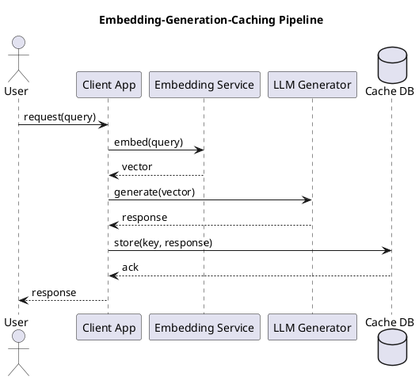

# Review: python
def embed(text: str) -> np.ndarray: ...
def generate(prompt: str, **kwargs) -> str: ...
def cache(key: str, value: Any) -> None: ...

**Source:** part-ii/ch06-language-and-models/lecture-08.adoc

---

## Review of Lecture 08 – “python”

### Summary  
**Grade: D** – The lecture consists of three bare‑bones function signatures with no narrative, context, or pedagogical scaffolding. It fails to meet any of the criteria for a 90‑minute, engaging session.  

---

## 1. Narrative Arc  

| Element | Verdict | Comments |
|---------|---------|----------|
| **Hook** | ❌ | No opening scenario, question, or tension. The reader is dropped straight into code without motivation. |
| **Development** | ❌ | No problem statement, no explanation of why these functions matter, no step‑by‑step build‑up (e.g., embedding → generation → caching). |
| **Closing / Bridge** | ❌ | No concluding remarks, no link to a lab, next lecture, or broader implications (e.g., ethical concerns of language models). |

**Overall:** The lecture lacks any narrative structure.  

---

## 2. Density (Target ≈ 2,500‑3,500 words)  

| Section | Expected | Present | Gap |
|---------|----------|---------|-----|
| Conceptual Core (4‑6 paragraphs, 6‑12 key points) | ✔︎ | 0 | – |
| Technical Example (2‑3 paragraphs, 5‑8 key points) | ✔︎ | 0 | – |
| Philosophical Reflection (2‑3 paragraphs, 5‑8 key points) | ✔︎ | 0 | – |

The manuscript is only three lines of code (≈ 30 words). It is far below the required word count and structural depth.  

---

## 3. Interest  

- **Attention‑holding:** A 90‑minute class cannot be sustained by three function signatures.  
- **Thin/Vague:** No explanation of *what* `embed`, `generate`, or `cache` do, nor *why* they are crucial for language‑model pipelines.  
- **Definition‑first:** The lecture starts with definitions (function signatures) before any motivation—exactly the opposite of the desired “hook‑first” approach.  

**Concrete ways to add interest:**  
1. Open with a vivid scenario (e.g., “Imagine you are building a chatbot that must answer customer queries instantly while keeping costs low…”)  
2. Pose a provocative question (“How can we reuse expensive model embeddings without recomputing them for every user?”)  
3. Walk through a real‑world pipeline: retrieve text → embed → generate response → cache result.  

---

## 4. Diagram Review  

No PlantUML blocks are present. A diagram would be highly valuable here (e.g., a flowchart of the embed → generate → cache loop).  

**Suggested diagram:**  

- Add labels for *key* (e.g., hash of query) and *value* (generated text).  
- Show a feedback loop where a cache hit bypasses the generator.  

---

## 5. Recommended Revisions (Prioritized)

1. **Create a Hook (5‑minute opening).**  
   - Start with a concrete, relatable problem (e.g., latency in AI‑powered assistants).  
   - Pose a question that the three functions will answer.

2. **Expand the Conceptual Core (≈ 1,200 words).**  
   - Explain embeddings: what they are, why they’re expensive, typical dimensions.  
   - Discuss generation: prompt engineering, temperature, token limits.  
   - Introduce caching: cache‑lookup strategies, invalidation, trade‑offs.  
   - Provide 6‑12 bullet‑point key takeaways.

3. **Add a Technical Example (≈ 800 words).**  
   - Walk through a complete Python snippet that uses `embed`, `generate`, and `cache`.  
   - Show a step‑by‑step execution trace, including error handling and performance metrics.  
   - Highlight 5‑8 concrete points (e.g., “Embedding cost ≈ 0.5 s per call”, “Cache hit reduces latency by 80%”).

4. **Insert a Philosophical Reflection (≈ 600 words).**  
   - Discuss implications of caching on model freshness, bias propagation, and privacy.  
   - Pose ethical questions: “Is it acceptable to reuse cached responses that may contain outdated or harmful content?”  
   - Provide 5‑8 discussion prompts for students.

5. **Add a Diagram (PlantUML).**  
   - Use the suggested flowchart; ensure arrows indicate data flow and decision points (cache hit/miss).  
   - Label each component clearly; include a legend if needed.

6. **Close with a Bridge (5‑10 minutes).**  
   - Summarize the pipeline’s benefits and limits.  
   - Preview the upcoming lab (e.g., “Implement your own cache for a GPT‑3 powered chatbot”).  
   - Pose a forward‑looking question to spark curiosity.

7. **Revise the Code Stubs.**  
   - Provide docstrings and type hints that explain purpose.  
   - Include a minimal working example at the end of the lecture.

---

**Bottom line:** The current lecture is a placeholder. To become a 90‑minute, engaging session it must be rebuilt around a strong narrative, expanded to meet word‑count targets, enriched with examples, reflections, and a supporting diagram. Implement the revisions above in order, and the lecture will meet the AIPA textbook standards.