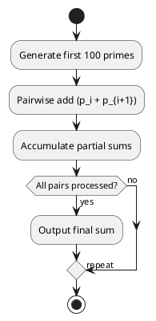

# Review: 1. List the first 100 primes: 2, 3, 5, …, 541.
2. Add them pairwise: (2+3)=5, (5+7)=12, …
3. Accumulate the partial sums: 5, 17, 34, …
4. Final sum = 24133.

**Source:** part-iii/ch08-reasoning-and-inference/lecture-05.adoc

---

## Review of Lecture – “Sum of the First 100 Primes”

| **Grade** | **Rationale** |
|----------|--------------|
| **D** | The lecture is only four bullet points (≈30 words). It contains no hook, no development, no closing, no conceptual depth, no technical example, no philosophical reflection, and no diagrams. It falls far short of the 2 500‑3 500‑word target for a 90‑minute session and cannot sustain student attention. |

---

### 1. Narrative Arc  

| **Element** | **What the lecture does** | **Verdict** |
|-------------|---------------------------|-------------|
| **Hook** | None – starts with a dry “list the first 100 primes”. | ❌ No concrete scenario, question, or tension. |
| **Development** | A linear list of arithmetic steps (pairwise add → accumulate → final sum). No explanation of *why* we are doing this, no connection to reasoning or inference. | ❌ No problem statement, no conceptual build‑up, no illustration of a reasoning pattern. |
| **Closing / Bridge** | Ends abruptly with the final sum. No implication, no link to a lab, no preview of the next topic. | ❌ No forward motion. |

**Overall verdict:** The lecture lacks a narrative arc entirely.

---

### 2. Density (Target: 2 500‑3 500 words, 4‑6 conceptual paragraphs, 6‑12 key points, etc.)

| **Section** | **Current** | **Target** | **Gap** |
|-------------|-------------|------------|----------|
| Conceptual Core | 0 paragraphs, 0 key points | 4‑6 paragraphs, 6‑12 points | **Missing** |
| Technical Example | 0 paragraphs, 0 key points | 2‑3 paragraphs, 5‑8 points | **Missing** |
| Philosophical Reflection | 0 paragraphs, 0 key points | 2‑3 paragraphs, 5‑8 points | **Missing** |
| Word Count | ~30 words | 2 500‑3 500 words | **~2 470 words short** |

---

### 3. Interest  

- **Engagement:** A 90‑minute class cannot be built around a single arithmetic exercise.  
- **Thin/Vague:** The steps are presented without context (“Why pairwise? Why accumulate?”).  
- **Definition‑first:** The lecture jumps straight into a list of numbers; there is no definition of “prime”, no motivation, no problem framing.

**What would make it interesting?**  
1. **Hook:** Pose a provocative question – e.g., “Can we predict the sum of the first *n* primes? What does this tell us about the distribution of primes?” or present a real‑world scenario (cryptographic key generation).  
2. **Storyline:** Frame the computation as a *reasoning* exercise: “Given only the first 100 primes, how can we infer a property of the whole set?”  
3. **Interactive element:** Let students discover the pairwise‑addition pattern themselves, then discuss algorithmic efficiency (O(n) vs O(n²) approaches).  
4. **Bridge:** Connect the sum to the next lecture on *probabilistic inference* or *prime number theorem*.

---

### 4. Diagram Review  

- **No PlantUML blocks are present.**  
- **Recommendation:** Add at least one diagram to visualise the reasoning process (e.g., a flowchart of the algorithm, a dependency graph showing how each partial sum builds on the previous one, or a number‑line illustration of the primes and their cumulative sum).  

---

## Recommended Revisions (Prioritized)

1. **Create a Hook (mandatory).**  
   - Begin with a short story or question: “Imagine you need to generate a large cryptographic key. The security hinges on prime numbers. Before we dive into algorithms, let’s explore a simple yet surprising property of the first 100 primes.”  
   - Alternatively, show a surprising pattern (e.g., the sum is even, divisible by 3, etc.) and ask students to hypothesise why.

2. **Expand the Conceptual Core (≈4 paragraphs, 8 key points).**  
   - Define *prime numbers* and why they matter in AI (e.g., hashing, randomness).  
   - Introduce the *reasoning pattern*: “pairwise addition → accumulation → total”.  
   - Discuss the *inference* aspect: from local operations to a global property.  
   - Highlight computational complexity and alternative strategies (vectorised sum, streaming sum).

3. **Add a Technical Example (≈2‑3 paragraphs, 6 key points).**  
   - Show a short Python (or pseudo‑code) snippet that generates the first 100 primes and computes the sum.  
   - Include a hand‑calculation of the first 5‑10 steps to illustrate the pattern.  
   - Compare naïve pairwise addition vs built‑in `sum()`; discuss time/space trade‑offs.

4. **Insert a Philosophical Reflection (≈2 paragraphs, 5 key points).**  
   - Ask: “What does this exercise teach us about inference? How do we move from concrete data (primes) to abstract conclusions (properties of number sets)?”  
   - Connect to broader AI themes: inductive reasoning, pattern discovery, limits of extrapolation.

5. **Add at least one PlantUML diagram.**  
   - **Diagram 1:** Flowchart of the algorithm (Generate → Pairwise Add → Accumulate → Output).  
   - **Diagram 2 (optional):** Number line showing primes, pairwise sums, and cumulative totals, with arrows indicating the “building” process.  
   - Ensure labels (`start`, `generate primes`, `pairwise add`, `accumulate`, `final sum`) and a feedback loop for “verify with known result”.

6. **Provide a Closing Bridge (≈1 paragraph).**  
   - Summarise the insight (“We turned a list of discrete facts into a single global inference”).  
   - Preview the next lab: “Now we will implement a streaming inference engine that can update the sum in real time as new primes arrive.”

7. **Adjust Word Count.**  
   - Target 2 800‑3 200 words across the three sections. Use bullet‑point key‑point lists (6‑12 per section) to meet the rubric.

8. **Add Student Activities.**  
   - Quick pair‑programming: write a function that returns the sum of the first *n* primes.  
   - Discussion prompt: “If we double the number of primes, how does the sum grow? What does the Prime Number Theorem predict?”

---

### Quick Sketch of a PlantUML Flowchart (to be inserted)

*Suggested improvements*: add `note right` explaining why pairwise addition is used, label the loop with “i = 1..99”, and include a `fork`/`join` if you want to show a parallel vectorised sum alternative.

---

### Bottom Line

The current lecture is a **definition‑dump** of a trivial arithmetic exercise and cannot fill a 90‑minute class. By embedding it in a narrative about reasoning, providing algorithmic depth, philosophical context, interactive coding, and visual aids, the lecture can be transformed into a compelling session that meets the AIPA textbook standards. Implement the revisions above in the order listed, and the lecture will move from a **D** to at least a **B** (potentially an **A** with richer philosophical links).