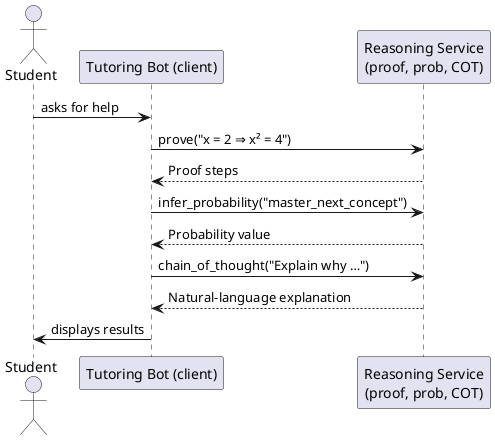

# Review: python
# client side (the tutoring bot)
from reasoning import client

# 1. Proof request
proof = client.prove("x = 2 ⟹ x^2 = 4")
if proof.success:
    display(proof.steps)

# 2. Probability request
p = client.infer_probability("master_next_concept after hint")
display(f"Estimated mastery probability: {p.value:.2f}")

# 3. Chain‑of‑thought request
cot = client.chain_of_thought("Explain why x=2 solves x^2=4")
display(cot.text)

**Source:** part-iii/ch08-reasoning-and-inference/lecture-07.adoc

---

## Review of Lecture **“python”** (client‑side tutoring bot)

### Summary  
**Grade: D** – The material is far too brief to fill a 90‑minute session. It consists of three code snippets with no narrative, motivation, or conceptual framing. There is no hook, no development of ideas, and no closing that ties the examples to a larger learning goal or lab activity. Consequently the lecture cannot sustain student attention for the allotted time and fails the density requirements.

---

## 1. Narrative Arc  

| Element | Verdict | Comments |
|---------|---------|----------|
| **Hook** | ❌ Missing | The lecture opens immediately with raw code. There is no concrete scenario (e.g., “Imagine a tutoring bot that can prove algebraic statements for you in real time”) or provocative question. |
| **Development** | ❌ Missing | The three API calls are presented back‑to‑back without explanation of **why** they exist, how they differ, or what underlying concepts (proof assistants, probabilistic inference, chain‑of‑thought prompting) they illustrate. No problem → solution → limitation structure. |
| **Closing / Bridge** | ❌ Missing | No summary, no implication for the upcoming lab, and no invitation for students to experiment or reflect. |

**Overall Verdict:** The lecture lacks any narrative arc. It reads as a definition‑first dump of API usage.

---

## 2. Density (Target: 2,500‑3,500 words, 4‑6 conceptual paragraphs, 6‑12 key points, plus technical & philosophical sections)

| Section | Current Length | Target | Gap |
|---------|----------------|--------|-----|
| Conceptual Core | 0 paragraphs / 0 words | 4‑6 paragraphs / ~1,200‑1,800 words | **Missing** |
| Technical Example | 3 short code blocks (~50 words) | 2‑3 paragraphs / ~800‑1,200 words | **Severely under‑developed** |
| Philosophical Reflection | 0 | 2‑3 paragraphs / ~500‑800 words | **Missing** |
| **Key Points** | ~0 | 6‑12 per section | **Missing** |

The lecture is essentially **empty** of the required content.

---

## 3. Interest  

- **Engagement:** Without a story or real‑world motivation, students will likely skim or disengage.  
- **Thin/Vague Sections:** The code is presented without context, input/output explanation, or discussion of edge cases.  
- **Definition‑first:** The three API calls are introduced without first explaining the underlying *reasoning* concepts they embody.

**How to make it interesting:**  
1. **Start with a scenario** – e.g., “A high‑school student is stuck on a quadratic equation. Our tutoring bot can prove the solution, estimate the student’s mastery, and generate a step‑by‑step explanation.”  
2. **Pose a question** – “Can a single Python client orchestrate symbolic proof, probabilistic inference, and natural‑language reasoning? What are the limits?”  
3. **Show a live demo** (or a video) where the bot interacts with a student, then unpack each request.  
4. **Introduce tension** – highlight a failure case (e.g., the bot mis‑estimates mastery) and discuss how to detect and remediate it.  
5. **Close with a lab prompt** – “In the next lab you will extend the client to handle multi‑step proofs and visualise confidence over time.”

---

## 4. Diagram Review  

*No PlantUML diagrams are present.*  
A visual architecture diagram would be essential here to show the flow:

- **Student ↔ Tutoring Bot (client) ↔ Reasoning Service (server)**
- Arrows for **prove**, **infer_probability**, **chain_of_thought** requests.
- Optional feedback loop showing how the bot updates its internal student model.

**Suggested diagram elements:**

Add labels, colors, and a small “confidence update” loop to reinforce the learning‑model concept.

---

## 5. Recommended Revisions  

| Priority | Action |
|----------|--------|
| **1️⃣** | **Create a strong hook** (story, demo, or provocative question) at the very start (≈1 paragraph, 150‑200 words). |
| **2️⃣** | **Expand the Conceptual Core**: introduce symbolic proof, probabilistic student modeling, and chain‑of‑thought prompting. Provide 4‑5 paragraphs with 6‑8 key points (definitions, why they matter, relationships). |
| **3️⃣** | **Develop each API call** into a mini‑case study:  • Explain the problem the request solves.  • Show input, expected output, and a walk‑through of the returned data structure.  • Discuss limitations or failure modes. (2‑3 paragraphs per request). |
| **4️⃣** | **Add a Philosophical Reflection** (≈2 paragraphs) on the implications of delegating reasoning to AI: trust, transparency, and the role of the human tutor. Include 5‑6 reflective key points. |
| **5️⃣** | **Insert a closing bridge**: summarize what was learned, preview the lab (e.g., “You will now implement a custom inference query”) and pose an open question for students to ponder. |
| **6️⃣** | **Add at least one PlantUML diagram** (architecture flow) with clear labels, feedback loops, and a caption that ties back to the narrative. |
| **7️⃣** | **Provide concrete in‑lecture activities**: e.g., ask students to predict the proof steps before running the code, or to critique the probability estimate. |
| **8️⃣** | **Adjust word count**: target 2,800‑3,200 words total across all sections. Use bullet lists for key points to improve readability. |
| **9️⃣** | **Proofread for consistency** (e.g., use the same notation for implication “⇒” vs “⟹”, and ensure code snippets are syntax‑highlighted). |
| **🔟** | **Add references** to the underlying libraries (`reasoning` package) and to the theoretical background (e.g., “Coq for proof, Bayesian Knowledge Tracing for mastery”). |

---

### Bottom Line
The current lecture is a skeletal code dump that cannot stand alone for a 90‑minute class. By embedding the code in a compelling narrative, fleshing out conceptual and philosophical context, and adding visual aids and interactive moments, the lecture can meet the AIPA textbook standards for quality, density, and student engagement.