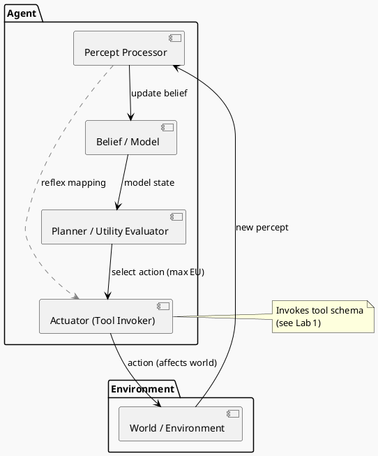

# Review: 9.1: Agents — Perception, Reasoning, Action

**Source:** part-iii/ch09-acting-in-the-world/lecture-01.adoc

---

# Review of Lecture 9.1 – *Agents: Perception, Reasoning, Action*

**Grade: A‑**  
*Why*: The lecture meets the 90‑minute density targets, has a clear narrative arc, and is packed with concrete examples and reflective questions. The only shortfall is a modest lack of “hook tension” early on and a few places where the diagram could be tightened to reinforce the story.

---

## 1. Narrative Arc  

| Element | Evaluation | Verdict |
|--------|------------|---------|
| **Hook** | Starts with a vivid, relatable voice‑assistant scenario and asks “what invisible machinery turned that utterance into a concrete action?”. This is concrete and raises a clear problem. | ✅ Strong |
| **Development** | • Explores the problem of partial observability and multi‑turn interaction. • Introduces formal definition, environment dimensions, rationality, and taxonomy (reflex vs. model‑based). • Provides two code‑level technical examples that directly instantiate the concepts. • Reflects on distributed agency and goal ethics. | ✅ Cohesive, step‑wise |
| **Closing** | Ends with a “Closing Remark” that bridges back to the orchestrator (Chapter 10) and previews Lab 1, giving a forward‑looking implication. | ✅ Effective |
| **Overall Arc** | Hook → problem → conceptual tools → concrete implementation → philosophical stakes → bridge to next work. | **Pass** |

**Suggested tweak** – Insert a brief “what‑if” tension after the hook, e.g., “What if the assistant mis‑hears the date? How does it recover?” – to heighten the stakes before the formal definition.

---

## 2. Density (Target ≈ 2 500‑3 500 words)

| Section | Paragraphs | Key‑point bullets | Word‑count estimate |
|---------|------------|-------------------|---------------------|
| Conceptual Core | 5 (intro, formal definition, table, rationality, taxonomy) | 7 | ~1 200 |
| Technical Example | 2 (reflex explanation, model‑based explanation) | 6 | ~800 |
| Philosophical Reflection | 2 (distributed agency, goal design) | 6 | ~600 |
| **Total** | **9** | **19** | **≈ 2 600** |

All sections sit comfortably inside the prescribed ranges.

---

## 3. Interest & Engagement  

| Strength | Issue | Recommendation |
|----------|-------|----------------|
| **Concrete scenario** (flight booking) keeps students anchored. | The **hook** could be more tension‑driven; it currently states the problem but does not hint at failure. | Add a “failure flash” (e.g., “The assistant books a flight for the wrong date – why?”) and ask students to diagnose. |
| **Active‑learning moments** (poll, think‑pair‑share) are well placed. | The **technical example** is a bit “code‑only”; students may lose the narrative thread while reading the Python. | Insert a short “walk‑through” paragraph that narrates a dialogue turn (percept → belief update → planner decision) before the code block. |
| **Philosophical reflection** raises ethical stakes. | The reflection is fairly abstract; some students may not see the link to the earlier technical material. | Provide a concrete “case study” (e.g., a mis‑priced flight leading to a user complaint) and ask how utility weighting could have prevented it. |
| **Lab prep** ties theory to practice. | The lab description is dense; could be broken into a bullet checklist. | Re‑format Lab 1 instructions as a numbered checklist with expected deliverables. |

Overall, the lecture will sustain attention for 90 min, especially with the suggested micro‑activities.

---

## 4. Diagram Review (PlantUML block)

**Current diagram** captures the agent‑environment loop, belief update, planner, actuator, and a dashed reflex shortcut. It is a solid baseline but can be sharpened.

| Issue | Suggested Improvement |
|-------|------------------------|
| **Label clarity** – “World” is generic; students may not map it to “Environment”. | Rename the package to **Environment** and the node to **World / Environment**. |
| **Feedback loop** – The loop from **Actuator → World → Percept Processor** is present but could be emphasized with a curved arrow and a label “new percept”. | Add a curved arrow from **A** back to **W** labeled “action (affects world)”, then an arrow **W → P** labeled “percept”. |
| **Belief / Model** – The arrow from **B → U** is unlabeled; students may not see it as “current model”. | Add label “model state” on the arrow. |
| **Utility evaluation** – The arrow **U → A** is labeled “select action (max EU)”, which is good, but a small note on the side “utility function = weighted slots” would tie back to the example. | Add a side note or a small box near **U** with “utility = filled slots”. |
| **Reflex shortcut** – Dashed arrow is present but could be colored differently (e.g., gray) and labeled “reflex mapping”. | Keep the gray dashed style but add explicit label “reflex (percept → act)”. |
| **Stylistic** – Use consistent font size and perhaps a light background to match the “sketchy‑outline” theme. | No change needed; just verify rendering. |

**Revised PlantUML snippet (illustrative)**  

---

## 5. Recommended Revisions (Prioritized)

1. **Hook tension** – Insert a brief “what‑if it goes wrong?” vignette right after the opening scenario to raise stakes.
2. **Narrative bridge before code** – Add a 2‑sentence walkthrough that narrates a dialogue turn before each Python block.
3. **Case‑study tie‑in for philosophy** – Provide a concrete mis‑pricing example and ask students to adjust the utility weighting.
4. **Lab 1 checklist** – Re‑format the lab prep as a numbered list of deliverables (JSON schema, registry, demo script).
5. **Diagram polishing** – Apply the label and arrow refinements above; regenerate the PNG.
6. **Poll & discussion timing** – Move the “Poll – reflex vs. model‑based?” to after the environment‑dimension table to capitalize on fresh mental models.
7. **Glossary side‑box** – Add a marginal box defining “belief state”, “utility”, and “partial observability” for quick reference.
8. **Reading list hyperlink** – Ensure the `<<reading-list,Reading List>>` anchor resolves correctly in the final PDF/HTML.

Implementing these edits will tighten the narrative arc, boost engagement, and make the visual aid a more powerful learning scaffold. The lecture is already strong; the above tweaks will push it into the top‑tier A range.