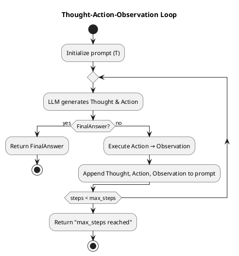

# Review:  generates Thought + Action
    if response contains FinalAnswer then
        return response.FinalAnswer
    end if
    observation ← execute(response.Action)
    prompt ← prompt + format(response.Thought, response.Action, observation)
    steps ← steps + 1
end while
return "max_steps reached"

**Source:** part-iii/ch09-acting-in-the-world/lecture-04.adoc

---

## 📚 Review of **Lecture: “generates Thought + Action”** (part‑iii/ch09‑acting‑in‑the‑world/lecture‑04)

### Summary
**Grade: D** – The lecture as submitted is a single 10‑line code fragment with no surrounding narrative, context, examples, or reflective discussion. It falls far short of the 2,500‑3,500‑word target, provides no hook or closing, and offers nothing to sustain a 90‑minute class. No diagrams are supplied, and the existing snippet reads like a definition‑first dump rather than an engaging story.

---

## 1. Narrative Arc
| Element | Verdict | Comments |
|---------|---------|----------|
| **Hook** | ❌ Missing | No concrete scenario, provocative question, or tension. The reader is dropped straight into pseudocode. |
| **Development** | ❌ Missing | No problem statement (e.g., “How can an LLM act in an environment?”), no step‑by‑step explanation of why the loop is needed, no discussion of alternatives or failure modes. |
| **Closing / Bridge** | ❌ Missing | No implication for labs, next lecture, or broader AI themes (e.g., planning, reinforcement learning). |

**Overall narrative arc:** *Absent.* The lecture needs a story‑frame that introduces a real‑world task, walks through the algorithm while exposing design choices, and ends with a “so‑what” that leads into a hands‑on activity or the next concept.

---

## 2. Density (Target 2,500‑3,500 words)

| Section | Expected Length | Current Length | Gap |
|---------|----------------|----------------|-----|
| Conceptual Core (4‑6 paragraphs, 6‑12 key points) | ~1,200‑1,600 words | 0 | – |
| Technical Example (2‑3 paragraphs, 5‑8 key points) | ~600‑900 words | 0 | – |
| Philosophical Reflection (2‑3 paragraphs, 5‑8 key points) | ~600‑900 words | 0 | – |
| **Total** | **2,500‑3,500 words** | **≈30 words** (the code) | **≈2,470‑3,470 words missing** |

The lecture is essentially a code listing; it does not meet any of the required structural components.

---

## 3. Interest & Engagement

- **Thin/Vague:** The only content is a loop; students will have no intuition about *why* this loop matters.
- **Definition‑first:** The code is presented without any explanation, violating the “no definition‑first dump” rule.
- **Potential hooks:**  
  1. **Scenario:** “Imagine a robot that must navigate a kitchen, fetching ingredients while reasoning about safety.”  
  2. **Provocative question:** “Can a language model decide *when* to stop thinking and start acting?”  
  3. **Tension:** Show a failed attempt where the model loops forever, then motivate the `max_steps` guard.

- **Forward motion:** Connect to upcoming lab where students implement `execute()` for a simple grid world, or to the next lecture on *planning horizons*.

---

## 4. Diagram Review
No PlantUML blocks are present. A visual flow‑chart of the **Thought‑Action‑Observation loop** is essential to help students see the feedback cycle.

**Suggested diagram:**

- Add **labels** on arrows (e.g., “LLM call”, “Environment step”, “Prompt update”).  
- Highlight the **guard** (`max_steps`) as a decision node.  
- Optionally show a **feedback loop** back to the LLM.

---

## 5. Recommended Revisions (Prioritized)

1. **Create a narrative frame** (≈500 words):
   - Open with a vivid, concrete task (e.g., a virtual assistant that must fetch a coffee while reasoning about user preferences).
   - Pose a question: “How does an LLM decide when it has thought enough and should act?”

2. **Expand the Conceptual Core** (≈1,200 words, 8‑10 key points):
   - Explain the *Thought‑Action* paradigm, its origins (CoT, ReAct), and why a loop is needed.
   - Define each component (`prompt`, `response`, `Thought`, `Action`, `Observation`) in context.
   - Discuss design choices: `max_steps`, prompt engineering, handling failures.

3. **Add a Technical Example** (≈800 words, 6‑7 key points):
   - Walk through a step‑by‑step execution on a simple grid‑world or text‑based game.
   - Show concrete `prompt` strings before/after each iteration.
   - Include a short code snippet (Python pseudo‑implementation) and a live‑coding demo outline.

4. **Insert Philosophical Reflection** (≈600 words, 5‑6 key points):
   - Question the limits of “thinking” vs “acting” in LLMs.
   - Relate to agency, autonomy, and safety concerns.
   - Bridge to next lecture on *planning under uncertainty*.

5. **Design and embed a PlantUML flow diagram** (as above) right after the pseudocode, with caption and discussion of each step.

6. **Add a closing bridge** (≈200 words):
   - Summarize the loop’s role in the broader architecture.
   - Preview the lab: students will implement `execute()` for a Mini‑World and observe the loop in action.
   - Pose an open question for next class: “How can we let the model *learn* the optimal number of steps?”

7. **Word‑count check**: Ensure total ≈2,800 words across the three sections.

8. **Pedagogical scaffolding**:
   - Insert **check‑point questions** after each major point (e.g., “What would happen if we omitted the observation from the prompt?”).
   - Provide a **quick‑quiz** (multiple‑choice) at the end of the lecture.

---

### Bottom Line
The current submission is a code fragment lacking any of the structural, narrative, or pedagogical elements required for a 90‑minute, engaging lecture. By building a concrete scenario, fleshing out the three required sections, adding a clear diagram, and weaving in reflective discussion, the lecture can be transformed into a compelling learning experience.