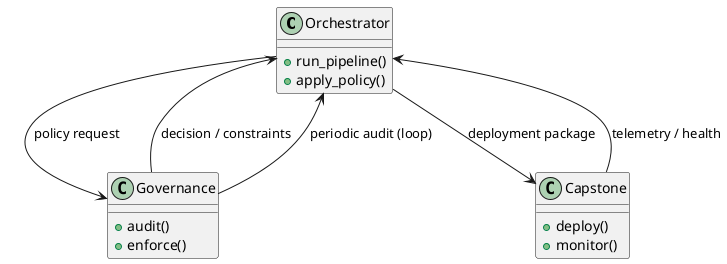

# Review: 10.8: Lab Integration — Agent Orchestrator

**Source:** part-iv/ch10-architectures-of-intelligence/lecture-08.adoc

---

## Review of Lecture 10.8 – “Lab Integration — Agent Orchestrator”

### Summary  
**Grade: C‑** – The lecture touches the right themes (orchestrator, governance, capstone) but it is far too thin for a 90‑minute class. The narrative starts with a vague “recap” and never builds a concrete problem‑solution tension. Word‑count is well under 1 000 words, far short of the 2 500‑3 500 target. The only visual aid is a three‑box flowchart that adds no insight. Substantial work is needed to give the session a hook, a step‑by‑step development, and enough technical depth to keep students engaged for the full period.

---

## 1. Narrative Arc  

| Element | Verdict | Comments / Suggested Fix |
|---------|---------|--------------------------|
| **Hook** | ❌ Weak | The opening epigraph is nice, but there is no concrete scenario that makes students care. A hook could be a “real‑world disaster” (e.g., a chatbot that crashes because the orchestrator is missing) or a provocative question: “What happens when the only thing that ties your agents together fails?” |
| **Development** | ⚠️ Fragmented | The “Conceptual Core” is essentially a bullet‑list of previous chapters. It does not show a problem → orchestrator design → limitation → next step. A clear progression could be: <br>1. **Problem** – scaling a multi‑agent pipeline leads to duplicated code & brittle integrations. <br>2. **Response** – introduce the orchestrator as the *spine* that abstracts pipelines, handles monitoring, and enforces policies. <br>3. **Limits** – discuss where orchestration can become a bottleneck (single point of failure, latency) and preview governance (Ch 11) as the mitigation. |
| **Closing / Bridge** | ❌ Missing | The lecture ends with discussion prompts and lab prep, but there is no forward‑looking statement that ties into the next lecture (e.g., “Next week we will see how governance policies are encoded as declarative rules that the orchestrator must obey”). A closing paragraph that frames the orchestrator as the *gateway* to responsible AI would give a satisfying arc. |

**Overall Narrative Verdict:** *Insufficient.* The lecture needs a stronger hook, a logical progression, and a clear bridge to the next topic.

---

## 2. Density (Target ≈ 2 500‑3 500 words)

| Section | Approx. Word Count | Target Range | Comments |
|---------|-------------------|--------------|----------|
| Conceptual Core | ~120 | 4‑6 paragraphs (≈ 800‑1 200 words) | Only two short paragraphs and a list. |
| Technical Example | ~70 | 2‑3 paragraphs (≈ 400‑600 words) | One‑sentence description of a lab; no code, no architecture walk‑through. |
| Philosophical Reflection | ~70 | 2‑3 paragraphs (≈ 400‑600 words) | Repeats the “epistemic machine” line without depth. |
| **Total** | **≈ 260** | **2 500‑3 500** | **≈ 10 %** of required density. |

**Verdict:** *Severely under‑dense.* The lecture must be expanded dramatically.

---

## 3. Interest (Engagement)

| Issue | Why it hurts attention | Quick fix |
|-------|------------------------|-----------|
| **Definition‑first dump** – the “Recap” simply enumerates prior concepts. | Students hear “again, again” and lose focus. | Start with a *scenario* (e.g., a user asks the agent to book a flight, but the tool‑calling fails because the orchestrator isn’t handling retries). |
| **Lack of concrete example** – no code snippets, no live demo outline. | No hands‑on mental model; the lab instructions feel detached. | Include a short walkthrough of a `orchestrator.yaml` file, a Python wrapper that registers a tool, and a monitoring dashboard screenshot. |
| **No tension or open question** – the discussion prompts are tacked on at the end. | Students may treat them as optional reading. | Pose a *challenge* at the start: “Can you design an orchestrator that automatically disables a tool that exceeds latency thresholds?” and revisit it throughout the lecture. |
| **Sparse visualisation** – a three‑box start‑stop diagram adds nothing. | Learners can’t see data flow or feedback loops. | Replace with a component diagram showing orchestrator, agent pipeline, governance audit, and capstone deployment, with arrows for request/response, policy enforcement, and telemetry. |

---

## 4. Diagram Review  

**Figure 10.8 – “Orchestrator and Ch11/Ch12”** (PlantUML)

Current diagram:

```
@startuml
start
:Orchestrator;
:Ch11 Governance;
:Ch12 Capstone;
stop
@enduml
```

| Issue | Recommendation |
|-------|----------------|
| **No relationships** – the three boxes are shown sequentially, implying a linear flow that is inaccurate. | Use `-->` arrows to indicate *orchestrator* is the central node, with bidirectional links to *Governance* (policy checks) and *Capstone* (deployment). |
| **Missing labels** – what data passes between them? | Add notes or `:` labels: `:Orchestrator --> :Policy Engine` (request), `:Policy Engine --> :Orchestrator :Decision`. |
| **No feedback loops** – governance audits are periodic, not one‑off. | Add a loop arrow from *Governance* back to *Orchestrator* labeled “audit/feedback”. |
| **Stylistic** – `start/stop` symbols are unnecessary for a static architecture diagram. | Remove `start`/`stop`, use `package` or `component` shapes. |
| **Theme** – “sketchy‑outline” is fine, but ensure the diagram is legible in printed slides. | Keep a clean line weight, add a legend if you introduce new symbols. |

**Revised PlantUML sketch (suggested):**



---

## 5. Recommended Revisions (Prioritized)

1. **Add a compelling hook (5‑10 min).**  
   - Open with a concrete failure case (e.g., “Our travel‑assistant crashed when two tools tried to write to the same DB”).  
   - Pose a provocative question that the orchestrator will answer.

2. **Restructure the narrative into a three‑act arc.**  
   - **Act 1 – Problem:** scaling, heterogenous tools, governance needs.  
   - **Act 2 – Solution:** design of the orchestrator (components, APIs, monitoring). Include a live‑coding demo of a minimal orchestrator config.  
   - **Act 3 – Limits & Next Steps:** single‑point‑of‑failure risk, latency, hand‑off to governance (Ch 11) and capstone (Ch 12).

3. **Expand each main section to meet word‑count targets.**  
   - **Conceptual Core (≈ 1 200 words):** 4–6 paragraphs covering (a) architectural patterns (pipeline vs. orchestrator), (b) service‑mesh analogy, (c) metadata & telemetry, (d) policy injection points, (e) scaling strategies (horizontal pods, queueing).  
   - **Technical Example (≈ 600 words):** Step‑by‑step walkthrough of a Docker‑Compose file, a Python orchestrator stub, and a monitoring dashboard screenshot. Include at least one code block (≈ 15 lines).  
   - **Philosophical Reflection (≈ 600 words):** Discuss the “epistemic machine” claim, relate to the metabolism thesis, and raise the question of *agency* when orchestration is externalized.

4. **Enrich the lab prep.**  
   - Provide a checklist with deliverables (YAML config, unit test, governance policy file).  
   - Suggest a “stretch goal” (e.g., implement a circuit‑breaker pattern).

5. **Redesign Figure 10.8** (see revised PlantUML).  
   - Add component labels, bidirectional arrows, and a feedback loop.  
   - Place the figure after the “Technical Example” to illustrate the architecture just described.

6. **Integrate discussion prompts throughout the lecture**, not only at the end.  
   - After each act, pause for a 2‑minute think‑pair‑share using the prompts.  
   - Record a few student answers on a shared board to keep the session interactive.

7. **Add a “Bridge to Next Lecture” paragraph (2‑3 sentences).**  
   - Explain how the orchestrator’s policy hooks will be populated by the governance language introduced in Chapter 11, setting up the next class.

8. **Proofread for consistency** (e.g., “Ch11” vs. “Chapter 11”) and ensure all key terms (orchestrator, governance, capstone, epistemic machine) are defined **once** in context, not repeated verbatim.

---

### Bottom Line
The lecture currently reads like a checklist rather than a learning experience. By inserting a real‑world hook, expanding the conceptual and technical depth, and providing a richer, labeled diagram, the session can be transformed into a 90‑minute, story‑driven class that keeps students actively constructing an “agent spine” while preparing them for the governance and capstone work that follows.