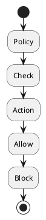

# Review: 11.1: Governance — Policies and Constraints

**Source:** part-iv/ch11-ai-in-institutions/lecture-01.adoc

---

## Review of Lecture 11.1 – “Governance — Policies and Constraints”

### Summary  
**Grade: C** – The lecture contains the essential concepts but falls short of a 90‑minute, engaging session. The narrative arc is weak (no concrete hook, the “story” ends where it began), the word‑count is well under the 2 500‑3 500 word target, and the sole diagram is a bare‑bones flowchart that adds little to the discussion. With a stronger opening scenario, richer examples, and more structured technical depth the lecture could become a solid “B‑plus”.

---

## 1. Narrative Arc  

| Element | Verdict | Comments |
|--------|---------|----------|
| **Hook** | ❌ Missing | The epigraph is philosophical but does not ground the learner in a concrete problem (e.g., a real‑world breach caused by missing PII policy). |
| **Development** | ⚠️ Partial | The “Conceptual Core” walks through definitions and trade‑offs, but the progression is linear rather than problem → attempted solution → limitation. The technical example is very short and does not show a failure‑mode that forces the learner to think about *when* to check compliance. |
| **Closing / Bridge** | ✅ Present but weak | The lecture ends by echoing the opening sentence and previewing later sections. It does not explicitly point to the upcoming lab or to the next lecture’s focus (cost, fairness). |

**Overall Narrative Verdict:** The lecture needs a clearer story‑line: start with a vivid incident, pose a provocative question (“What if your chatbot accidentally leaks a user’s SSN?”), walk through the design of a policy, expose a limitation (latency vs. safety), and finish by linking to the lab and the next governance dimension.

---

## 2. Density (Target ≈ 2 500‑3 500 words)

| Section | Approx. Word Count | Target Range | Comments |
|---------|-------------------|--------------|----------|
| Conceptual Core | ~340 words | 1 200‑1 800 words (4‑6 paragraphs) | Too brief; only 4 paragraphs, 6 key points. |
| Technical Example | ~180 words | 600‑900 words (2‑3 paragraphs) | Needs a richer code‑like illustration, a walkthrough of policy evaluation, and a failure case. |
| Philosophical Reflection | ~150 words | 600‑900 words (2‑3 paragraphs) | Mostly restates earlier points; no new philosophical tension. |
| **Total** | **≈ 670 words** | **2 500‑3 500 words** | **~27 %** of required density. |

**Key Point Count:** Each subsection lists 5‑6 bullet points, well below the 5‑8 recommended.  

**Result:** The lecture is far under‑populated; students will run out of material long before 90 minutes.

---

## 3. Interest & Engagement  

| Issue | Why it hurts attention | Suggested fix |
|-------|------------------------|---------------|
| **Definition‑first dump** (e.g., “Policies are rules, constraints, guardrails…”) | Learners hear abstract jargon before seeing why it matters. | Open with a *case study*: a news story about a chatbot that leaked credit‑card numbers because a PII filter was missing. |
| **Thin technical example** | No code, no step‑by‑step evaluation, no debugging story. | Provide a mini‑policy engine (pseudo‑code) that parses a JSON policy, evaluates a request, and logs a violation. Show a live REPL trace where a rate‑limit policy is breached. |
| **Lack of tension** | No trade‑off dilemma that forces a decision. | Pose a “design sprint” challenge: “You must keep latency < 100 ms. Which policies can you afford to enforce pre‑action vs. post‑action?” |
| **No interactive hook** | Discussion prompts appear at the end, after the content. | Sprinkle short “think‑pair‑share” questions after each key point (e.g., “Who should own the ‘no‑PII’ policy in a SaaS product?”). |
| **Monotonous prose** | Repetition of the same sentence (“governance structures what the AI can and cannot do”). | Vary sentence structure, add anecdotes, and use active verbs (“Governance *writes* the AI’s rulebook”). |

---

## 4. Diagram Review  

**Diagram 1 – “Policy and compliance flow”**  

| Issue | Impact | Concrete improvement |
|-------|--------|----------------------|
| **Missing decision node** – No explicit “if‑else” that shows the branching between *Allow* and *Block*. | Learners cannot see the logical split. | Insert a diamond (`if (policy satisfied?) then (yes) else (no)`) with arrows to *Allow* and *Block*. |
| **No labels on arrows** – Arrows are unlabeled, so the flow of data (request, decision, response) is unclear. | Ambiguity about what is being passed. | Label the arrow from *Check* to the decision as “policy evaluation result (true/false)”. |
| **No feedback loop** – Post‑action audit is mentioned in the text but not visualised. | Missed opportunity to reinforce the “after‑action” compliance path. | Add a loop from *Block* (or *Allow*) back to *Policy* labelled “log & report”. |
| **Stylistic mismatch** – Theme “sketchy‑outline” is fine, but the diagram is too simplistic compared to the narrative. | Reduces perceived rigor. | Use `@startuml` with `skinparam` to colour *Allow* (green) and *Block* (red), and give the *Policy* node a distinct shape (e.g., a database icon). |
| **No scope/context** – The diagram does not show where the policy store lives (e.g., “Policy DB”). | Learners cannot map the diagram to the schema described later. | Add a side box “Policy Store (JSON/DSL)” feeding into the *Check* step. |

---

## 5. Recommended Revisions (Prioritized)

1. **Add a compelling hook (30 min)**  
   * Write a 2‑paragraph “real‑world incident” (e.g., a healthcare chatbot that inadvertently disclosed patient IDs).  
   * Pose a provocative question: “If the system never *knew* it could output PII, would the breach have happened?”  

2. **Expand Conceptual Core to 1 200‑1 500 words**  
   * Break into 5‑6 sub‑sections: (a) What is governance? (b) Constitutive vs. constraining view, (c) Policy representation formats, (d) Decision points (pre‑ vs. post‑action), (e) Trade‑off matrix (safety vs. latency), (f) Political dimensions.  
   * Insert 2‑3 short “mini‑case” boxes (e.g., “Rate‑limit in a gaming bot”).  

3. **Develop a richer Technical Example (≈ 800 words)**  
   * Provide pseudo‑code for a `PolicyEngine.evaluate(request)` function.  
   * Walk through three policies (PII, rate‑limit, tool blocklist) with concrete input/output traces.  
   * Show a failure scenario where a post‑action audit catches a policy breach that a pre‑check missed.  

4. **Deepen Philosophical Reflection (≈ 700 words)**  
   * Connect Foucault’s “norms” to modern regulatory frameworks (EU AI Act, US Executive Orders).  
   * Introduce a short debate: “Should users be able to override a “no‑PII” policy for emergency assistance?”  

5. **Re‑design Diagram 1** (≈ 15 min)  
   * Replace current flow with a decision diamond, labelled arrows, feedback loop, and a side “Policy Store” box.  
   * Use colour coding (green allow, red block) and add a legend.  

6. **Integrate interactive checkpoints**  
   * After each major point, insert a 2‑minute “Think‑Pair‑Share” prompt.  
   * Example: “List three stakeholders who might write a policy for a public‑facing chatbot.”  

7. **Link to Lab & Next Lecture**  
   * End the lecture with a “Bridge” paragraph: “In Lab 1 you will encode the policies you just designed. Next we will examine cost‑governance and how budget constraints become policy constraints.”  

8. **Increase Key‑Point Lists to 5‑8 items**  
   * For each section, flesh out bullet points (e.g., add “Policy versioning”, “Conflict resolution”, “Auditable provenance”).  

9. **Proofread for redundancy**  
   * Remove repeated sentences (“governance structures what the AI can and cannot do”) and replace with varied phrasing.  

---

### Quick “90‑minute” Session Outline (post‑revision)

| Time | Activity |
|------|----------|
| 0‑10 min | Hook story + provocative question |
| 10‑30 min | Conceptual Core (5 mini‑sections, interactive Q&A) |
| 30‑45 min | Diagram walk‑through (new diagram, live annotation) |
| 45‑65 min | Technical Example (code walk‑through, REPL demo) |
| 65‑75 min | Philosophical Reflection & short debate |
| 75‑85 min | Lab preview & bridge to next lecture |
| 85‑90 min | Open discussion prompts |

Implementing the above changes will bring the lecture into the target word‑count, give it a clear narrative arc, and make it sufficiently rich to sustain a 90‑minute classroom experience.