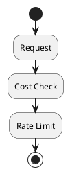

# Review: 11.2: Cost Control and Rate Limiting

**Source:** part-iv/ch11-ai-in-institutions/lecture-02.adoc

---

## Review of Lecture 11.2 – *Cost Control and Rate Limiting*

### Summary  
**Grade: C** – The lecture covers the right topics but falls short of a 90‑minute, engaging session. The narrative starts with a quotation rather than a concrete, tension‑filled scenario, the core material is only ~600 words (well under the 2,500‑3,500 word target), and the diagram is a bare‑bones flow that does not reinforce the concepts. Substantial expansion, stronger hooks, and richer visualisation are needed before the lecture can sustain a full class period.

---

## 1. Narrative Arc  

| Element | Verdict | Comments / Suggested Fix |
|---------|---------|--------------------------|
| **Hook** | ❌ Weak | The epigraph is a nice tagline but does not create an immediate problem for students. Replace it with a short story: e.g., “A startup launches an autonomous research‑assistant that, left unchecked, spends $10 k in a single hour because it repeatedly calls the LLM for marginal improvements.” |
| **Development** | ⚠️ Partial | The “Conceptual Core” lists ideas in a paragraph‑style dump. It needs a clear progression: <br>1️⃣ *Problem*: runaway spend in autonomous agents.<br>2️⃣ *Response*: cost tracking → budgeting → alerts.<br>3️⃣ *Limitation*: trade‑off between cost and capability. Each step should be illustrated with a mini‑example before moving on. |
| **Closing / Bridge** | ❌ Missing | The lecture ends with a discussion prompt and lab prep, but there is no explicit “take‑away” that ties back to the opening scenario or previews the next lecture (e.g., “Next we’ll look at fairness‑aware throttling”). Add a 2‑paragraph wrap‑up that (a) restates the impact of cost governance on access, (b) highlights the key levers students just built, and (c) previews the upcoming topic. |

**Overall Verdict:** The arc is present in outline but needs a stronger hook, a step‑by‑step development, and a clear closing that creates forward momentum.

---

## 2. Density (Target ≈ 2,500‑3,500 words)

| Section | Approx. Word Count | Target Range | Key‑Point Count | Target KP |
|---------|-------------------|--------------|----------------|----------|
| Conceptual Core | ~340 | 1,200‑1,600 | 5 | 6‑12 |
| Technical Example | ~150 | 600‑900 | 3 | 5‑8 |
| Philosophical Reflection | ~130 | 600‑900 | 3 | 5‑8 |
| **Total** | **≈ 620** | **2,500‑3,500** | **14** | **16‑28** |

**Verdict:** The lecture is dramatically under‑dense. It needs roughly **four‑times** more explanatory prose, additional sub‑sections (e.g., “Cost‑aware Prompt Engineering”, “Dynamic Rate‑Limit Policies”, “Case Study: Cloud‑Provider Billing”), and more granular key‑points.

---

## 3. Interest & Engagement  

| Issue | Why it hurts attention | Concrete remedy |
|-------|------------------------|-----------------|
| **Definition‑first dump** (e.g., “Cost tracking: every LLM call consumes tokens…”) | Students hear a list of facts without a problem to solve. | Start each concept with a *question* or *failure scenario*: “What happens when an agent loops until the token budget is exhausted?” |
| **Thin technical example** (only a few lines of pseudo‑code) | No hands‑on tension; students cannot visualise the implementation challenge. | Expand the example: show a JSON log entry, a simple Python snippet for a token‑counter decorator, and a diagram of the rate‑limiter middleware. Include a “what‑if” twist (price surge, burst traffic). |
| **Philosophical reflection is brief** | Misses the opportunity to spark debate about equity, corporate vs. public funding, etc. | Add a short case study (e.g., “OpenAI’s free‑tier throttling”) and a provocative question: “Should a public university be allowed to run unlimited LLM queries for research?” |
| **Lack of interactive moments** | 90 min needs at least two “mini‑activities”. | Insert a quick think‑pair‑share after the hook (“Estimate the cost of 1 M tokens at $0.00002 each”), and a live polling on acceptable budget caps. |

---

## 4. Diagram Review  

**Current PlantUML (Figure 11.2)**  



| Issue | Impact on Narrative | Suggested Improvement |
|-------|---------------------|-----------------------|
| **Too linear / no decision branches** | Does not illustrate what happens when a cost check fails or when the rate limit is exceeded. | Add a decision diamond after *Cost Check* → “Within budget?” → **Yes** → continue; **No** → *Reject* (return 402). Likewise after *Rate Limit* → “Allowed?” → **Yes** → *Process*; **No** → *429*. |
| **Missing actors & data** | Students cannot see who is being throttled (user, API key, task). | Label the request with *User ID* and *Task ID*. Show a *Cost Ledger* component that is queried. |
| **No feedback loop** | No visual of alerts or budget‑adjustment. | Add an *Alert Service* that is triggered when spend > 80 % of budget, feeding back to the *User Dashboard*. |
| **Styling** | “sketchy-outline” is fine, but the diagram could benefit from colour coding (green = allowed, red = blocked). | Use `#green` / `#red` background for decision outcomes, and arrows labeled “continue” / “reject”. |

**Revised PlantUML sketch (conceptual)**  

```plantuml
@startuml
skinparam backgroundColor #FDF6E3
actor User
participant "API Gateway" as GW
database "Cost Ledger" as CL
database "Rate‑Limiter" as RL
entity "Alert Service" as AS

User -> GW : Request (userId, taskId)
GW -> CL : queryCost(userId)
alt Within budget?
    CL --> GW : OK
else
    CL --> GW : BudgetExceeded
    GW -> User : 402 Payment Required
    stop
end

GW -> RL : checkRate(userId)
alt Rate OK?
    RL --> GW : OK
    GW -> User : 200 Response
else
    RL --> GW : RateExceeded
    GW -> User : 429 Too Many Requests
    AS -> User : Alert (rate limit)
    stop
end
@enduml
```

---

## 5. Recommended Revisions (Prioritized)

1. **Rewrite the Hook (high impact)**
   - Begin with a 2‑minute narrative of a runaway‑cost incident (real or fabricated). Pose a provocative question: “How could a harmless‑looking chatbot drain a $10 k budget in minutes?”
2. **Expand the Conceptual Core to ~1,300 words**
   - Break into three sub‑sections: *Problem Space*, *Control Levers* (cost tracking, budgeting, alerts, rate limiting), *Design Trade‑offs* (performance vs. cost, equity).
   - Add at least **6** concrete key‑points (e.g., “Token‑price tiers per model”, “Dynamic throttling based on load”, “User‑level vs. task‑level budgets”).
3. **Deepen the Technical Example (~800 words)**
   - Provide a full Python decorator for token counting, a Redis‑backed rate‑limiter snippet, and a sample JSON cost log.
   - Include a “What‑if” scenario (price surge, burst traffic) and show how the system reacts.
4. **Enrich the Philosophical Reflection (~800 words)**
   - Insert a short case study (e.g., OpenAI free‑tier limits, academic consortium pricing).
   - Pose 2‑3 debate questions and link to EU AI Act/NIST sections with page numbers.
5. **Add a Closing/Bridge (≈150 words)**
   - Summarise the three levers, restate the opening scenario’s resolution, and preview the next lecture (e.g., “Fairness‑aware throttling”).
6. **Insert Interactive Activities**
   - Quick cost‑estimation exercise (5 min).
   - Live poll on acceptable budget caps (using Mentimeter/Polly).
7. **Redesign Figure 11.2**
   - Replace the current linear flow with the decision‑branch diagram above.
   - Label actors, add alert feedback, colour‑code outcomes.
8. **Increase Key‑Point Lists**
   - Ensure each major section has **5‑8** bullet points, matching the density guideline.
9. **Proofread for Consistency**
   - Align terminology (e.g., “budget”, “quota”, “spend”) and ensure all acronyms are defined on first use.
10. **Add References**
    - Cite the specific EU AI Act article and NIST AI RMF sub‑section that discuss economic governance.

---

**By implementing the above changes, the lecture will meet the 90‑minute density requirement, provide a compelling narrative arc, and keep students actively engaged while reinforcing the material with a clearer, more informative diagram.**